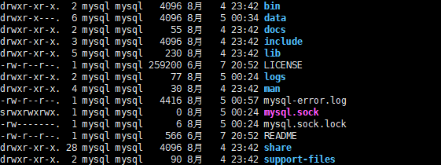
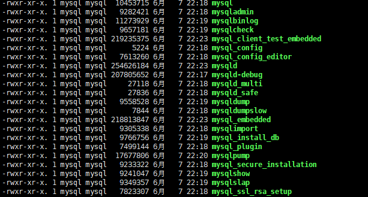
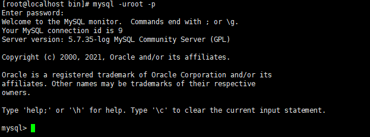
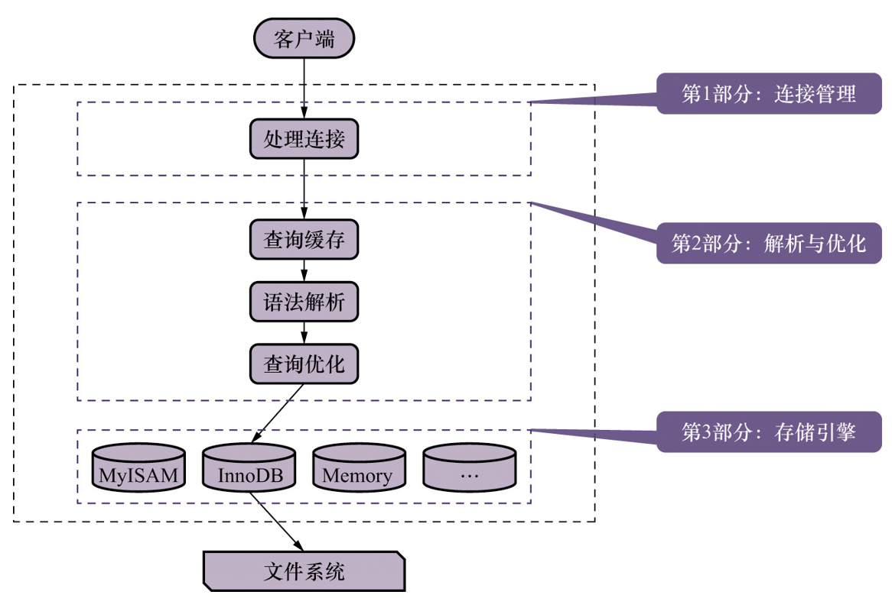
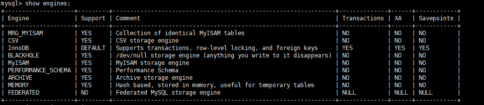
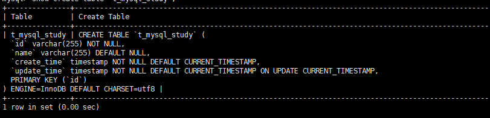

## 1.1 MySQL的C/S架构:

MySQL是典型的C/S架构, 由 `客户端程序Client` 和 `服务端程序server`两部分组成.

MySQL的大致运行过程为: 服务端程序直接与要存储的数据打交道,多个客户端程序可以连接到这个服务器程序,向服务器程序发送 CRUD请求,然后服务端程序根据这些请求进行相应的处理,最后将结果响应给客户端.

## 1.2 MySQL的安装:

[参考链接](zip包安装mysql： https://www.cnblogs.com/qixing/p/12271499.html)

**注意事项**

配置文件中一些重要文件的路径要写对, <font color=red>都需要根据自己具体的文件所在路径来写</font>,比如: 

```yaml
[mysqld]
# binlog 配置
log-bin=/usr/local/mysql/logs/mysql-bin.log
expire-logs-days=14
max-binlog-size=500M
server-id=1
# GENERAL
basedir=/usr/local/mysql
datadir=/usr/local/mysql/data
socket=/usr/local/mysql/mysql.sock
user=mysql
default-storage-engine=InnoDB
character-set-server=utf8
lower_case_table_names = 1
explicit_defaults_for_timestamp=true
[mysqld_safe]
log-error=/usr/local/mysql/mysql-error.log
pid-file=/usr/local/mysql/mysqld.pid
[client]
socket=/usr/local/mysql/mysql.sock
[mysql]
default-character-set=utf8
socket=/usr/local/mysql/mysql.sock
```

`mysql`通过zip包安装之后,文件目录为:  学习的时候`mysql`程序是安装在`/usr/local/mysql`目录下面的



### 1.2.1 bin目录下的可执行文件

`bin`目录下面放了很多的`mysql`程序的可执行文件,大致如下:



启动`mysql`: 通常是通过 上面列举的可执行文件的`相对`/`绝对`路径来启动`mysql`.比如: `/usr/local/mysql/bin/mysqld`,但是为了在任何地方都可以直接使用`mysql`的可执行文件, 会将`mysql`的`bin`目录加入到环境变量文件中去.


## 1.3 启动`mysql`服务端程序:

### 1.3.1 `mysqld`:

`mysqld`可执行文件就表示一个`mysql`服务器程序,运行`mysqld`就可以启动一个`mysql`进程. **但是这个可执行文件不常用**

### 1.3.2 `mysqld_safe`:

`mysqld_safe`是一个启动脚本, 在脚本中会去调用`mysqld`可执行文件来启动一个 `mysql`进程, 然后持续监控服务器的运行状态, **当服务器出现错误的时候可以帮助重启服务器程序**. 程序运行期间的`错误日志`或者其他`诊断日志`被存放在数据目录(我的路径为: `/usr/local/mysql/data`)中一个`.err`后缀的文件里面.

### 1.3.3 `mysql.server`:

`mysql.server`也是启动脚本, 它会简介的调用`mysald_safe`. 

`mysql.server`实际上是一个链接文件,指向的是 `/usr/local/mysql/support-files/mysql.server`

`mysql.server`启动`mysql`程序:  `mysql.server start`

`mysql.server`停止`mysql`程序:  `mysql.server stop`

### 1.3.4 `mysqld_multi`:

`mysqld_multi`: 使用来启动多个`mysql`服务器程序的,也可以报告服务器程序的运行状态,本质上还是是一个 `shell`脚本.

## 1.4 启动`mysql`客户端程序:

`bin`目录下面有许多的客户端程序,如: `mysqladmin`,`mysqldump`,`mysqlcheck`等等.重点关注名字为 `mysql` 的可执行文件.

通过`mysql`可执行文件常用格式:

```bash
mysql -h主机ip -P端口号 -D数据库名 -u用户名 -p密码
```

| -h   | 表示`mysql`服务器程序所在的主机i地址,本地连接可以省略这个参数 |
| ---- | :----------------------------------------------------------- |
| -P   | 表示`mysql`服务器程序所使用的端口号                          |
| -D   | 表示要连接`mysql`服务器程序中的哪一个数据库                  |
| -u   | 使用哪一个用户来链接`mysql`服务器程序                        |
| -p   | 密码                                                         |

链接成功后如图:  本地连接省略了部分参数



退出`mysql`客户端程序: `quit`,`exit`,`\q`等命令都可以退出

### 1.4.1 连接注意事项:

1. `不要显示通过mysql -pxxxx去连接服务器`: 通过`history`,`ps`之类的命令可以看到
2. `一定要显示连接的话,-p和密码之间不能有空格`: `-p`之后的任何字符都会被认为是密码的一部分,如果密码含有特殊字符还需要转义
3. `参数之间没有顺序要求`.
4. `unix系统中,如果不指定-u参数,会使用系统当前用户作为mysql用户去连接服务器,win系统默认是ODBC`.

## 1.5 客户端与服务端的连接过程:

### 1.5.1 TCP/IP:

`mysql`程序是一个`c/s`架构的程序,底层是依靠`tcp/ip`网络通信协议来实现`c/s`之间的通信.`tcp/ip`协议是通过 `ip+端口号`来确定一个应用层程序的.而服务端程序则会持续监听`默认端口号`或者`启动时指定的其他端口号`

`mysql`服务端程序默认的端口号是: `3306`.也可以通过 `mysqld -P端口号`在服务器程序启动的时候使用其他端口作为服务器程序监听的端口号.

### 1.5.2 命名管道和共享内存:

win系统上可以给客户端程序和服务器程序之间使用`命名管道`或`共享内存`进行通信,不过启动时需要添加一些参数:

1. 使用`命名管道`进行进程之间通信:
   -  启动服务器程序的时候,需要加上`--enable-named-pipe`参数
   -  启动客户端程序的时候,需要加上 `--pipe`或者 `--prototype=pipe`
2. 使用`共享内存`进行进程之间通信:
   - 启动服务器,加上`--shared-memory`
   - 服务器启动之后共享内存就是本地客户端程序默认的链接方式,也可以在启动客户端,加上`--protocol=memory`来链接

### 1.5.3 UNIX域套接字:

当服务器和客户端都是运行在`UNIX系统`上的时候,可以使用`UNIX域套接字`进行进程之间通信

开启方法: 

- 服务器默认开启: 启动客户端程序的时候 `不指定-h参数`、`-h参数为localhost` 或者 `指定--protocol=socket`都可以开启`UNIX域套接字`进行进程之间通信.

- 客户端显示开启: `mysql -hlocalhost -uroot --socket=文件路径`

默认的`UNIX域套接字文件`为 `/tmp/mysql.sock`,可以通过 `mysqld --socket=文件路径`修改.

## 1.6 服务端程序处理客户端请求:

无论客户端进程和服务端进程采用什么方式通信,最后客户端程序的请求都会转换成一段文本(`MYSQL语句`),服务器进程处理后再向客户端进程响应一段文本`处理结果`

整个处理过程大致如下: 



### 1.6.1 处理连接:

`mysql`对于处理客户端请求的线程采用了`池化`思想来管理.每当有客户端请求过来,服务器进程都会创建一个线程专门与这个客户端进行交互; 当客户端与服务器断开连接的时候,线程不会被销毁,而是被集中缓存起来,待后续连接过来继续使用.

客户端发送给服务端的连接,会携带`主机信息`,`用户名`,`密码`等信息,服务端会对这些信息进行校验,通过的连接服务端才会创建线程与其建立连接.

### 1.6.2 解析与优化:

连接建立之后,服务端已经获取到了客户端的文本请求,然后开始对文本请求进行处理,比较重要的部分是: `查询缓存`,`语法解析`,`查询优化`

1. 查询缓存: `MYSQL`服务器会对之前已经处理过的文本请求 和 请求结果进行缓存,如果当前查询是已经处理过的,直接将对应的结果返回给客户端;如果没有处理过就会进行下一步处理.
   - 缓存不命中的原因:
     - 如果两个查询请求有`任何字符上的不同`(如: 空格、注释、大小写),都会造成缓存不命中
     - 如果查询请求中包含某些系统函数,用户自定义变量和函数、系统表,如: `mysql`、`information_schema`等
     - `mysql`的缓存系统会监测涉及的每张表,只要该表的`结构`或者`数据`被修改,那么 与该表关联的所有查询缓存都会被删除
   - 查询缓存的缺点: 查询缓存可以提高查询效率,但是也会存在对缓存数据进行维护的开销
     - 每次都要去查询缓存中检索
     - 查询请求处理完之后要更新缓存数据
     - 维护该查询缓存对应的内存区域等
2. 语法解析: 如果没有命中缓存,就会进行真正的查询处理.`MYSQL`会对查询请求文本进行解析,判断语法是否正确,然后从文本中将要查询的表、和查询条件提取出来,存放在`MYSQL`服务器内部使用的结构上
3. 查询优化: 在语法解析之后,`MYSQL`会对查询语句进行优化.优化后的结果就是生成一个执行计划.

### 1.6.3 存储引擎:

`查询优化`之后还没有去访问表中的数据.`MYSQL`服务器将数据的`存储`和`提取`操作都封装到了一个名为 `存储引擎`的模块里面.

`存储引擎`主要还是负责 `物理上如何表示数据记录`、`如何从逻辑上的表中读取数据`、`怎么把数据写入到具体的物理存储器上`等

为了方便管理, `MYSQL`处理请求的过程大致被分为了两部分: `server层`(连接管理,查询缓存,语法解析,查询缓存),`存储引擎层(存取真实数据的功能)`.所以在`server层`堆语法进行优化完毕之后,只需要按照`执行计划`去调用底层存储引擎提供的接口获取到数据后返回给客户端.通常是以一条`记录`为单位.

以`SELECT`为例: `server层`按照执行计划向`存储引擎层`获取一条`记录`然后判断是否符合`where`条件,如果符合就返回给客户端(存入一个缓冲区,缓冲区满了一起flush出去),不符合就跳过该数据,然后向`存储引擎层`获取下一条数据,以此往复.

## 1.7 常用的存储引擎:

| 存储引擎  |                     描述                     |
| :-------- | :------------------------------------------: |
| ARCHIVE   |      用于数据文档(插入之后不能再被修改)      |
| BLACKHOLE |        丢弃写操作,读操作会返回空内容         |
| CSV       |      在存储数据的时候,以逗号分隔数据项       |
| FEDERATED |                用来访问远程表                |
| InnoDB    |              支持事务,行锁,外键              |
| MyISAM    |           只要的非事务处理存储引擎           |
| MEMORY    | 数据存储在内存,不存储在磁盘里面;多用于临时表 |
| MERGE     |       用来管理多个MyISAM表构成的表集合       |
| NDB       |            MySQL集群专用存储引擎             |

其中最常用的是 `InnoDB`,`MyISAM`和`MEMORY`.

支持的功能:

| Feature                                | MyISAM       | Memory           | InnoDB       | Archive      | NDB          |
| :------------------------------------- | :----------- | :--------------- | :----------- | :----------- | :----------- |
| B-tree indexes                         | Yes          | Yes              | Yes          | No           | No           |
| Backup/point-in-time recovery (note 1) | Yes          | Yes              | Yes          | Yes          | Yes          |
| Cluster database support               | No           | No               | No           | No           | Yes          |
| Clustered indexes                      | No           | No               | Yes          | No           | No           |
| Compressed data                        | Yes (note 2) | No               | Yes          | Yes          | No           |
| Data caches                            | No           | N/A              | Yes          | No           | Yes          |
| Encrypted data                         | Yes (note 3) | Yes (note 3)     | Yes (note 4) | Yes (note 3) | Yes (note 3) |
| Foreign key support                    | No           | No               | Yes          | No           | Yes (note 5) |
| Full-text search indexes               | Yes          | No               | Yes (note 6) | No           | No           |
| Geospatial data type support           | Yes          | No               | Yes          | Yes          | Yes          |
| Geospatial indexing support            | Yes          | No               | Yes (note 7) | No           | No           |
| Hash indexes                           | No           | Yes              | No (note 8)  | No           | Yes          |
| Index caches                           | Yes          | N/A              | Yes          | No           | Yes          |
| Locking granularity                    | Table        | Table            | Row          | Row          | Row          |
| MVCC                                   | No           | No               | Yes          | No           | No           |
| Replication support (note 1)           | Yes          | Limited (note 9) | Yes          | Yes          | Yes          |
| Storage limits                         | 256TB        | RAM              | 64TB         | None         | 384EB        |
| T-tree indexes                         | No           | No               | No           | No           | Yes          |
| Transactions                           | No           | No               | Yes          | No           | Yes          |
| Update statistics for data dictionary  | Yes          | Yes              | Yes          | Yes          | Yes          |

## 1.8 关于引擎的一些操作:

### 1.8.1 查询支持的引擎:

```sql
show engines;
```



- `Support`: 是否支持该引擎,`DEFAULT`表示该引擎是默认存储引擎
- `Comment`: 是该引擎的功能概述
- `Transaction`: 表示该引擎是否支持事务
- `XA`: 表示该存储引擎是否支持分布式事务
- `Saveoptions`: 表示该引擎是否支持部分回滚

### 1.8.2 设置表的存储引擎:

1. 建表的时候就设置存储引擎

   ```sql
   CREATE TABLE `t_mysql_study`(
       字段语句
   )ENGINE= 存储引擎名字;
   ```

   

2. 修改已经创建好的表的存储引擎:

   ```sql
   # 修改表的引擎
   ALTER TABLE 表名 ENGINE = 存储引擎名称;
   # 查看建表语句来看引擎是否修改
   SHOW CREATE TABLE `t_mysql_study`
   ```

   

