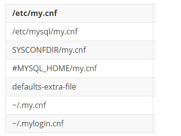

## 2.1 启动选项和配置文件

任何程序都可以通过配置文件和程序启动参数设置该程序在运行的时候的一些默认值和必要参数的值.

### 2.1.1  在命令行上使用选项:

```bash
# 在启动的时候使用选项的通用格式:
可执行文件 --启动选项1[=值1] --启动选项2[=值2] --启动选项3[=值3] ... --启动选项n[=值n]
```

在命令行中,可以将各个启动选项写到一行里面,每个启动选项使用`--`表示开始,选项之间使用空格分开.

**选项的长形式和短形式**: `--`为参数的长形式,`MYSQL`对于某些常用的参数提供了短形式`-`,比如: `mysql -p`启动的时候确定要连接的服务器端

**注意事项:**

1. 在命令行中指定选项值得时候需要注意, `选项名`、`=`和`值`这三者之间是不能有空格的.
2. 长形式和短形式之间的区别是: 长形式前缀为 `--`,短形式为 `-`;长形式的选项名是单词,短形式的选项名是字母
3. 选项名是区分大小写的: `-p` --- 表示密码 和`-P` --- 表示端口号 这两个之间是不一样的.
4. `可执行文件 --help`: 可以看到该可执行文件支持的启动选项

### 2.1.2 配置文件中使用选项:

<font color=red>推荐使用选项的方式.</font>

1. 配置文件的路径:

   `mysql`会从多个路径下面的配置文件去寻找相关配置信息.`unix系统`下的配置文件路径为:

   | /etc/my.cnf         |                                      |
   | ------------------- | ------------------------------------ |
   | /etc/mysql/my.cnf   |                                      |
   | SYSCONFDIR/my.cnf   |                                      |
   | #MYSQL_HOME/my.cnf  | 特定服务器的悬系那个(仅限服务器)     |
   | defaults-extra-file | 命令行指定的额外配置文件路径         |
   | ~/.my.cnf           | 特定于用户的选项                     |
   | ~/.mylogin.cnf      | 特定于用户的登录路径选项(仅限客户端) |

   说明:

   - SYSCONFDIR: 表示使用CMake构建MySQL时使用SYSCONFDIR选项指定的目录
   - MYSQL_HOME: 就是配置好的系统环境变量.
   - 除了`.mylogin,cnf`(只能存放客户端的一些选项), `$MYSQL_HOME/my.cnf`(只能存放服务器相关选项)外,其余配置文件即可以存放客户端,也可以存放服务器相关的选项.
   - `~`: 表示当前用户目录,`unix系统`的概念
   - `default-extra-file`: 表示程序启动的时候可以通过指定`default-extra-file`启动选项的值来添加额外的配置文件路径
   - `.mylogin.cnf`是一个特殊的配置文件,私有`mysql_config_editor`实用程序创建的加密文件.该文件只能包含一些在启动客户端程序时用于连接服务器的选项.

2. 配置文件的内容:

   ```properties
   [mysqld]
   (具体的启动选项....)
   [client]
   (具体的启动选项....)
   [mysql]
   (具体的启动选项....)
   
   [mysqld]
   # binlog 配置
   log-bin=/usr/local/mysql/logs/mysql-bin.log
   expire-logs-days=14
   max-binlog-size=500M
   server-id=1
   # GENERAL
   basedir=/usr/local/mysql
   datadir=/usr/local/mysql/data
   socket=/usr/local/mysql/mysql.sock
   user=mysql
   default-storage-engine=InnoDB
   character-set-server=utf8
   lower_case_table_names = 1
   explicit_defaults_for_timestamp=true
   [mysqld_safe]
   log-error=/usr/local/mysql/mysql-error.log
   pid-file=/usr/local/mysql/mysqld.pid
   [client]
   socket=/usr/local/mysql/mysql.sock
   [mysql]
   default-character-set=utf8
   socket=/usr/local/mysql/mysql.sock
   ```

   说明:

   - 配置文件只能使用长形式的选项来设置,且`不能使用--前缀`

   - `选项`、`=`和`值`之间不能有空格

   - `[]`: 表示一个选项组,名称和可执行文件相对应,特别地:

     - `[server]`: 下面的启动选项将作用于所有的服务器程序
     - `[client]`: 下面的启动选项将作用于所有的客户端程序

   - 程序对应类别和能读取的选项组:

     | 程序名       | 类别       | 能读取的组                       |
     | ------------ | ---------- | -------------------------------- |
     | mysqld       | 服务器程序 | [mysqld]  [server]               |
     | mysqld_safe  | 服务器程序 | [mysqld] [server] [mysqld_safe]  |
     | mysql.server | 服务器程序 | [mysqld] [server] [mysql.server] |
     | mysql        | 客户端程序 | [mysql] [client]                 |
     | mysqladmin   | 客户端程序 | [mysqladmin] [client]            |
     | mysqldump    | 客户端程序 | [mysqldump] [client]             |


   配置文件设置系统变量举例:

   ```properties
   [server]
   skiping-networking
   default-storage-engine=MyISAM
   ```

   配置文件,如上,然后通过 `mysqld`启动服务器:

   虽然在启动的时候,并没有设置任何的启动项,但是`mysql`会去默认路径下面读取相关的配置文件,上面的这个配置文件就会被读取出来,并且`mysqld`是可以读取`[server]`组下面的配置的.所以上面两个配置通过`mysqld`是可以生效的.

   <font color=red>如果上面配置文件中的`[server]`改成`[client]`,那么设置的启动项是不会生效的</font>

3. 特定`mysql`版本的专用选项组:

   在具体的选项组上面加上`mysql`的版本号,就可以让该选项组只能被对应`mysql`版本的可执行文件才能读取到.

   比如: `[mysqld-5.7] `就只能由5.7版本的`mysql`中的可执行文件 `mysqld`读取到

4. 配置文件的优先级:

   如果创建了多个配置文件,配置文件将按照下图从上到下的顺序依次读取配置文件:

   

   <font color=red>注意: 如果不同的配置文件中设置了相同的配置项,那么后面加载的配置文件中的配置项,会将先加载的配置文件中的配置项覆盖.即`多个配置文件,相同配置,以最后加载的为准`</font>

5. 同一个配置文件中多个组的优先级:

   在同一个配置文件中,可执行文件会从上到下依次读取多个组的配置文件,如果多个组中存在相同的配置项,以后面读取到的配置项为准.

6. default-file的使用:

   default-file: 在程序启动的时候指定配置文件的加载路径,<font color=red>注意: default-file指定了之后,就只会从指定的文件路径中去加载配置,程序不再去默认的配置文件加载配置</font>

   default-extra-file: 在程序启动的时候指定配置文件`额外`的加载路径,<font color=red>注意: default-extra-file指定的是额外的配置文件路径,也就是说程序还是会去默认的配置文件路径加载配置</font>

7. 命令行和配置文件中启动选项的区别:

   除了部分专门为`命令行`设计的启动选项外,大部分启动选项都可以写入配置文件中.如果 命令行和配置文件出现了相同的配置项,那么以`命令行中的配置项为准`


## 2.2 系统变量:

一些会影响`mysql`程序行为的变量,被称为`系统变量`.

比如: 

- `max_connects:` 控制同时连接的客户端数量
- `default_storage_engine:`控制表的默认存储引擎
- `query_cache_size:`控制查询缓存的默认大小

### 2.2.1 查看系统变量:

```sql
-- 建议使用模糊匹配去查询需要的系统变量
show variables [liske 匹配的模式]
```

### 2.2.2 设置系统变量:

#### 1. 通过启动项设置:

- 通过命令行设置系统变量

  ```bash
  mysqld --default-storage-engine=MyISAM --max-connections=10
  ```

- 通过配置文件设置系统变量:

  ```properties
  [server]
  default-storage-engine=InnoDB
  max_connections=1000
  ```

#### 2. 服务器程序运行过程中设置:

在服务器程序运行过程中可以动态修改变量而且无需停止并启动服务器.

**系统变量的作用范围:**

`GLOBAL(全局范围)`: 影响服务器的整体操作.具有`GLOBAL`作用范围的系统变量可以称为全局变量

`SESSION(会话范围)`: 影响某个客户端链接的操作.具有`SESSION`作用范围的变量可以称为会话变量

**系统变量初始化的过程**

1. 服务器在启动的时候,会将每个全局变量按照配置设置全局变量的默认值.

2. 客户端连接到服务器,服务器会为每个连接维护一组会话变量,初始值为同名的全局变量的值,(有部分的特殊会话变量不会按照全局变量的值进行初始化)

举个例子: 以默认存储引擎为例

1. 服务器启动,会将`default-storage-engine`按照配置设置成为一个作用范围为`GLOBAL`的全局变量.

2. 之后,每一个客户端成功连接,服务器都会为其分配一个名字为 `default-storage-engine`,作用范围为`SESSION`的会话变量,且这个会话变量的初始值为 `作用范围为GLOBAL的同名全局变量的值`

**设置系统变量:**

``` sql
set [GLOBAL|SESSION] 系统变量名 = 值
set [@@(GLOBAL|SESSION).]系统变量名 = 值

-- 设置全局默认存储引擎:
SET GLOBAL default-storage-engine = MyISAM
SET @@GLOBAL.default-storage-engine = MyISAM
-- 设置当前会话默认存储引擎
SET GLOBAL default-storage-engine = MyISAM
SET @@GLOBAL.default-storage-engine = MyISAM
SET default-storage-engine = MyISAM
```

实际上,`GLOBAL`影响的是之后新客户端连接到服务器时 该系统变量取什么值,`SESSION`影响的是 当前客户端连接到服务器时 该系统变量取什么值.

<font color=red><b>注意:</b></font>

1.  如果不指定作用范围,默认是`SESSION`范围
2.  改变`GLOBAL`作用范围的变量值,不会影响服务器为已经连接的客户端分配好了,作用范围为`SESSION`的对应变量值,只会影响后续连接到服务器的客户端`SESSION`范围的值.

**查看不同作用范围的值**

```sql
SHOW [GLOBAL|SESSION] VARIABLES [LIKE '匹配模式']
```

注意:

- 如果查询的是`GLOBAL`全局变量,如果改变量没有`GLOBAL`作用范围是不会显示出来的
- 同理,变量没有`SESSION`作用范围,也不会显示
- 如果不指定作用范围,默认查询的是`SESSION`作用范围

#### 3. 注意事项:

1. `关于作用范围`:  并不是所有的系统变量都既有`GLOBAL`范围又有`SESSION`范围,可能只有其中一种范围.

2. 有些系统变量是只读的,是不能被设置的

3. 启动项和系统变量的区别:

   `启动项`是程序启动时由用户传递的一些参数,`系统变量`是影响服务器程序运行行为的变量.

   - 大部分系统变量都可以通过启动项进行传参
   - 有些系统变量是程序运行过程中生成的,不能当做启动项来设置
   - 部分启动项也不是系统变量

## 2.3 状态变量:

`状态变量`: 是为了让我们更好了解服务器程序运行情况的信息数据

状态变量是用来展示服务器程序运行情况的信息数据,只能由服务器程序自己设置,不能人为设置.

查询语法:

```sql
SHOW [GLOBAL|SESSION] STATUS [LIKE '匹配模式'];
```

