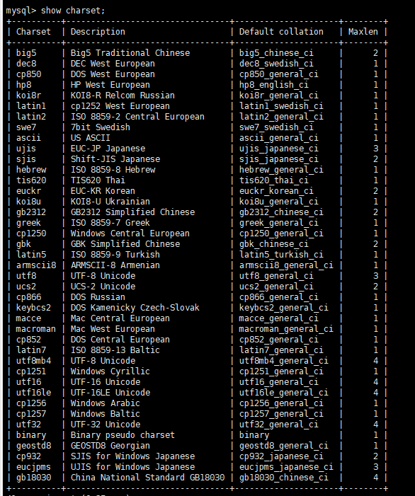
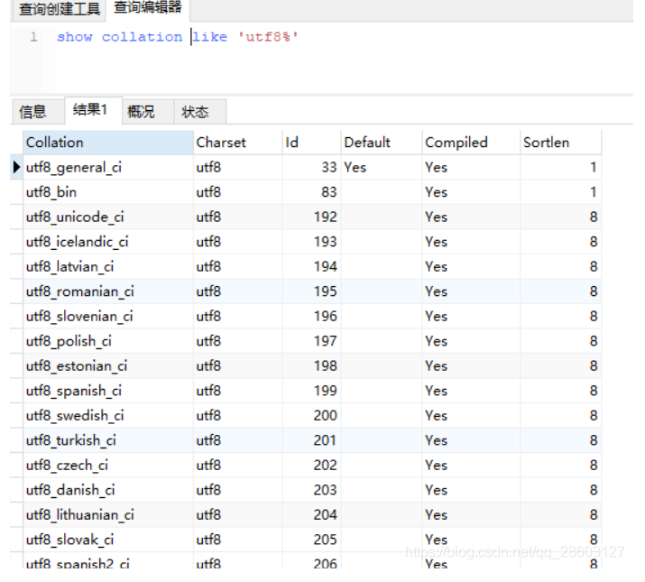
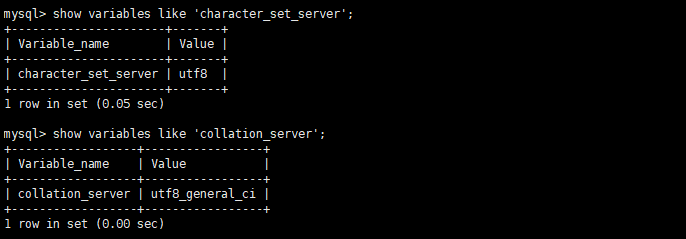
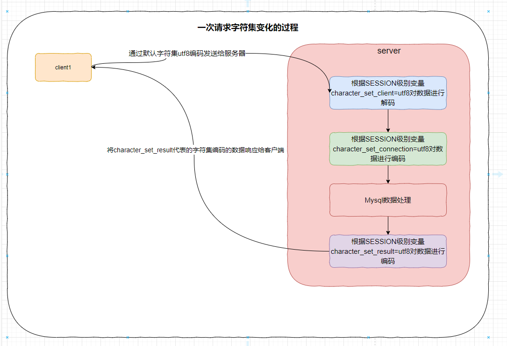
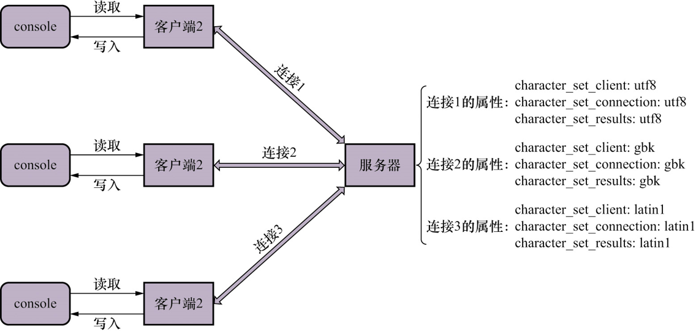

## 3.1 字符集和比较规则:

### 3.1.1 字符集介绍:

数据在计算机中实际上是以二进制的关系存储的.

**字符集: 是描述某个字符范围的编码规则**

主要是解决两个问题:

- 界定字符的范围,就是要将哪些字符转换成二进制数据
- 二进制数据和字符之间如何转换,即 编码解码过程

### 3.1.2 比较规则简介:

**比较规则:** 即确定两个字符之间的大小关系.不同字符集在`mysql`中的比较规则也是不相同的

### 3.1.3 一些重要的字符集:

1. `ASCⅡ字符集`: 共`128`个字符,包括空格,标点,数字,大小写字母和一些不可见的字符.`一个字节`就可以表示所有的`ASCⅡ字符`

2. `ISO 8859-1字符集`:共`256`个字符,在`ASCⅡ`的基础上增加了`128`个西欧常用字符. 也可以使用`一个字节`表示所有字符

3. `GB2312字符集`: 收录了 `汉字`以及`拉丁字母`,`希腊字母`,`日本平假名,片假名`,`俄语西里尔字母`;汉字共`6763`个,其他文字符号`682`个. `GB2312`也兼容了`ASCⅡ字符`,所以`当GB2312字符在ASCⅡ字符范围内,使用一个字节;不在就是用两个字节进行编码`

4. `GBK字符集`: 对`GB2312字符集`在字符范围上进行了扩充,编码方式与`GB2312字符集`相同

5. `UTF-8字符集`: 字符范围几乎涵盖当今世界各个国家/地区所使用的字符.编码方式兼容`ASCⅡ`,采用变长编码方式,一个`UTF8字符`可能需要`1~4个字节`

   > `UTF-8`实际上是`Unicode字符集`的一种编码方案.

## 3.2 MySQL支持的字符集和比较规则

### 3.2.1 `utf8`和`utf8mb4`:

由于日常常用的字符使用`1~3`个字节基本就可以表示,为了提高编码效率,MySQL在处理`UTF8字符集`的时候从字符集名称上做了区分:

- `utf8mb3`: mysql中`utf8`的别名,通常使用的`uft8`字符集就是这种,只使用`1~3个字节`表示字符.
- `utf8mb4`: 真正意义上的`utf8`字符集,使用`1~4`个字节表示字符. `可以存储emoji表情`

### 3.2.2 查看字符集:

```sql
show (character set | charset) [like '字符集名称匹配模式']
```



说明:

1. `Default collation`: 表示该字符集默认的比较规则
2. `Maxlen`: 表示该字符集最多使用多少个字节来描述字符.

> 注意: mysql中字符集名称都是小写的

### 3.2.3 查看比较规则:

```sql
show collation [like '字符集匹配模式']
```



**比较规则的命名:**

- 比较规则都是由与其关联的字符集的名称开头,如图中都是`utf8`的比较规则

- `_`之后紧跟的是该规则适用的语种名称.如: `utf8_slovak_ci`表示斯洛伐克语言的比较规则

- `_`之后紧跟的是该规则是否区分对应语言中某些性质,如`大小写`,`重音`等

  | 后缀 | 描述                           |
  | ---- | ------------------------------ |
  | _ai  | 不区分重音(accent insensitive) |
  | _as  | 区分重音(accent sensitive)     |
  | _ci  | 不区分大小写(case insensitive) |
  | _cs  | 区分大小写(case sensitive)     |
  | _bin | 二进制形式比较(binary)         |

> 每个字符集都有很多的比较规则,`show collation`语句查询出来的信息中,`default`为yes的那一种比较规则就是默认比较规则

## 3.3 mysql中的应用:

### 3.3.1 不同级别的字符集和比较规则:

mysql字符集和比较规则分成了四个级别:

- 服务器级别
- 数据库级别
- 表级别
- 列级别

#### 1. 服务器级别:

服务器级别的字符集和比较规则,通过两个系统变量来设置.

- `character_set_server`: 服务器级别字符集
- `collation_server`: 服务器级别比较规则

**两个变量的查询:**

```sql
-- 查询字符集
SHOW VARIABLES LIKE 'character_set_server';
-- 查比较规则
SHOW VARIABLES LIKE 'collation_server'
```



**两个变量的设置:**

可以通过 `SET`语句和`配置文件`的方式设置这两个系统变量

#### 2. 数据库级别:

数据库级别的字符集和比较规则,通过两个系统变量来设置:

- `character_set_database`: 字符集
- `collation_database`: 比较规则

**变量查询:** 跟服务器级别没区别,只是换下变量名

**变量修改:**

在创建数据库的时候就可以指定字符集和比较规则:

```sql
-- 创建的时候设置
CREATE TABLE 数据库名
	[[DEFAULT] CHARACTER SET 字符集名]
	[[DEFAULT] COLLATION 比较规则名字];
	
-- 修改
ALTER TABLE 数据库名
	[[DEFAULT] CHARACTER SET 字符集名]
	[[DEFAULT] COLLATION 比较规则名字];
```

**注意事项:**

1. 如果没有设置数据库级别的字符集和比较规则,那么就会使用服务器级别的字符集和比较规则
2. `character_set_database`和`collation_database`这两个变量只是用来给用户展示当前数据库使用的字符集和比较规则,并不能通过`SET`这两个变量来改变当前数据库的字符集和比较规则.

#### 3. 表级别:

表级别没有字符集和比较规则的系统变量

**设置表级别的字符集和比较规则:**

```sql
-- 建表设置
CREATE TABLE 表名 (列信息)
	[[DEFAULT] CHARACTER SET 字符集名称]
	[COLLATION 比较规则名字];
	
-- 修改
ALTER TABLE 表名 (列信息)
	[[DEFAULT] CHARACTER SET 字符集名称]
	[COLLATION 比较规则名字];
```

**注意事项:**

1. 如果建表的时候没有设置字符集和比较规则,那么就会使用表所在数据库的字符集和比较规则.

#### 4. 列级别:

列级别没有字符集和比较规则的系统变量

**设置列级别的字符集和比较规则:**

```sql
-- 建表设置
CREATE TABLE 表名 (
    列名 字符串类型 [CHARACTER SET 字符集名称] [COLLATION 比较规则名],
    其他列信息
);
	
-- 修改
ALTER TABLE 表名 MODIFY 列名 字符串类型 [CHARACTER SET 字符集名称] [COLLATION 比较规则名称];
```

**注意事项:**

1. 如果建表的时候没有设置列的字符集和比较规则,那么就会使用列所在表的字符集和比较规则.
2. 修改列的字符集时,如果列中的数据不能使用修改后的字符集表示,则会发生错误.

#### 5. 仅修改字符集或比较规则:

字符集和比较规则之间是相互关联的,如果仅仅修改其中某一项,另外一项也会变成对应的值

- 仅修改字符集,则 比较规则将变为修改后的字符集默认的比较规则
- 仅修改比较规则, 则 字符集将变为修改后的比较规则对应的字符集

### 3.3.2 c/s通信过程中使用的字符集:

1. 客户端向服务器发送数据的时候,会使用一种字符集对数据进行编码,服务器接收到数据之后会对数据进行解码

2. 字符集转换: 就是服务器接收到数据之后使用与客户端相同的字符集解码,然后再用其他字符集对数据进行编码

3. 一次查询请求字符集的变化:

   1. 客户端发送请求: 

      客户端在发送查询请求的时候,默认使用的字符集与系统使用的字符集相同,使用该字符集给数据进行编码.

      > 特别的: win系统下,可以使用`--defualt-character-set`启动项设置客户端使用的字符集,`unix系统`不行

   2. 服务器接收请求:

      服务器接收到客户端编码之后的二进制字节序列后,会为当前客户端维护一个`SESSION范围的变量 --- character_set_client`,该变量表示的是客户端在编码数据的时候使用的字符集.

      如果`character_set_client`表示的字符集不能解码客户端的请求,则 报错

   3. 服务器处理请求:

      在真正处理之前,会将请求数据使用 `character_set_client`表示的字符集进行解码,解码之后使用`SESSION 范围变量 cahracter_set_connect`对数据进行编码,称为一个新的字节序列

      `character_set_client` 变量的作用是: 描述服务器接收到请求数据并解码之后,要想正确表示客户端表达的语义应该使用什么字符集进行编码.

   4. 服务器响应之前对响应数据进行编码:

      将查询结果通过数据本身在Mysql中使用的字符集进行解码,然后根据`SESISION范围变量 character_set_result`表示的字符集进行编码,编码之后发送给客户端

   5. 客户端接收到相应之后:

      使用默认的字符集对数据进行解码,然后展示给用户

4. 交换过程流程图:

   

5. 几个变量的总结:

   | 系统变量(SESSION范围)    | 作用                                       |
   | ------------------------ | ------------------------------------------ |
   | character_set_client     | 表示请求数据编码使用的字符集               |
   | character_set_connection | 表示请求序列需要被转换的字符集             |
   | character_set_result     | 表示客户端希望的响应数据编码时使用的字符集 |

   

### 3.3.3 比较规则的应用:

比较规则主要是应用于 数据字段排序.如果发现数据排序结果与期望不同,就可以考虑是不是比较规则的问题.
