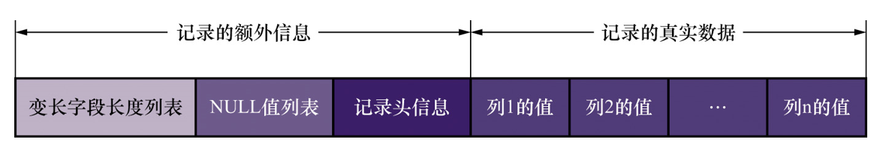
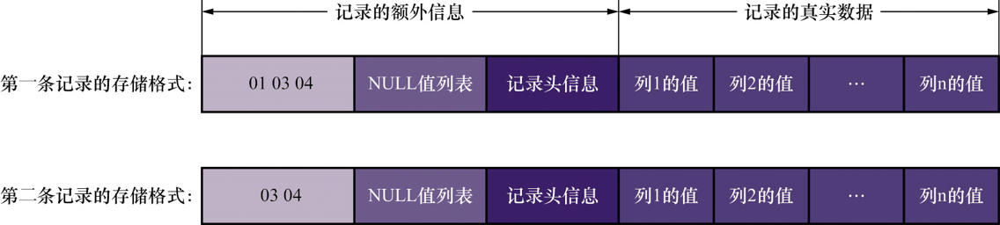
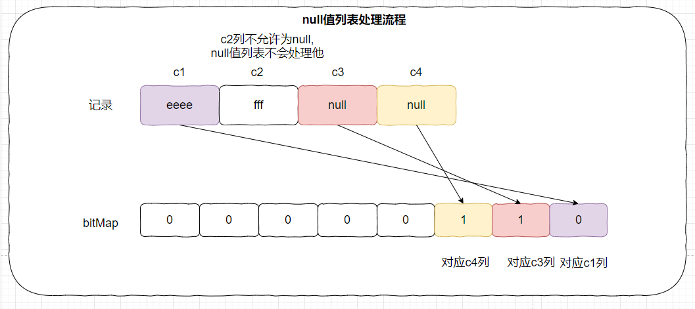
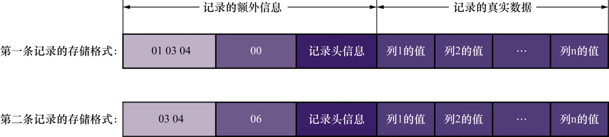
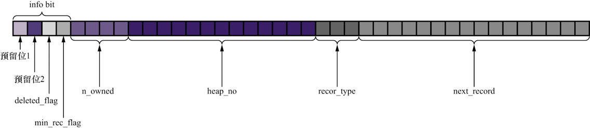
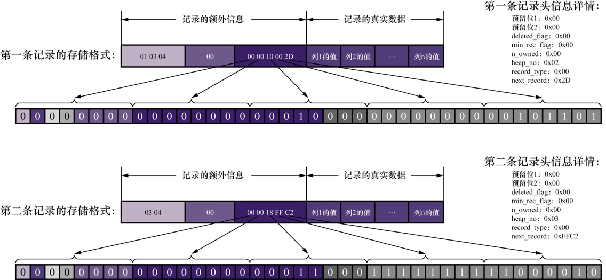
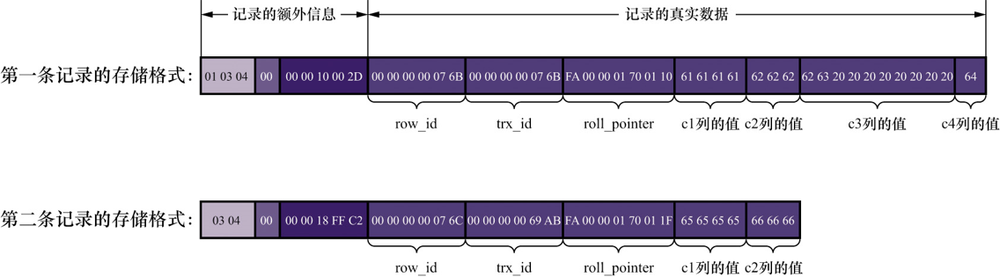
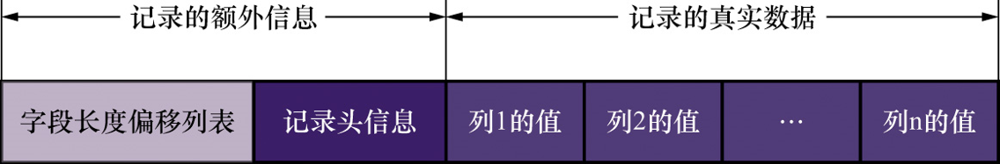
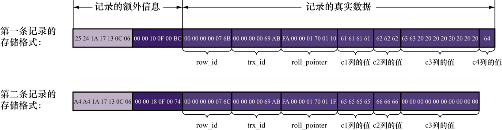
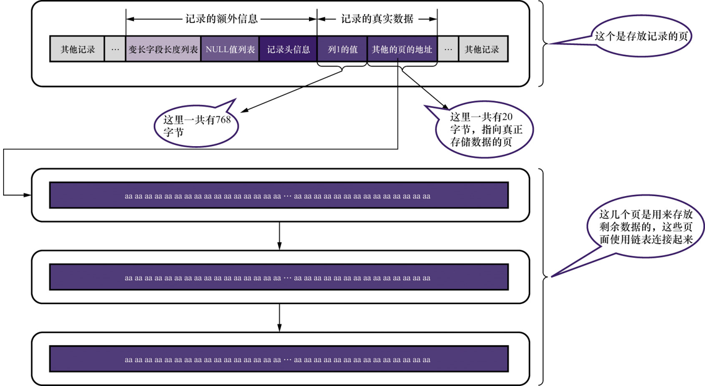

## 4.2 InnoDB页简介:

`InnoDB`引擎是一个将表中的数据存储到磁盘上的存储引擎,也就是说 即使服务器宕机,数据仍然存在于磁盘中.

由于计算机对于数据的处理都是发生内存中,为了提高效率,`InnoDB存储引擎`将数据分成若干页,以页作为磁盘和内存之间交互的基本单位.

`InnoDB`的数据页的大小一般为 `16KB`,也就是说 一次最少从磁盘中读取`16KB`的数据到内存中,一次最少从内存中向磁盘写入`16KB`的数据

> 1. 系统变量`innoDB_page_size`表示 `InnoDB`存储引擎数据页的大小,默认值为 `16384B`
> 2. `innoDB_page_size`变量只能在`mysql`第一次初始化数据目录的时候通过 `mysql --initialize`命令指定.服务器运行过程中并不能被修改

## 4.3 InnoDB行格式:

通常插入数据的时候,都是以一行(一条记录)为单位插入,所以记录在磁盘中存放的形式也被称为 `行格式`或者`记录格式`

`行格式`总共4种: `COMPACT`,`REDUNDANT`,`DYNAMIC`和 `COMPRESSED`.

### 4.3.1 指定行格式的语法:

```sql
-- 建表的时候指定
CREATE TABLE table_name (
	columns...
) ROW_FORMAT=行格式名称;

-- 修改
ALTER TABLE table_name ROW_FORMAT=行格式名称;
```

### 4.3.2 COMPACT行格式:

示例数据:

```sql
CREATE TABLE record_format_demo(
	c1 VARCHAR(10),
	C2 VARCHAR(10) NOT NULL,
	C3 CHAR(10),
    C4 VARCHAR(10)
)CHARSET=ascⅡ ROW_FORMAT=COMPACT;

INSERT INTO record_format_demo(c1,c2,c3,c4) 
values ('aaaa', 'bbb', 'cc', 'd')
	   ('eeee', 'fff', null, null)
```


#### 1. `COMPACT行格式`示意图:



#### 2. 字段解释: 

##### 1. 记录的额外信息: 

这部分是服务器为了更好的管理记录而不得不额外添加的一些信息.

###### 1. 变长字段长度列表: 

存储长度可以变化的字段的真实长度.比如: `VARCHAR`, `VARBINARY`, `TEXT`, `BLOB`类型字段的真实长度.

`COMPACT`行格式中, 所有变长字段真实数据占用的字节数都存放在记录的开头, `各列所占字节数按照列的顺序逆序排列起来`,形成一个变长字段长度列表

<font color=red>变长字段长度列表只记录非null字段真实数据的长度(占用字节数)</font>

**变长字段真实数据占用字节数,使用多少字节表示规则如下:**

假设字符集表示一个字符需要`W字节`, 变长类型`VARCHAR(M)`最多能存放`M个字符`,变长字段内容占用`L字节`.

```java
if M * W > 255 &&　Ｌ > 127{
	// 使用两个字节表示变长字段真实数据占用字节数    
}else{
    // 使用一个字节表示变长字段真实数据占用字节数    
}
```

示例数据第一条记录,变长字段长度列表如下: `示例数据使用的是 ASCⅡ字符集`

| 列名 | 存储内容 | 内容长度(占用字节数) | 内容长度(16进制) |
| ---- | -------- | -------------------- | ---------------- |
| c1   | `aaaa`   | 4                    | 0x04             |
| c2   | `bbb`    | 3                    | 0x06             |
| c4   | `d`      | 1                    | 0x01             |

变长字段长度列表填入之后,示意图:



###### 2. NULL值列表:

由于记录中允许存入`null值`,为了节省空间,`COMPACT`行格式将一条记录中值为`null`的列统一管理,存入`null值列表`中

处理过程:



1. 统计表中允许值为`null`的列名.
2. 如果没有允许值为`null`的列,`null值列表就不存在`,否则将 列从后往前分别对应`bitMap`的一个位置(`bitMap`从第一位开始),当 `bitMap`中元素值为 1表示对应列的值为null,值为0表示对应列的值不为null.
3. 字节填充, `MYSQL`要求`null值列表`必须是 `8b`的整数倍(即 整数)

null值列表填入后,记录结构为:



###### 3. 记录头信息:

`记录头信息`使用`5个字节,40位`表示,用于描述记录的一些属性,不同位记录不同的信息.前4位称为 `info位`



| 名称         | 大小(位) | 意义                                                         |
| ------------ | -------- | ------------------------------------------------------------ |
| 预留位1      | 1        | 没有使用                                                     |
| 预留位2      | 1        | 没有使用                                                     |
| delete_flag  | 1        | 标记记录是否被删除                                           |
| min_rec_flag | 1        | B+树每层非叶子结点中最小的目录项记录都会添加这个标记         |
| n_owned      | 4        | 每页数据都会被分成若干组,每个组都有个组长,组长记录的n_owned值表示该组人员数量 |
| heap_no      | 13       | 表示当前记录在页面堆中的相对位置                             |
| record_type  | 3        | 表示当前记录的类型,0(普通记录),1(B+树非叶子节点的目录项记录),2(Infimum记录),3(Supremum记录) |
| next_record  | 16       | 表示下一条记录的相对位置                                     |

见[字段详解](5_InnoDB数据页结构.md)

**示例数据的记录头信息:**



##### 2. 记录的真实信息:

###### 1. 隐藏字段:

记录的真实信息里面,由于`null值字段`已经被位图映射的方式记录在了null值字段表里面,所以真实信息是不包含null值字段的.

除了一些真实字段数据会被记录在记录的真实信息里面,`MySQL`还会向里面添加几个隐藏字段:

| 列名         | 是否必须 | 占用空间 | 描述                  |
| ------------ | -------- | -------- | --------------------- |
| row_id       | 否       | 6字节    | 行ID,唯一表示一条记录 |
| trx_id       | 是       | 6字节    | 事务ID                |
| roll_pointer | 是       | 7字节    | 回滚指针              |

说明:

1. 这三个真实的名字为 `DB_ROW_ID`,`DB_TRX_ID`,`DB_ROLL_POINTER`

2. `row_id`这个字段不是必须的原因,在`MYSQL`无法使用用户自定义字段为主键的时候才添加.

   `mysql`主键生成策略:

   1. 使用用户指定的主键作为主键
   2. 用户没有指定主键,使用`非null的UNIQUE键`作为主键
   3. 没有`非null的UNIQUE键`,添加隐藏字段`row_id`.

3. 真实信息里面,不会出现null字段

##### 3. CHAR(M)列的存储格式:

- `CHAR(M)`类型数据,在使用定长字符集(比如: `ascⅡ`字符集)的时候,这种类型的字段长度是不会被记录到变长字段长度列表里面.此时变长字段长度列表如图:


- `CHAR(M)`类型字段,在使用变长字符集(比如: `utf8`字符集)的时候,这种类型的字段长度是会记录到变长字段长度列表里面.此时变长字段长度列表如图:

  

  > 采用变长编码字符集的时候,CHAR(M)类型的数据,至少占用M个字节,即哪怕空串该列也会占用M字节

#### 3. 示例数据最终的样子:



### 4.3.3 REDUNDANT行格式:

这种格式在 `MYSQL5.0`之前就在使用了.

#### 1. `REDUNDANT行格式`示意图:



#### 2. 字段解释:

示例数据具体格式:



##### 1. 字段长度偏移列表:

通过字段长度偏移量的差值表示字段的长度,同样是按照字段顺序逆序存放.

##### 2. 记录头信息:

`REDUNDANT行格式`的记录头信息占用6字节(48位)

| 名称            | 大小(位) | 意义                                                         |
| --------------- | -------- | ------------------------------------------------------------ |
| 预留位1         | 1        | 没有使用                                                     |
| 预留位2         | 1        | 没有使用                                                     |
| delete_flag     | 1        | 标记记录是否被删除                                           |
| min_rec_flag    | 1        | B+树每层非叶子结点中最小的目录项记录都会添加这个标记         |
| n_owned         | 4        | 每页数据都会被分成若干组,每个组都有个组长,`组长记录`的n_owned值表示该组人员数量 |
| heap_no         | 13       | 表示当前记录在页面堆中的相对位置                             |
| n_field         | 10       | 记录中列的数量                                               |
| 1byte_offs_flag | 1        | 标记字段长度偏移列表中每个列对应的偏移量是使用1字节还是2字节 |
| next_record     | 16       | 表示下一条记录的相对位置                                     |

##### 3. 1byte_offs_flag如何选择:

```java
int length = 当前记录总长度;
if length <= 127 {
    // 使用一个字节表示,即 1byte_offs_flag = 1
} else {
    // 使用两个字节表示,即 1byte_offs_flag = 0
}
```

说明: 

实际上,当前记录总长度大于127时分成了两种情况: 

- `length > 127 && lenght <= 32767`.
- `length > 32767`. 这种情况下,由于每页只会保存记录前768字节和20字节的溢出页面地址,使用两个字节来表示列的长度偏移量也足够了

为什么总长度大于127就要使用两个字节.

原因是: 每个列长度偏移量值 的第一位是用来记录该列是否为null的.第一位为1表示该列为null,所以 非null列数据偏移量的第一位不能为null,但是此时还需要多余的位来记录偏移量信息,于是只能使用第二个字节了.

##### 4. REDUNDANT行格式null值得处理:

- 对应列偏移量值的第一位是 该列是否为null的标志位,如果第一位为1,则表示该列为null
- 如果值为null的列是定长类型的,则真实数据部分也会为其开辟空间,然后使用0值填充
- 如果值为null的列是变长类型的,则真实数据部分不会为其开辟空间

##### 5. CHAR(M)的处理:

`REDUNDANT行格式`在处理CHAR(M)类型字段的时候,固定使用 对应字符集表示一个字符最多需要的字节数* M 表示该字段所占用的空间.

### 4.3.4 溢出列:

示例数据:

```sql
CREATE TABLE off_page_demo(
	c VARCHAR(65532)
)CHARSET=utf8 ROW_FORMAT=COMPACT;
-- REPEAT('a',65532)表示a重复65532次
INSERT INTO off_page_demo (c) VLAUES (REPEAT('a',65532))
```

#### 1. 溢出列:

在`COMPACT`和`REDUNDANT`行格式中如果某个列占用的字节数非常多,那么在该记录的真实数据处只会存储真实数据的前768字节和 存放其余数据的溢出页的地址(占20字节)




#### 2. 产生溢出页的临界点:

`Mysql`规定正常页面至少要存放两条记录,溢出页没有这个规定

`Mysql页空间的分配`:

- 除了记录以外的额外信息,占用132字节
- 每条记录的额外信息是 27字节
  - 2字节用于存放真实数据的长度
  - 1字节存放列是否为null
  - 5字节存放记录头信息
  - 6字节的row_id列信息
  - 6字节的trx_id列信息
  - 7字节的roll_pointer列

如果假设一个单列记录真实数据的字节数为n,如果该列不发生溢出现象,n应该满足:  `132 + 2* (27*n) <= 16384 `,也就是说单列记录不发生溢出现象的最大长度为 8099字节.

### 4.3.5 DYNAMIC COMPRESSED

`MySQL5.7版本`默认的行格式为 `DYNAMIC`:

这两个行格式和`COMPACT`格式基本相同,只是处理溢出列上不同: 不会存储溢出列真实数据的前768字节,而是将所有真实数据都存放在溢出页中,在真实数据部分只会存放溢出页的地址.

COMPRESSED行格式会采用压缩算法对页面进行压缩,以节省空间.DYNAMIC行格式不会压缩页面.

