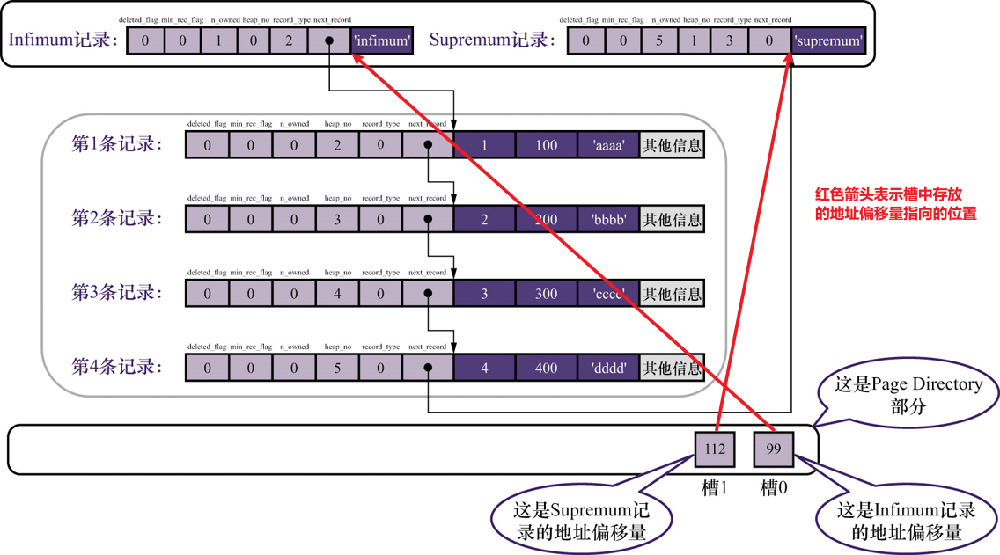

## 5.1 不同类型的页简介:

页是`InnoDB存储引擎`管理存储空间的基本单位, 一个页的基本单位是16KB.

InnoDB为了不同目的而设计了多种不同类型的页,比如:  `存放表空间头部信息的页`, `存放change buffer 信息的页`,`存放INODE信息的页`,`存放undo日志信息的页`等等

本章节主要是介绍`存放表中记录的页`,官方称之为 : `索引页index`,为了方便理解 称之为 `数据页`.

## 5.2 数据页结构简介:

`Mysql`将数据页这块16KB大小的存储空间大致被划分成了 7个部分,不同部分有不同的功能.  如图所示: 


各部分大致存储什么内容,如下表所示:

| 名称             | 中文名                   | 占用空间(字节) | 功能概述               |
| ---------------- | ------------------------ | -------------- | ---------------------- |
| File Header      | 文件头部                 | 38             | 页的通用信息           |
| Page Header      | 页面头部                 | 56             | 数据页的专有信息       |
| Infimum+Supremum | 页面中最小记录和最大记录 | 26             | 两个虚拟记录           |
| User Record      | 用户记录                 | 不确定         | 用户存放的记录         |
| Free Space       | 空闲空间                 | 不确定         | 页中尚未使用的空间     |
| Page Directory   | 页目录                   | 不确定         | 页中某些记录的相对位置 |
| File Trailer     | 文件尾部                 | 8              | 校验页是否完整         |

## 5.3 记录在页中的存储:

在数据页的7个部分中,用户自己存入的记录会按照指定的行格式存储到`User Records`部分中.

在数据页生成的时候实际上是没有`User Records`这部分的,每当一条数据插入进来的时候,就会去`Free Space`部分申请记录需要的空间,然后与之前的`User Records`合并.当`Free Space`使用完之后就会去申请新的数据页.

数据存入大致流程:


**示例数据:**

```sql
CREATE TABLE page_demo (
	c1 INT,
	c2 INT,
    c3 VARCHAR(10000),
    PRIMARY KEY(c1)
)CHARSET=ascii ROW_FORMART=COMPACT;

INSERT INTO page_demo VALUES(1,100,'aaaa'),(2,200,'bbbb'),(3,300,'cccc'),(4,400,'dddd');
```

`COMPACT`行格式中,`记录头信息`包含以下内容:

| 名称         | 大小(位) | 意义                                                         |
| ------------ | -------- | ------------------------------------------------------------ |
| 预留位1      | 1        | 没有使用                                                     |
| 预留位2      | 1        | 没有使用                                                     |
| delete_flag  | 1        | 标记记录是否被删除                                           |
| min_rec_flag | 1        | B+树每层非叶子结点中最小的目录项记录都会添加这个标记         |
| n_owned      | 4        | 每页数据都会被分成若干组,每个组都有个组长,组长记录的n_owned值表示该组人员数量 |
| heap_no      | 13       | 表示当前记录在页面堆中的相对位置                             |
| record_type  | 3        | 表示当前记录的类型,0(普通记录),1(B+树非叶子节点的目录项记录),2(Infimum记录),3(Supremum记录) |
| next_record  | 16       | 表示下一条记录的相对位置                                     |

为了屏蔽干扰,后续示例数据行格式图都只给出`记录头信息`和`数据真实部分`,如图:


向`page_demo`表插入四条数据之后,`User Records`部分如图所示: 


<font color=red>**从上图可以看出来,记录在数据页中是按照主键大小依次排列紧挨着排列的** </font>

### 5.3.1 记录头信息各个字段的含义:

#### 1. delete_flag: 

`delete_flag`: 是用于标记该记录是否被删除,占用1位, `值为0表示记录没有被删除`,值 为1表示记录被删除.

`MySQL`在删除数据的时候,实际上采用了`逻辑删除`的思想, 通过标记位标记记录是否被删除,当有新记录要插入进来的时候,复用这些被删除记录占用的空间,而不是将数据从磁盘中删除掉,然后对所有记录按照主键进行重排序.这样做的好处是<font color=#green>**避免了重排序和空间开辟的性能消耗,又不浪费空间** </font>.

被删除的数据还会通过记录头中的`next_record`将当前页中被删除的记录形成一个链表.

#### 2. min_rec_flag:

`min_rec_flag`: B+树每层非叶子结点中的最小的目录项记录都会添加这个标记.

#### 3. o_owned:

`o_owned`: `Mysql`会将数据页中的记录按照一定的规则分成多个小组,每个小组中主键值最大的记录就是组长,只有组长的记录头信息中的`o_owned`字段记录着这个分组中有多少个成员(包括组长).

#### 4. heap_no:

记录在数据页中真实的情况是按照主键大小紧密无间的排列,`MySQL`将这种结构称为 `heap堆`.

`heap_no字段`: 表示记录在堆中的编号,即堆中第几条记录.

两个特殊的记录:


- `Infimum记录`: `MySQL`自动给数据页中插入的`Mysql规定的当前页`最小的记录. <font color=yellow>**并且`MySQL`**规定** `Infimum记录`记录头信息中`heap_no字段值为0`,`next_record`永远指向用户自己添加的记录中主键最小的那一条记录.** </font>
- `Supremum记录`: `MySQL`自动给数据页中插入的`MySQL规定的当前页面`最大的记录.<font color=yellow>**并且`MySQL`**规定**,`Supremum记录`记录头信息中`heap_no字段的值为1`, 用户自己添加的记录中主键最大的那一条记录的`next_record`永远指向`Supremum记录`** </font>

> 1. 这两条特殊记录共同组成了数据页中`Infimum+Spremium`部分
> 2. 对于一条完整的记录来说,比较记录的大小就是比较主键的大小. 一条完整的记录,一条完整的记录,一条完整的记录

用户自己插入的记录是普通记录,普通记录根据记录的大小从2开始递增作为其记录头信息`heap_no字段`的值.

<font color=red>** `heap_no字段`因为是表示记录在堆中的编号,一旦在分配了之后就不会改变,哪怕那条记录被删除了** </font>

#### 5. record_type:

`record_type`: 表示当前记录的类型.`MySQL`中一共4中类型 --- 0表示普通类型,1表示B+树非叶子结点的目录项记录,2表示Infimum记录,3表示Supremum记录.

#### 6. next_record:

`next_record`: 表示当前记录的真实数据到下一条记录的真实数据的距离.

`next_record`值的符号表示方向,如果值为负数表示下一条记录的真实数据在当前记录真实数据的前面,如果值为整数,表示下一条记录的真实数据在当前记录的真实数据的后面.


为什么`next_word`表示的是 到下一条记录真实数据的距离,而不是下一条记录开始的位置?

因为`next_record`指向这里刚刚好,向前就是记录的头信息,向后就是记录的真实数据,而且行格式中,`变长字段列表`和`null值列表`都是按照逆序存放的,这样可以使记录中位置靠前的字段和他们对应的字段长度信息在内存中的距离更近,可能会提高高速缓存的命中率

## 5.4 Page Directory:

由于`Mysql`中的记录是按照主键值从小到大排列的,通过记录头信息中`next_record`字段可以定位到下一个记录,从而形成一个单向链表,单向链表在查找的时候效率不高,于是`Mysql`通过目录的形式快速定位某个区间,然后逐一去排查的方式来快输定位.

### 5.4.1 实现过程如下:

1. 将所有记录(包含: `Infimum`和`Spremum`)划分成多个小组.

2. 因为每个记录都是按照主键值从小到大依次排列,将小组中最后一条记录选为目录项(即组长),在其记录头信息的`o_owned`字段中记录该小组有多少条记录

3. 将目录项在页面中的地址偏移量(就是该记录的真实数据与页面第0个字节之间的距离),单独提取出来,按在分组的先后顺序从最靠近页尾部的地方开始存放起来.存放目录项地址偏移量的地方被称为`槽`,是一个2字节大小的空间.

4. 这些槽构成页面中的`Page Directory`部分.

   > 对于小组,`mysql`规定: 
   >
   > 1. `Infimum`记录,单独为一个小组,即 `Infimum`记录所在的小组只能有一条记录
   > 2. `Spremum`记录所在的小组记录条数只能在 `1~8`条之间
   > 3. 其他小组记录条数只能在`4~8`条之间
   >
   > 关于槽:
   >
   > - 槽的顺序: 分组的时候先从主键值小的记录开始向后分,槽表示的记录越小就越靠近`File Tailer`部分
   > - 槽如何排列的: `Page Directory`部分实际上就是一个`指针数组`,数组中的元素连续分布. 
   >
   > 为什么槽只需要两个字节:
   >
   > 因为页面大小为16KB,范围在`0 ~ 16384`字节之间,2个字节可以表示的范围在 `0 ~ 65535`之间,所以两个字节够了.



### 5.4.2 分组的过程:

1. 数据页在还没有插入记录的时候,实际上只有两个分组,一个 `Infimum`代表的分组和`Spremum`代表的分组.

   页目录也只有两个槽,分别指向`Infimum`和`Spremum`的真实数据开始的位置.

2. 之后每插入一个记录都会从页目录中找到槽指向记录的主键值比待插入主键值大但是差值最小的槽.然后将槽指向记录的记录头信息中`o_owned`字段+1,表示本组新增一条记录,直到该组中记录数等于8个.

3. 当小组中记录数目等于8个的时候,再向组内插入记录,该组就会分裂成两个小组,一个组4个一个组5个元素.然后给新增的小组分配一个新的槽位,来记录新增小组中组长真实数据的地址偏移量.

### 5.4.3 查找演示:

示例数据:

```sql
Insert into page_demo values(1,100,'aaaa'),(2,200,'bbbb'),(3,300,'cccc'),(4,400,'dddd'),(5,500,'eeee'),(6,600,'ffff'),(7,700,'gggg'),(8,800,'hhhh'),(9,900,'iiii'),(10,1000,'jjjj'),(11,1100,'kkkk'),(12,1200,'llll'),(13,1300,'mmmm'),(14,1400,'nnnn'),(15,1500,'oooo'),
(16,1600,'pppp')
```

假设目前分组如图:


现在想要查找主键值为6的元素,因为`Page Directory`实际上就是个指针数组,并且指向的值还是按照大小逆序的,所以可以使用2分发查找:

1. 计算中间槽位: (0+４)／2 = 2,槽2指向记录的主键值为8,比6大,所以要查找的6在槽2的前面.调整high=2,low不变
2. 重新计算中间槽位: (0+2)/2 =1,槽1指向记录的主键值为4,比6小,所以要查找的6在槽1的后面.
3. 此时high-low=1,表示中间没有槽位了,所以主键为6的记录应该是在槽2对应的小组里面.由于记录在数据页中是按照主键从小到大依次根据`next_record`形成的一条单向链表,虽然知道槽2对应分组最大的记录但是也无法从其找到需要的记录,所以应该从槽1指向的记录通过`next_record`开始遍历找到需要的记录.

## 5.5 Page Header:

`Page Header`主要是用来存储数据页中记录的状态信息的,比如: 数据页已经存了多少条记录,`Free Space`在页中的偏移量,页目录中存储了多少个槽位等.固定`56字节`.

**Page Header 各部分及作用:**

| 状态名称          | 占用空间(字节) | 作用                                                         |
| ----------------- | -------------- | ------------------------------------------------------------ |
| PAGE_N_DIR_SLOTS  | 2              | 页目录中槽的数量                                             |
| PAGE_HEAP_TOP     | 2              | 当前Free Space开始的地址                                     |
| PAGE_N_HEAP       | 2              | 第一位表示本页记录是否为紧凑型记录,其余位本页堆中记录的数量(包含Infimum,Supremum,被标记为`已删除`的记录) |
| PAGE_FREE         | 2              | 表示的是 `已删除记录`形成的单向链表中头结点记录在页面的偏移量. |
| PAGE_GARBAGE      | 2              | `已删除记录`占用的字节数                                     |
| PAGE_LAST_INSERT  | 2              | 最后插入的记录的位置                                         |
| PAGE_DIRECTION    | 2              | 记录插入的方向                                               |
| PAGE_N_DIRECTION  | 2              | 一个方向连续插入记录的数量                                   |
| PAGE_N_RECS       | 2              | 本页用户记录数量(不含: `Infimum`,`Supremum` 以及 `已删除记录`) |
| PAGE_MAX_TRX_ID   | 8              | 本页最大的事务id,这个值仅在二级索引页面中定义                |
| PAGE_LEVEL        | 2              | 本页在B+树中所处的层级                                       |
| PAGE_INDEX_ID     | 8              | 索引ID,表示当前页属于哪个索引                                |
| PAGE_BTR_SEG_LEAF | 10             | B+树叶子结点段的头部信息,仅在B+树的根页面中定义              |
| PAGE_BTR_SEG_TOP  | 10             | B+树非叶子结点段的头部信息,仅在B+树的根页面中定义            |

> 1. `PAGE_DIRECTION`: 待插入记录的主键值比上一条记录的主键值大,则 待插入记录的插入方向就是右边,否则为左边.`PAGE_DIRECTION`就是记录这个方向
> 2. `PAGE_N_DIRECTION` : 如果连续插入几条记录`PAGE_DIRECTION`都是一样的,`Mysql`就会记录沿着同一个方向插入的记录条数.如果如果方向改变`PAGE_N_DIRECTION`就会被清零重新统计

## 5.6 File Header:

`File Header`通用于个类型的页,它描述一些通用于各种页的信息,比如本页编号,上一页,下一页等,固定占用`38字节`

**File Header**各部分及其作用:

| 状态名称                         | 占用空间大小(字节) | 描述                                                         |
| -------------------------------- | ------------------ | ------------------------------------------------------------ |
| FIL_PAGE_SPACE_OR_CHKSUM         | 4                  | 本页校验和                                                   |
| FIL_PAGH_OFFSET                  | 4                  | 页号                                                         |
| FIL_PAGE_PREV                    | 4                  | 上一页的页号                                                 |
| FIL_PAGE_NEXT                    | 4                  | 下一页的页号                                                 |
| FIL_PAGE_LSN                     | 8                  | 本页被最后修改时对应的LSN(Log Sequence Number,日志序列号)    |
| FIL_PAGE_TYPE                    | 2                  | 本页类型                                                     |
| FIL_PAGE_FILE_FLSH_LSN           | 8                  | 仅在系统表空间的第一个页中定义,表示文件至少被刷新到了对应的LSN |
| FIL_PAGE_ARCH_LOG_NO_OR_SPACE_ID | 4                  | 页属于哪个表空间                                             |

- `FIL_PAGH_OFFSET`: 页的唯一标识,`MySQL`通过页号唯一确定一个页

- `FIL_PAGE_NEXT`和`FIL_PAGE_PREV`: 由于一张表可能存储成千上万条数据,所以肯定无法分配连续的空间来存储,那么就需要将一张表的数据页关联起来.`MySQL`就是通过`FIL_PAGE_NEXT`和`FIL_PAGE_PREV`分别指向下一页和上一页,以页为结点形成一个双向链表.

  

**页的类型:**

| 类型                    | 16进制 | 含义                    |
| ----------------------- | ------ | ----------------------- |
| FIL_PAGE_TYPE_ALLOCATED | 0x0000 | 刚分配还未使用          |
| FIL_PAGE_UNDO_LOG       | 0x0002 | undo日志页              |
| FIL_PAGE_INODE          | 0x0003 | 存储段的信息            |
| FIL_PAGE_IBUF_FREE_LIST | 0x0004 | Change buffer空闲列表   |
| FIL_PAGE_IBUF_BITMAP    | 0x0005 | Change Buffer的一些属性 |
| FIL_PAGE_TYPE_SYS       | 0x0006 | 存储一些系统数据        |
| FIL_PAGE_TYPE_TRX_SYS   | 0x0007 | 事务的系统数据          |
| FIL_PAGE_TYPE_FSP_HDR   | 0x0008 | 表空间的头部信息        |
| FIL_PAGE_TYPE_XDES      | 0x0009 | 存储区的一些属性        |
| FIL_PAGE_TYPE_BLOB      | 0x000A | 溢出页                  |
| FIL_PAGE_INDEX          | 0x45BF | 索引页(即数据页)        |

## 5.7 File Trailer:

`File Trailer`: 由于数据操作实际上都是在内存中,操作完成之后需要将结果刷新到磁盘里面去,为了防止数据没有被完全刷新的情况,`Mysql`通过`File Trailer`来校验一个数据页是否是完整的.`File Trailer`通用于所有类型的页,由`8字节`组成:

- `前四字节`表示页的校验和: 这部分与`File Header`中的校验和是相对应的. 每当一个页在内存中操作完成,写回磁盘的时候都是先写`File Header`,在最后校验和也会被写入到`File Trailer`.如果写回磁盘的过程中,出现了只写了`File Header`中的校验和,没来得及写`FIle Trailer`中的校验和,那么就会出现在校验的时候`File Header`中的校验和是新的,而`File Trailer`中的校验和是旧的,导致出现问题
- `后四字节`表示页面被修改时对应的LSN的后四字节,正常情况下,`File Header`的`FILE_PAGE_LSN`字段的后四字节相同.

