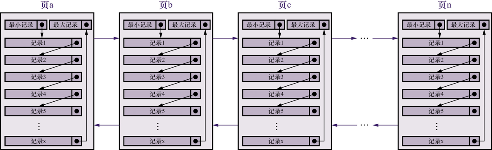

前面说过,每页都有一个`page directory`作为页中记录的目录,可以通过二分法快速定位页中某条记录,现在可以快速定位页中的记录了,但是如何定位到页就成了问题,索引就是解决这个问题的

## 6.1 没有索引如何查找

### 6.1.1 在页中查找:

在页中查找一般是分为两种情况:

- 以主键为搜索条件: 页目录中的槽快速定位某个主键,然后根据主键去快速定位某条记录
- 以其他列作为条件: 对非主键列的查找无法通过页目录中的槽定位主键,只能从`Infimum`开始一个一个的遍历.

在很多页中查找:

在很多页中查找首先需要定位数据在那一页,然后才能在数据页中查找到数据.如果没有引入索引的话,无论是以主键为条件,或者以其他列为条件都无法快速定位数据在那一页,只能从第一页开始沿着双端链表逐一遍历.

## 6.2 索引:

### 6.2.1 一个简易的索引方案:

为了演示效果,数据示意图将会以下面的形式出现:

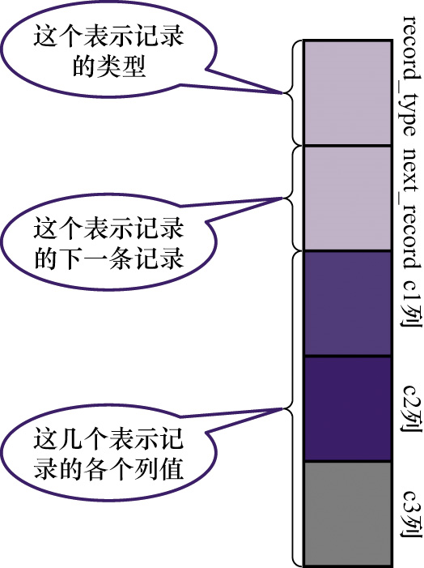

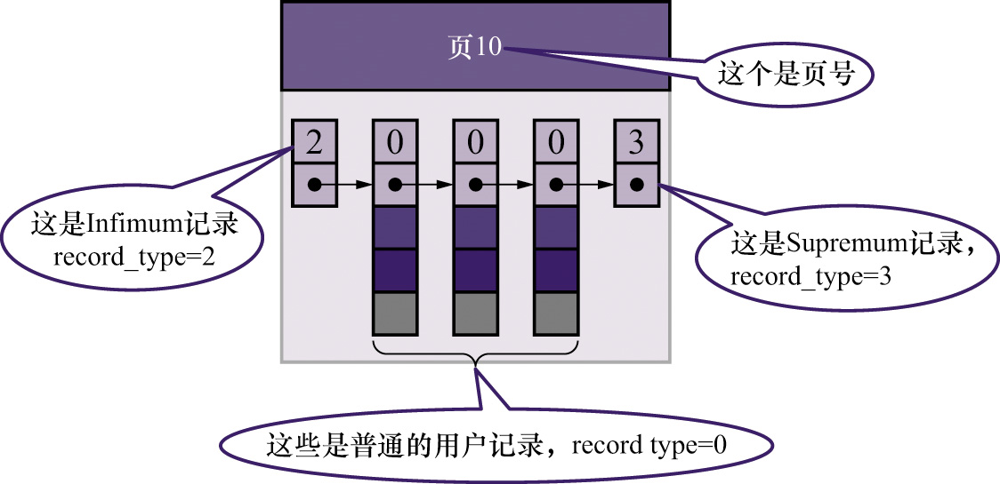

示例数据:

```sql
CREATE TABLE `index_demo`(
	c1 INT,
    C2 INT,
    C3 char(1),
    PRIMERY KEY(c1)
)

Insert into `index_demo` VALUES (1,4,'U'),(3,9,'D'),(5,3,'Y')
insert into `index_demo` values(4,4,'a')
```

为了演示效果,假设一个数据页中只能存放3条数据,大于3条就要开辟新的页来存放数据. 所以在插入上面三条记录之后,在页面中已经形成一条单向链表,且已经满了在执行第二条插入语句的时候,就会形成下面这种情况:

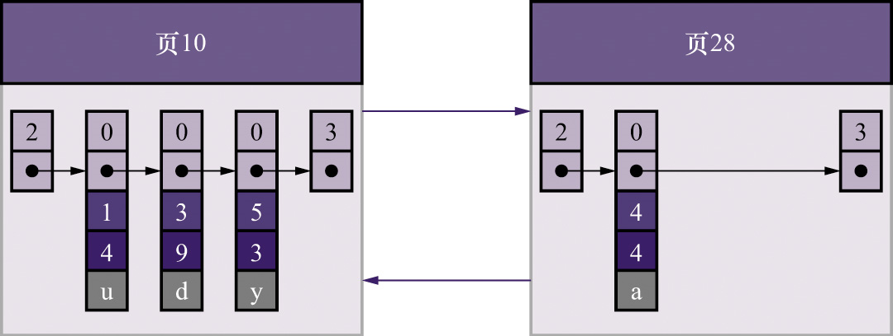

>1. 新生成的页号为什么是28? 因为在磁盘中多次申请磁盘空间可能不是连续的,因此页号页可能不是连续的
>2. `Mysql`规定页号大的数据页中数据主键值要比页号小的数据页中数据主键值大,否则就需要将不满足要求的数据与旧数据页中满足要求的数据进行交换

为了满足页 号大的数据页中数据主键值要比页号小的数据页中数据主键值大,交换的过程如下:

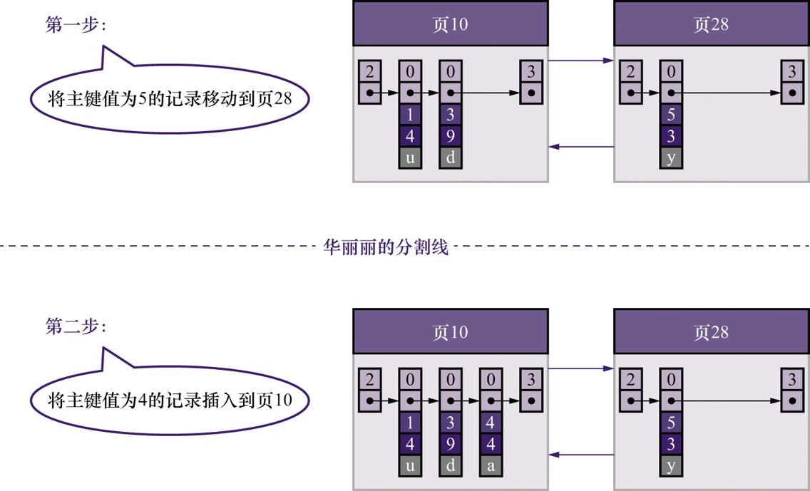

多次向 `index_demo`表中插入数据之后,如图:

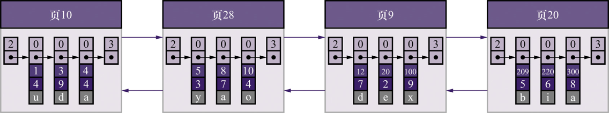

由于数据页之间是一个双端链表的结构,想要定位数据页只能逐一遍历,为了提高定位数据的效率,给数据页建立对应的目录,每个目录包含下列两部分:

- 页的用户记录中最小的主键值,用 `key` 来表示;
- 页号,用 `page_no` 表示

加上目录后如图:

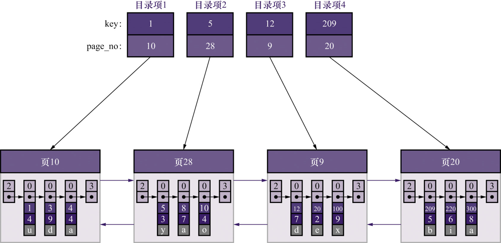

为了能够像`page directory`中访问槽一样的访问, 数据页的目录项, 我们需要将这些目录项在`物理存储器`上连续存储.这个时候在`多页中定位数据的步骤`为:

- 先从根据二分法快速定位目录项,从而找到记录所在的数据页
- 然后去数据页中找数据

### 6.2.2 InnoDB中索引方案:

上面说到为了快速定位数据页从而给数据页的搞了一个目录项,并且要求目录项在物理存储中是可以连续存放的,但是会出现两个问题:

- `InnoDB`使用页作为管理存储空间的基本单位,即 最多只能保证16KB的连续空间来存放数据. 如果记录数量一旦特别多,所有的目录项连续存储可能会出现问题
- 我们可能会经常对数据进行增删改操作,如果某个页面中的数据都删除了,那么该页也没有存在的必要了,就意味着存放目录项的连续空间需要把之后的目录项都向前移动一下.太影响效率

`MySQL`对于这一问题的解决方案是 复用存储用户记录的数据页来存储目录项,将目录项当成用户记录分页存储(`只不过将用户记录换成了只有主键列和页号列的目录项`),以保证目录向是连续的,在每一页中同样会按照目录向记录中的主键值进行排列.

为了区分目录项和用户记录, `Mysql`将目录项统称为`目录项记录`,即 在记录头信息中`record_type`字段的值设置为1.

将目录项记录存放进数据页中之后,整个结构如图:

 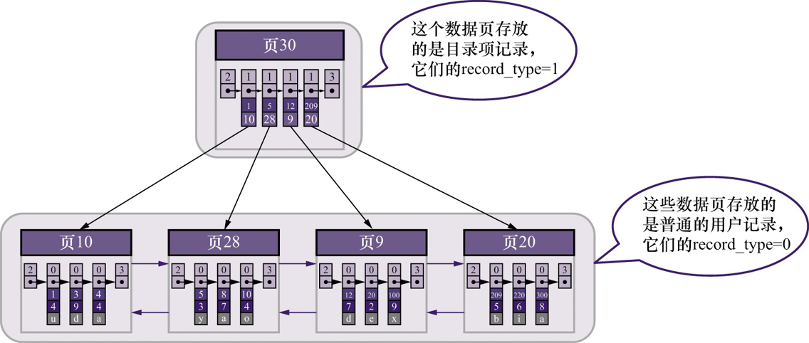

<font color=red>目录项记录和用户记录的区别与联系:</font>

- 区别:
  - 目录项记录头的`record_type`值为1,用户记录记录头的`record_type`值为0.
  - 目录记录只有索引列和页编号两列,用户记录可能有多个列(`用户自定义列`,`mysql添加的隐藏列`)
  - 每页目录记录中最小的那一条记录的记录头信息中`min_rec_flag`字段值为1.用户记录记录头`min_rec_flag`字段值为0
- 联系:
  - 除了上面几点不同之外,其余的性质并没有区别.使用的是一样的数据页,`页面类型都在FILE HEADER中,值为 0x45BF`,页的结构也是一样的,主键同样会生成对应的页目录.

> 目录记录的真实数据只会存放两个值, 一个是索引列的值,一个是页码

有了目录项记录的数据页之后,举个查询主键为20的记录的例子,此时查询的过程为:

- 在存放`目录项记录`的数据页中通过`页目录`定位到具体的目录项记录,然后根据目录项记录中的数据页页码,找到对应存放`用户记录`的数据页(即9页)
- 再到9页中通过`页目录`定位到主键为20的记录,完成查找.

一旦目录项多了超出了页面能存放的范围,就会像用户记录一样申请新的数据页来存放目录项,`多个存放目录项的数据页的结构如图`:

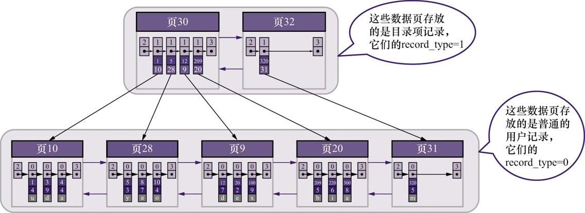

如果存放目录项的数据也变得非常多了,`Mysql`就会为这些存放目录项的数据页,创建他们对应的目录项,生成一个更高级的目录,以此类推逐渐形成一颗树一样的结构 ---- 这就是`B+`树结构.

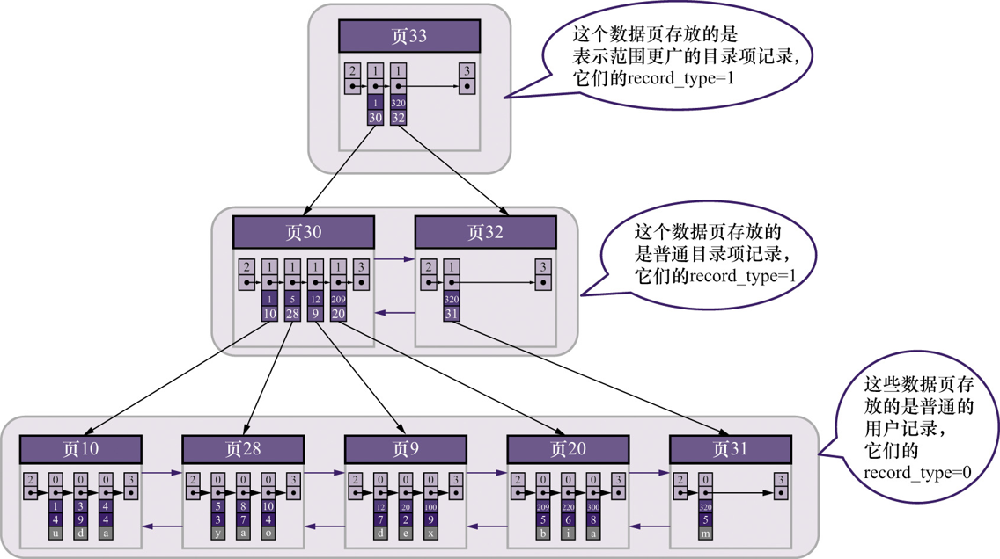

**B+树,示意图:**

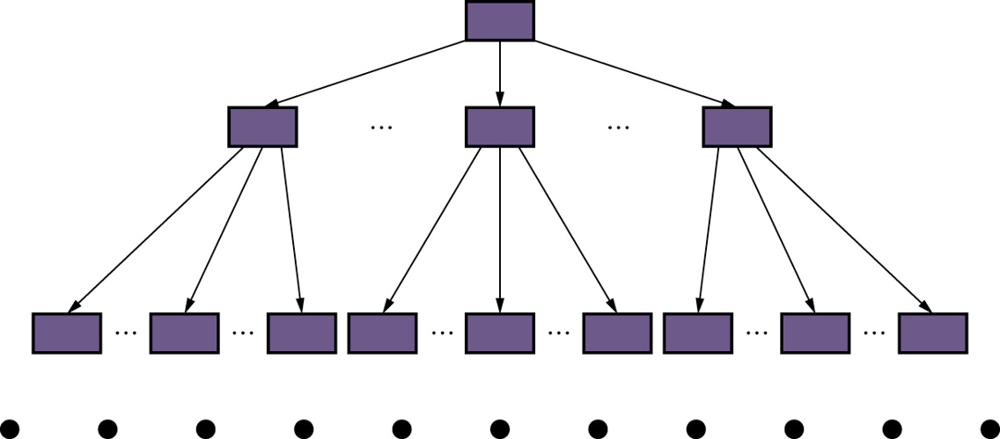

> `mysql`规定B+树的叶子结点为0层,之后逐渐+1.

假设一个数据页能够存放10条用户记录,所存放目录项记录的数据页能够存放1000条,那么B+树每层存储数据数量为:

- 如果B+树只有1层,也就只有1个数据页,那么只能存储100条
- 如果B+树有2层,那么记录数为 1000 * 100 = 100,000条
- 如果B+树有3层,那么记录数为 1000 * 1000 * 100 = 100,000,000条
- 如果B+树有4层,那么记录数为 1000 * 1000 * 1000 * 100 = 100,000,000,000条

可以发现B+树4层就能够存储很多的数据,`mysql`在日常使用中B+树的层数是不会超过4层的,也就是只需要去4个数据页(3个目录项数据页,1个用户记录数据页)中就能够找到指定数据(`要以主键为条件`)

#### 1. 聚簇索引:

前面介绍的以主键大小来排序的B+树本身就是一个目录,或者本身就是一个索引,具有以下特点:

- 使用记录主键值的大小进行记录和页的排序:
  - 数据页中的任何记录都是按照主键值的大小顺序排成一个单向链表,页内记录被分成若干组,每个组里中主键值最大的记录的偏移量当做目录存放页`页目录`的槽里面
  - 存放记录的数据页也是按照页中记录的主键大小顺序排成一个双向链表
  - 存放目录记录的数据页分为不同层级,在同一层级的页也是按照页中目录记录的主键大小排成一个双端链表
- B+树的叶子结点存放的是 `完整的用户记录`(完整的用户记录是指: 这个记录中存储了所有列的值,包括隐藏列).

具有这两个特点的索引就是`聚簇索引`,`InnoDB`默认就是聚簇索引.并且在`InnoDB`中聚簇索引就是数据的存储方式(`所有用户数据存放于叶子结点中`), 即`索引即数据,数据即索引`

#### 2. 二级索引:

当我们不以主键为索引创建出来的索引,具有以下特点:

- 以普通列x的大小为记录和页的排序依据:
  - 页内记录都是按照x值的大小顺序形成单链表,记录被分成多个小组,将组内x值最大的记录的偏移量存放在`页目录`中.
  - 每个数据页都是按照x值的大小顺序形成一个双向链表
  - 存放目录项的数据页都会按照目录项记录中索引列的值大小顺序形成一个双向链表
- B+树的叶子结点存放的并不是完整的用户记录,真实的数据部分只有两个值,一个是索引列的值,一个是主键列的值.

具有以上特点的索引就是 `二级索引`. `二级索引`是一个新的B+树,并不是主键形成的B+树,也就是说每个`二级索引`都是一颗B+树.

`二级索引`的查找过程:

1. 根据索引值快速定位到索引值所在的非叶子节点,如果该叶子结点没有满足条件的`不完整的用户记录`,就会沿着双向链表去下一个叶子结点中找是否有满足索引条件的用户记录

2. 在非叶子结点中找到了符合条件的用户记录, 就会根据主键值去主键形成的聚簇索引中查找到`完整的用户记录`

3. 如果`二级索引`没有唯一性的约束,那么在主键聚簇索引中找到了一条`完整的记录`后还要回到`二级索引`中沿着叶子结点形成的双向链表中继续寻找下一个满足搜索条件的`不完整记录`,然后再一次去主键聚簇索引中查找,以此往复.

   > 根据`二级索引`非叶子节点中`不完整的用户记录`存储的主键值去主键聚簇索引中查找`完整用户记录`的过程 称为 `回表`.

#### 3. 联合索引:

`联合索引`本质上也就是一个`二级索引`

处理可以使用单列作为索引,还可以使用多个列作为索引,不过他们之间是有排序优先级的,比如(a,b)这样的联合索引,会先以a为标准排序,如果a相同才会以b为标准进行排序.

以示例数据来讲: 按照(c2,c3)构成的联合索引,如图

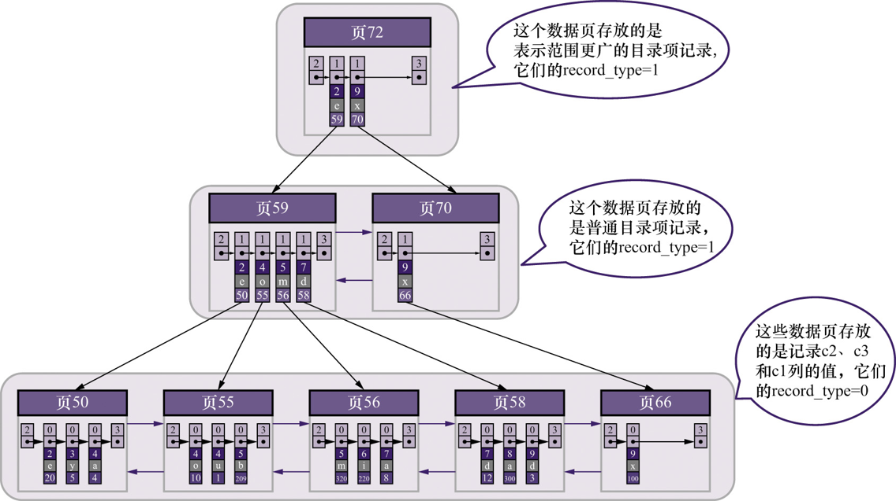

说明:

- 联合索引的每条目录项的真实数据部分都包含 c2,c3, 页号这三个数据.
- c2先排序,c2相同再比较c3
- 联合索引叶子结点中用户记录的真实数据部分包含 c2,c3 ,主键值这三个数据
- 联合索引只会建立一个B+树,而不是创建多个B+树

### 6.2.3 B+树索引注意事项:

#### 1. 根页面永远不动:

B+树的形成过程:

1. 为每个表创建B+树索引的时候, 最开是都会创建一个根节点页面.最开始没有数据的时候,根节点页面是什么都没有的
2. 随后插入数据的过程中,先向根页面中插入数据.
3. 当根页面中的可用空间使用完了,就会将根节点中所有数据复制到新分配的页面a中,然后对这个新页面进行页分裂作用,得到另一个页面b.然后将新插入数据按照主键值插入到页面a或者页面b中.`根结点升级为存储目录项的目录页面`.

> 从整个过程来看,根节点变化的只是页面内的数据,根节点在创建之后页码就不会变化.页号会被记录下来,然后当`mysql`需要使用这个索引的时候,就会查询出对应索引根节点的页号,然后进行操作.

#### 2. 非叶子节点中目录项的唯一性:

前面简单的将`二级索引`认为是 `索引列 + 页号`的搭配,但是会出现下面这个问题:

以示例数据 c2列为索引的时候,会形成下图所示的索引:

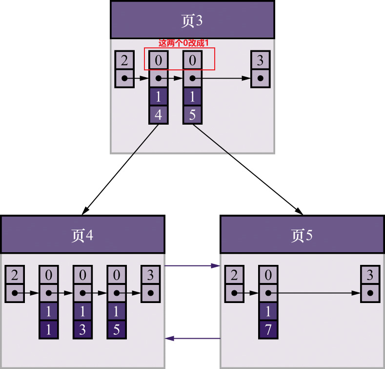

当插入新数据 (9,1,c)的时候, 会发现根节点中所有的目录向索引列的值都是一样的,这样就无法定位新插入数据应该插入页4还是页5.

实际上`二级索引`的目录项还是会将`主键存储下来`,用于处理上面这个问题. 即当索引列相同的时候,比较主键从而决定记录的大小.所有的二级索引都是这样的,哪怕是`UNIQUE`类型的二级索引,也是这样的(因为`UNIQUE列可能出现多个null值`,或者多条记录键值相同的情况`MVCC`)

#### 3. 一个页面至少容纳两条数据:

主要是为了避免B+树层级增长过高.

### 6.2.4 MyISAM索引方案简介:

MyISAM的索引方案与InnoDB的索引方案,最大的区别就是

- MyISAM中索引和数据分开存储,即 `索引是索引,数据是数据`
- InnoDB中索引和数据是存储在一起的,即 `索引即数据,数据即索引`

MyISAM索引方案主要包含两部分:

- 数据文件: 将表中的记录按照记录插入的顺序单独存储在一个文件中, 这个文件就称为`数据文件`.

  数据文件并不划分如同`InnoDB`中数据页一样的结构,而是来多少数据就往数据文件中存多少数据.

  MyISAM中数据在数据文件中是不会按照主键大小顺序排列的,而是按照插入的顺序排列.

  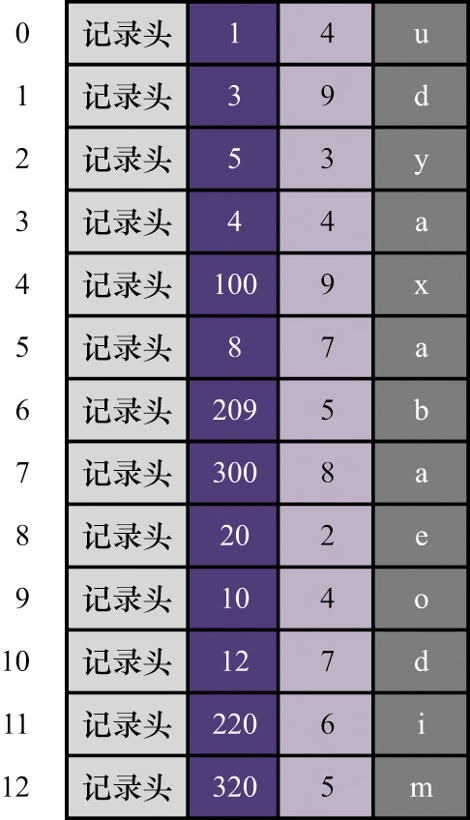

- 索引文件: MyISAM会把索引信息单独存放到一个文件中,这个文件称为`索引文件`.

- 主键索引: MyISAM会为主键单独创建一个索引,但是主键索引叶子结点中用户记录存放的`不再是完整的用户记录`,而是主键值与行号

- 非主键索引: MyISAM也可以创建非主键索引,与`InnoDB`中的二级索引结构差不多.只不过

  在叶子结点中用户记录存放的是 索引列,主键列,记录在数据文件中的行号.

> 1. 叶子结点中记录的是索引列+主键值+被查询数据在数据文件中的行号或者偏移量
> 2. MyISAM的索引全是二级索引包括主键索引, 所以都会去进行一次回表操作,只不过由于索引叶子结点记录的是查询记录在数据文件中的行号,或者是偏移量,所以可以直接定位被查询操作,速度是不需要担心的.
> 3. `MyISAM`中,对于定长记录格式,直接使用行号来标记某条记录在数据文件中的精确位置.对于变长类型记录格式,在叶子结点中使用的是偏移量来精确定位数据文件中的位置.

### 6.2.5 索引sql:

创建索引:

- 建表的时候同时创建索引:

  ```sql
  CREATE TABLE `表名`(
  	列,
      (KEY | INDEX) 索引名 (需要加索引的列)
  )
  ```

- 对已经存在的表,新增索引:

  ```SQL
  -- alter语句
  ALTER TABLE 表名 ADD (KEY|INDEX) 索引名 (需要加索引的列)
  -- create语句
  CREATE [UNIQUE | FULLTEXT | SPATIAL] INDEX index_name
      [index_type]
      ON tbl_name (key_part,...)
      [index_option]
      [algorithm_option | lock_option] ...
   
   key_part: 需要加索引的列,可以指定排序规则
      col_name [(length)] [ASC | DESC]
  
  index_option: {
      KEY_BLOCK_SIZE [=] value
    | index_type
    | WITH PARSER parser_name
    | COMMENT 'string'
  }
  
  index_type: 索引类型
      USING {BTREE | HASH} 
  
  algorithm_option:
      ALGORITHM [=] {DEFAULT | INPLACE | COPY}
  
  lock_option:
      LOCK [=] {DEFAULT | NONE | SHARED | EXCLUSIVE}
  ```

- 删除索引:

  ```sql
  1) ALTER TABLE 表名 DROP (KEY|INDEX) 索引名
  
  2) 使用 DROP INDEX 语句
  语法格式：
  DROP INDEX <索引名> ON <表名>
  
  语法说明如下：
  <索引名>：要删除的索引名。
  <表名>：指定该索引所在的表名。
  ```

- 修改索引:

  ```sql
  -- 没有直接操作的语法,都是先删除原索引再新增索引
  -- 先删除
  alter table user
  drop index idx_user_username;
  --再以修改后的内容创建同名索引
  create index idx_user_username ON user (username(8));
  ```

  

- 索引查看:

  ```sql
  1) show index from table_name;
  纵向查看：show index from table_name\G;
   
  2) show keys from table_name;
  纵向查看：show keys from table_name\G;
  ```

  

  
