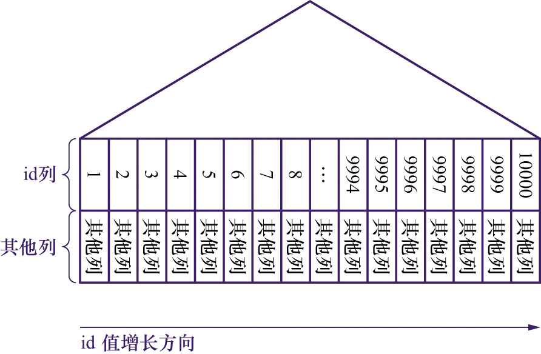
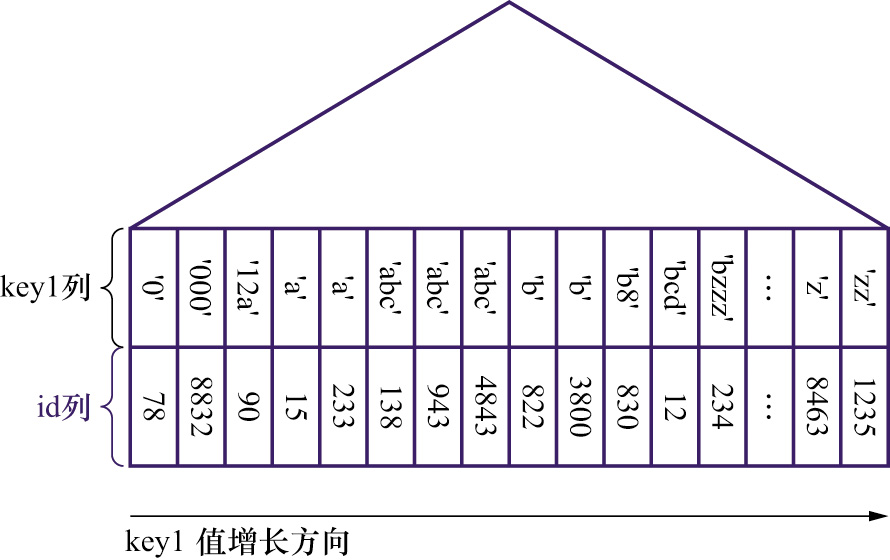
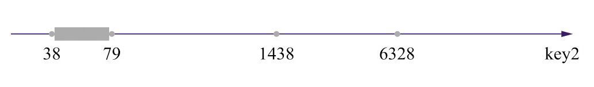
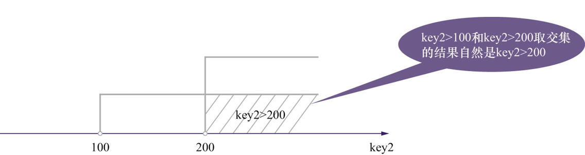
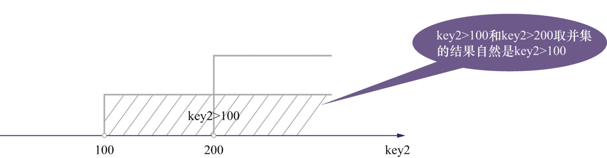
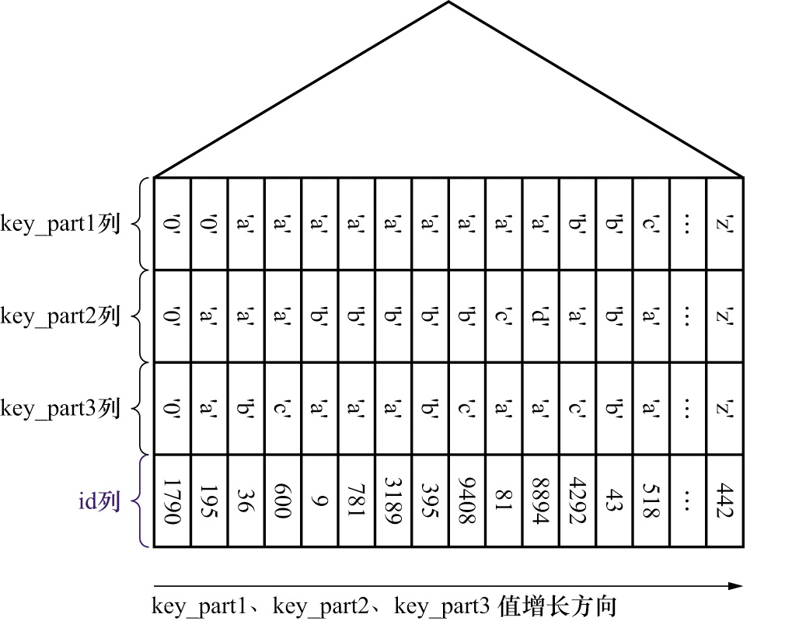

## 7.1 B+树索引示意图的简化:

### 示例数据:

```sql
create table `single_table`(
	`id` INT NOT NULL AUTO_INCREMENT,
    key1 varchar(100),
    key2 int,
    key3 varchar(100),
    key_part1 varchar(100),
    key_part2 varchar(100),
    key_part3 varchar(100),
    primary key (id), -- 主键索引(聚簇索引)
    key idx_key1 (key1), -- 二级索引(唯一索引)
    unique uk_key2 (key2), -- 二级索引
    key idx_key3 (key3), -- 二级索引
    key idx_key_part (key_part1,key_part2,key_part3) -- 联合索引
)engine=InnoDB charset=utf8
```

第6章画出了详细的B+树索引结构,现在对索引结构进行简化如下图: <font color=red>里面的数据是假设的</font>

**主键索引:** 只画出了叶子结点中的记录真实数据部分



**二级索引:**



## 7.2 索引的代价:

### 7.2.1 空间代价:

每一个索引都是一颗B+树,而B+树的结点都是一个最大为16KB的数据页,如果数据量很大的话,那么会使用很多的数据页来存储B+树的结点.占用空间很多

### 7.2.2 时间代价:

- 排序代价:

  B+树中,每层结点都是按照索引列值的大小顺序排列形成一个双向链表,数据页中的记录同样是按照索引列值的大小顺序形成一个单向链表.

  当我们在执行写操作的时候,必然会对记录造成修改,从而会影响到数据页中记录和数据页之间的顺序,然后存储引擎就需要去做一些额外的`页分裂`,`页回收`等操作.

  如果索引创建过多,这样的时间消耗就很大.

- 索引选择时间消耗代价:

  在执行查询操作的时候,首先会生成一个查询计划,而一般情况下,`mysql`在执行过程中只会使用一个二级索引,在执行`sql`语句的时候会去计算不同索引执行查询时所需要的时间,最后选取时间最少的索引执行.

  如果索引过多,就会花很多的时间去分析.

# 7.3 B+树索引的应用:

### 7.3.1 用于查询:

如果想要使用某个索引执行查询,但是又无法通过查询条件形成合适的扫描区间来减少需要扫描的记录数量时,则不考虑是使用这个索引来执行查询

**全表扫描:** 

- 对于某个查询来说简单粗暴的方式就是扫描表中的所有的记录,判断每一条记录是否符合搜索.如果符合,就返回结果,不符合就跳过该条记录.

- 对于`InnoDB`搜索引擎的表来说,全表扫描就是从聚簇索引中叶子结点第一条记录依次遍历下去,直到最后一条记录

**区间扫描:**

- 由于B+树叶子结点中的记录是按照索引列值的大小顺序进行排列的,可以利用B+树查找索引列值等于某个值的第一条记录,向前或者向后的某个区间内进行记录扫描,来减少记录扫描的范围.

- 比如:

  ```sql
  select * from `single_table` where id >= 2 and id <= 100;
  ```

  这个语句意义是寻找 id 在区间[2,100]的数据, `mysql`会通过聚簇索引首先定位id = 2 的用户记录,然后沿着叶子结点向后扫描,直到id > 100.

  `扫描区间`: 在这个`select`语句中[2,100] 就是扫描区间

  `边界条件`: `id >= 2 and id <= 100`就是形成扫描区间的边界条件

  对于`全表扫描`来说,这是一个特殊的`区间扫描`,因为他扫描的区间涵盖了所有的数据,即 `(-∞,+∞)`.

- 生成扫描区间的`sql`举例:

  ```sql
  select * from `single_table` where key2 in (1438,6328) or (key2 >= 38 and key2 <= 79)
  ```

  这个语句`where`条件后面使用的key2列,之前的示例数据中,又为key2列创建了索引`uk_key2`,会形成下面这三个区间:

  - [1438,1438] : 边界条件是 `key2 in (1438)` , 这种扫描区间中只有一个值的称为 `单点扫描区间`

  - [6382,6382] : 边界条件是 `key2 in (6382)`

  - [38,79] : 边界条件是 `key2 >= 38 and key2 <= 79` , 这种扫描区间中含有多个值的区间称为 `范围扫描区间`

  - 对应到数轴上就是:

    

- 无法生成扫描区间`sql`举例:

  ```sql
  select * from `single_table` where key1 < 'a' and key3 > 'z' and common_field = 'abc';
  ```

  - 如果使用`idx_key1`去查询:

    那么扫描区间为 `(-∞,'a')`,边界条件是 `key1 < 'a'`,  key3 > 'z' and common_field = 'abc' 只是普通搜索条件,普通搜索条件在获取到`idx_key1`的二级索引记录之后,回表查询获取到完整的用户记录后才能判断是否符合普通搜索条件.

  - 如果使用`idx_key3`去查询:

    那么扫描区将为`('z',+∞)`,边界条件是 `key3 > 'z'`, 普通条件 key1 < 'a' and common_field = 'abc'. 

**如何产生扫描区间:**

对于B+索引,只要索引列 和 常量 使用 `=`, `<=>`,`IN`, `NOT IN`, `IS NULL`, `IS NOT NULL`, `>`, `<`, `>=`, `<=`, `<>`, `BETWEEN`, `LIKE`连接起来就能产生扫描区间.

注意:

- `IN` 的语义 和 若干个等值匹配操作之间使用 `OR` 连接起来是一样的

- `!=(<>)`产生 的扫描区间比较特殊:

  ```sql
  -- 生成的扫描区间为: (-∞,'a') ∪ ('a',+∞)
  select * from `single_table` where key1 != 'a'
  ```

- `LIKE`操作只有在完全匹配和前缀匹配才能产生扫描区间

**如何从若干个OR或者AND连接的语句之间提取扫描区间:**

##### 1. 所有查询条件都可以生成合适的扫描区间:

```sql
select * from `single_table` where key2 > 100 and key2 > 200
```

生成的扫描区间为:



> and连接的查询条件是对两个扫描区间取交集

```sql
select * from `single_table` where key2 > 100 or key2 > 200
```

生成的扫描区间为:



> or连接的查询条件是对两个扫描区间取并集

##### 2. 部分查询条件能够生成扫描区间:

```sql
select * from `single_table` where key2 > 100 and common_field = 'abc';
```

如果使用`uk_key2`索引进行查询:

- 查询条件`key2 > 100`生成的扫描范围是 (100,+∞)
- 查询条件`common_field = 'abc'`由于`uk_key2`索引中的二级索引记录根本就不按照`common_field列`进行排列所以这个查询条件根本就不能使扫描范围减小.也就是产生的扫描范围是: `(-∞,+∞)`.
- 最终产生的扫描范围是 (100,+∞)

如果将sql中`and`连接换成`or`连接,产生的扫描范围是 (-∞,+∞)

##### 3. 复杂查询条件中找出扫描范围:

```sql
select * from single_table where 
(key1 > 'xyz' and key2 = 738) or 
(key1 < 'abc' and key1 > 'lmn') or 
(key1 like '%suf' and key1 > 'zzz' and (key2 < 8000 or common_field = 'abc')) 
```

分析思路:

- 找出where中使用了哪些列,以及表中创建了哪些索引.

  在这个sql中查询条件使用了 key1,key2,common_field列,key1列有`idx_key1`,key2列有`uk_key2`.

- 将可能使用到的索引进行假设,分析他们的扫描区间

**假设使用`idx_key1`索引:**

首先分析哪些搜索条件是不能产生扫描范围的:

比如上面的sql,`key2 = 738`, `key2 < 8000`, `common_field = 'abc'`以及`key1 like '%suf'`是不能产生扫描范围的,直接将他们替换成`true`,则sql为:

```sql
select * from single_table where 
(key1 > 'xyz' and true) or 
(key1 < 'abc' and key1 > 'lmn') or 
(true and key1 > 'zzz' and (true)) 

-- 简化:
select * from single_table where 
(key1 > 'xyz') or 
(key1 < 'abc' and key1 > 'lmn') or 
(key1 > 'zzz') 

-- key1 < 'abc' and key1 > 'lmn'永远是false
select * from single_table where 
(key1 > 'xyz') or  
(key1 > 'zzz') 
```

因为'xyz' < 'zzz' , 又是使用or连接, 取二者之间的并集, 所以产生的扫描范围是: ('xyz',+∞)

**假设使用`uk_key2`索引:**

替换掉不能差生扫描范围的查询条件之后sql为:

```sql
select * from single_table where 
(true and key2 = 738) or 
(true and true) or 
(true and true and (key2 < 8000 or true)) 

-- key2 < 8000 or true 一定为true
select * from single_table where key2 = 738 or true
```

因为查询条件恒成立,那么就是个全表扫描,扫描范围是: (-∞,+∞).但是使用了二级索引,比主键全表扫描还多了一次回表操作,所以显然不适合使用`uk_key2`作为查询索引

##### 4. 使用联合索引执行查询索引时的扫描范围:

联合索引的排序规则:

```sql
    key idx_key_part (key_part1,key_part2,key_part3) -- 联合索引
```

以上面这个索引为例:

- 先对`key_part1`列的值进行排序
- `key_part1`相同,再根据`key_part2`列的值进行排序
- `key_part1`和`key_part2`列的值都相同的情况下,再使用`key_part3`列的值进行排序



举例

```sql
select * from `single_table` where key_part1 = 'a';
```

使用联合索引确定的扫描范围为 `['a','a']`,扫描边界为`key_part = 'a'`.

```sql
select * from `single_table` where key_part1 = 'a' and key_part2 = 'b'
```

使用联合索引确定的扫描范围为 `[('a','b'),('a','b')]`,扫描边界为`key_part1 = 'a' and key_part2 = 'b'`.

`[('a','b'),('a','b')]`表示: 在`idx_key_part`索引中,从第一条满足边界条件,到最后一条满足边界条件为止的所有二级索引记录

```sql
select * from `single_table` where key_part1 = 'a' and key_part2 = 'b' and key_part3 = 'c'
```

 使用联合索引确定的扫描范围为 `[('a','b','c'),('a','b','c')]`,扫描边界为`key_part1 = 'a' and key_part2 = 'b' and key_part3 = 'c'`.

```sql
select * from `single_table` where key_part1 < 'a'
```

 使用联合索引确定的扫描范围为 `(-∞,'a')`,扫描边界为`key_part1 = 'a' and key_part2 = 'b' and key_part3 = 'c'`.

```sql
select * from `single_table` where key_part1 = 'a' and key_part2 > 'a' and key_part2 < 'd'
```

 使用联合索引确定的扫描范围为 `(('a','a'),('a','d'))`,扫描边界为`key_part1 = 'a' and key_part2 > 'a' and key_part2 < 'd'`.

```sql
select * from `single_table` where key_part2 = 'a';
```

因为联合索引排序优先级第一位的并不是`key_part2`列,所以无法减少扫描范围,因此这条sql不适合使用`idx_key_part`.

```sql
select * from `single_table` where key_part1 = 'a' and key_part3 = 'c'
```

这条sql能够通过`key_part1 = 'a'`减少扫描范围,但是由于`key_part='a'`之后是按照`key_part2`列的值大小顺序排列的,所以`key_part3 = 'c'`并不能减少扫描范围.

所以实际得到的扫描范围是: `['a','a']`.边界条件是 `key_part1 = 'a'`

```sql
select * from `single_table` where key_part1 < 'b' and key_part2 = 'a';
```

这个比较特殊,先看下叶子结点中二级索引的排列, 如果数据为红字的情况就会造成 `key_part1 < 3 and key_part2 = 2`的查询条件,在使用符合索引的时候,只走key_part1,而不走key_part2,这是因为在`key_part1 < 3`的前提下二级索引记录根本不是按照`key_part2`列的值排列的.


所以实际上对扫描范围起到作用的只有查询条件`key_part1 < 'b'`.扫描范围为: `[-∞,'b')`.

```sql
select * from `single_table` where key_part1 <= 'b' and key_part2 = 'a';
```

这条sql跟上面那条sql基本上是一个意思,但是在`key_part1 = 'b'`的时候,二级索引是按照`key_part2`值的顺序进行排列的,但是在`key_part1 < 'b'`的时候,`key_part2`仍然是起不到作用的.生成的扫描范围是:

- `[-∞,'b')`,边界条件: `key_part1 < 'b'`

- `[('b','a'),('b','a')]`,边界条件: `key_part1 = 'b' and key_part2 = 'a'`

两个扫描范围求并集: `((-∞,-∞),('b','a'))`

### 7.3.2 用于排序:

由于查询出来的数据不一定是按照我们需要的顺序进行排序的,就需要对数据进行重新排序,`mysql`中通常是将记录加载到内存中,通过排序算法进行排序操作,如果记录太多甚至还会借助磁盘空间来存放排序结果,在排序操作完成后再把排好序的结果返回给客户端.

`文件排序(filesort)`: 在内存或者磁盘中进行排序的方式统称为文件排序.文件排序会影响查询速度.

>  如果`order by`后面的字段加上了索引,就可以避免`filesort`

```sql
select * from `single_table` order by key_part1,key_part2,key_part3 limit 10; 
```

由于二级索引中索引记录本身就是按照索引列进行排列的,也就是说数据本身就是按照`order by`后面的顺序排列的自然无序再次进行额外的排序.

#### 1. 使用索引进行排序时的注意事项:

- 如果要想使用联合索引优化排序过程,那么必须要将`order by`后面排序列的顺序按照联合索引声明的顺序.

- 使用联合索引进行排序的时候,可以使用部分联合索引进行排序,比如: (part1,part2,part3),只使用`part1`,或者`part1,part2`进行排序,用来排序的列一定要是从左边开始连续的

- 如果使用联合索引进行排序时,查询条件是联合索引从左开始并且连续的常量,那么就可以使用剩下的索引进行排序,比如:

  ```sql
  select * from `single_table` where key_part = 'a' and key_part = 'b' order by key_part3 limit 10;
  ```

  查询结果已经按照`key_part1`,`key_part2`的顺序排列好了,按照联合索引的排列规则,数据实际上已经按照`key_part3`排列好了,使用`order by key_part3`进行排序自然不需要额外的排序.

#### 2. 无法使用索引进行排序的情况:

1. 排序规则(ASC,DESC)混用:

   使用联合索引进行排序,要求各排序列的排序规则是一致的,即 `要么都是ASC,或者要么都是DESC`.

2. 排序列包不是同一个索引:

3. 排序列在同一个索引中,但是不是按照声明的顺序连续出现:

4. 用来形成扫描区间的索引列和排序列不同:

   ```sql
   select * from `single_table` where key1 = 2 order by key2 limit 10;
   ```

5. 排序列不是以单独列名的形式出现在order by 语句中:

   ```sql
   select * from `single_table` order by UPPER(key1) limit 10;
   ```

#### 3. 总结:

将索引用于排序,主要是利用索引中的数据都是按照索引列值顺序排列好了的,不需要在进行额外的排序,这一特点.

### 7.3.3 索引用于分组:

规则与用于排序差不多,分组列必须与索引列的顺序一致,也只能使用索引列中左边连续的列进行分组.

## 7.4 回表的代价:

```sql
select * from `single_table` where key1 > 'a' and key1 < 'c'
```

- 全表扫描:

  扫描全部的聚簇索引,然后逐一对聚簇索引记录进行条件判断,不满足就跳过,满足就返回给客户端

- 使用`idx_key1`索引进行查询:

  在使用`idx_key1`索引进行查询时 将数据扫描的范围缩小到了('a','c')之间, 但是由于查询的是用户记录所有的列,而二级索引记录中只存放了索引列和主键值,所以必须要根据主键值进行重新去聚簇索引中查询(回表).

  `Mysql`中使用页作为空间管理的基本单位,对于`InnoDB`引擎的表,索引中的数据页必须是存放在磁盘中的,在需要的时候通过页号对应数据页在磁盘中的偏移量加载到内存中来.`Mysql`会尽量保证数据页是按照页号顺序进行排列的,因此一次磁盘I/O就可以加载很多的二级索引记录到内存中,扫描二级索引记录的代价就不会太大.

  但是在执行回表操作的时候,二级索引记录中存储的主键值是丝毫没有顺序的,极端的情况下,扫描区间中的二级索引记录有n条,主键值存在对应的数据页就有n页,因此可能要执行n次磁盘i/0.磁盘i/o的时间消耗是特别大的

  `mysql`在执行查询的时候,首先会进行查询语句的优化,查询优化器会对表中的记录事先进行一些计算,通过计算出来的统计数据,或者访问少量的记录来获得查询时的回表数量,如果回表数量特别多,就选择`全表扫描`,否则选择索引.

  > 为了避免全表扫描:
  >
  > 1. 通过`limit`减少返回的数量,从而减少回表次数,让查询走索引
  > 2. 通过`limit`减少返回的数量,也可以让排序使用索引

## 7.5 更好的创建和使用索引:

### 7.5.1 只为查询,排序,分组列创建索引:

通常只会为`where`字句中的列,连接字句中的连接列,分组列或者排序列创建索引.

只出现在查询列表中的列就没有必要创建索引了,比如: 

```sql
select common_field, key_part4 from `single_table` where key1 = 1
```

这个sql中`common_field`,`key_part4`就没有必要创建索引了.

### 7.5.2 考虑索引列值不重复的数量:

如果索引列重复值太多,那么在通过该索引进行查询的时候,一个常量查询条件都有可能有很多条,这样会造成大量的回表操作,从而导致效率不如全表扫描.

如果想要加索引的列,值重复数率太高就不要给他加索引了.

### 7.5.3 索引列尽量选择占用空间小的类型:

`mysql`都是以页为单位进行磁盘I/O加载数据的,如果数据类型占用的空间越小,一页中存放的记录数就越多.`在取值范围允许的情况下`,索引列尽量选择占用空间小的类型

<font color=red>尤其是主键列,主键列不仅仅是聚簇索引中会记录主键值,所有的二级索引记录都会保存主键值,因此主键列更应该选择占用空间小的类型</font>

### 7.5.4 为列前缀建立索引:

处于减少二级索引记录中存放索引值长度,从而增加数据页中存放索引的数量,减少磁盘I/O的目的,可以列值前缀建立索引.

比如:

```sql
-- 先删除在重新创建索引
alter table `single_table` drop index idx_key1
alter table `single_table` add index idx_key1(key1(10))
```

因为索引列值的字符串前缀实际上也是排好序的,所以可以在二级索引记录中只保留字符串前面几个字符.根据字符串前缀定位出二级索引记录中以索引值为前缀的记录,然后在判断他是否完整的匹配查询条件.

```sql
select * from `single_table` where key1 = 'abcdefghijklmn'
```

首先会定位出以`abcdefghij`为前缀的二级索引记录,然后判断他们是否完全匹配`abcdefghijklmn`

<font color=red>这种索引无法用于排序.排序对于字符串比较的是整个字符串的全部字符,但是这种二级索引只是按照字符串的前面几个字符排好顺序</font>

### 7.5.5 覆盖索引:

`覆盖索引`: 查询列表中的列包含在索引中,就称这种查询方式为 覆盖索引.

```sql
select key1,id from `single_table` where key1 = 2
```

通过`idx_key1`进行查询的时候,二级索引记录中包含了 `key1`,`id`这两列的值,所以在定位到叶子结点中的二级索引记录时就获取到了查询结果,无需进行回表操作.

### 7.5.6 索引列名单独出现在查询条件中:

单独出现的意思是: 不要让索引列在查询条件中参与运算

```sql
-- 不走索引:
select * from `single_table` where key2 * 2 < 5
-- 走索引:
select * from `single_table` where key2 < 5/2
```

sql 1 会被`mysql`认为 key2*2 是一个列,从而不会走`idx_key2`

### 7.5.7 新插入记录时主键大小对效率的影响:

主键值大小(新插入数据的主键值)对插入效率的影响,主要问题出现在无序插入,如果插入时刚好要插入的数据页满了,待插入记录的主键值又恰好位于该数据页的中间,就会造成页分裂,从而导致插入效率降低.

### 7.5.8 冗余和重复索引:

尽量避免冗余和重复的索引,比如不要对联合索引包含的索引再创建单独的索引

