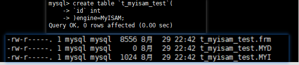

## 8.1 数据库和文件系统的关系:

`Mysql`中像`InnoDB`和`MyISAM`这类存储引擎都是将数据存储在磁盘中,操作系统通过文件系统来管理磁盘,换句话说: 数据是存储在文件系统中的.

读数据是从文件系统中将数据读取到内存中,写数据是从内存中将数据写入到文件系统.

## 8.2 Mysql的数据目录:

Mysql服务器在启动的时候会从文件系统中的某个目录下加载一些数据,之后在运行过程中产生的数据也会存储到这个目录下的某些文件中.这个目录就是`数据目录`.

### 8.2.1 数据目录和安装目录的区别:

`安装目录`: 安装目录是mysql程序运行文件存放的地方

`数据目录`: 数据目录是mysql程序在运行过程中产生的一些 `用户数据`,`程序运行状态数据`等数据存储的地方

### 8.2.2 数据目录在哪儿:

`show variables like 'datadir'`


## 8.3 数据目录结构:

### 8.3.1 数据库在文件系统中的表示:

每个数据库在文件系统中都对应数据目录下的一个子目录(即一个文件夹), 在创建数据库的时候, MySQL主要会发生以下流程:

1. 数据目录下创建一个与数据库名相同的子目录
2. 在该子目录下,创建一个名字为 `db.opt`的文件. 这个文件中包含了数据库的一些属性,比如: 数据库的字符集和比较规则


### 8.3.2 表在文件系统中的表示:

在文件系统中,表的信息主要被分成下面两类的数据存储起来:

- `表结构信息描述`: 主要描述表结构信息,比如表名,表有多少列,表每列的数据类型等各种信息
  - InnoDB 和 MyISAM 这两种存储引擎都在数据目录中,对应数据库目录内为每一张表创建了一个 后缀为`.frm`的文件来描述表结构.
- `表中的数据`: 

#### 1. InnoDB是如何存储表数据的:

InnoDB中无论是用户记录,还是索引记录都是存在数据页里面的,为了更好的管理这些数据页,InnoDB提出了`表空间`这一概念,`表空间`对应文件系统上一个或者多个真实文件.每一个表空间可以被划分为多个页,表数据就存放在`表空间`下的某些页中.

表空间分类:

- `系统表空间`: 在默认情况下, InnoDB会在数据目录下创建一个名为`ibdata1`,初始大小为12MB的文件,这个文件就是在文件系统上`系统表空间`的表示.

  这个文件是一个自扩展文件, 在文件容量不够的时候,就会自己增加文件的大小.

  如果想让系统表空间对应多个文件,或者自己指定系统表空间使用哪个文件,可以通过配置文件中进行如下配置:

  ```properties
  # 指定系统表空间文件为: data1和data2,并且data2是自扩展文件
  [server]
  innodb_data_file_path=data1:512M;data2:512M:autoextend
  ```

  > MySQL服务器中,系统表空间只有一份5.5.7版本到5.6.5版本之间的Mysql,Innodb表数据默认存放在系统表空间中

- `独立表空间`: 在5.6.6版本之后,InnoDB不再默认把各个表的数据存储到系统表空间中,而是为每一张表都创建一个`独立表空间`.在使用`独立表空间`存放数据的时候,在MySQL数据目录中对应数据库文件夹中,会生成一个`表名.ibd`格式的文件,用来表示一张表的`独立表空间`.

  

  下面的配置`此后新建的表`指定使用系统表空间还是独立表空间来存放数据:

  ```properties
  # 这个配置只对新建的表有用,不会影响已经存在的表
  # 0表示使用系统表空间,1表示使用独立表空间
  [server]
  innodb_file_per_table=0
  ```

  如果想要移动已经存在表的数据,到系统表空间或者独立表空间,可以使用sql

  ```sql
  -- 系统表空间 转移到 独立表空间
  alter table 表名 tablespace [=] innodb_file_per_table
  -- 独立表空间 转移到 系统表空间
  alter table 表名 tablespace innodb_system
  ```

- `其他表空间`: 除了上面说的这两种表空间以外,还有一些其他的表空间,比如: `undo表空间`, `临时表空间`等

#### 2. MyISAM是如何存储表数据的:

MyISAM中 索引与数据是分开存放的,表现在文件系统中就是使用不同文件来分别存储数据和索引.`但是MyISAM没有表空间这个概念`,索引文件和数据文件都存放在数据库文件夹中.



其中: `.MYD`后缀表示表的数据文件,`.MYI`后缀表示表的索引文件

### 8.3.3 其他文件:

数据目录还包含了一些确保程序更好运行的额外文件:

- 服务器进程文件: 每一个MySQL服务器程序都意味着启动一个进程, MySQL服务器会把自己的进程ID写入到这个文件中.
- 服务器日志文件: 服务器运行期间,会产生各种各样的日志, 比如常规的查询日志, 错误日志, 二进制日志,redo日志等.
- SSL和RSA证书与密钥文件: 主要是为了客户端和服务器安全通信而创建的一些文件.

## 8.4 文件系统对数据库的影响:

因为数据都是存放在文件系统中,所以会收到文件系统的一些制约:

- 数据库名称和表名称不能超过文件系统所允许的最大长度:
- 特殊字符的问题: 为了避免发生文件系统不支持特殊字符的情况,mysql会将数据库名字和表名字中除了数字和拉丁字母以外的字符在文件系统中都映射成`@+编码值`的形式
- 文件长度受到文件系统对文件最大长度的限制.

## 8.5 MySQL系统数据库简介:

- `mysql`: 存放`mysql`的用户账户和权限信息, 一些存储过程和事件的定义信息,一些运行过程中产生的日志信息,一些帮助信息以及时区信息
- `information_schema`: 保存MySQL服务器维护的所有其他数据库的信息,比如有哪些表,那些试图,哪些触发器,哪些列,哪些索引等. `就是其他数据的描述信息,有时候也称之为元数据`
- `performance_shcema`: 保存MySQL服务器运行过程中的一些状态信息
- `sys`: 以视图的形式把`information_shcema`和`performance_shcema`结合起来,让开发人员更方便了解Mysql的性能信息

