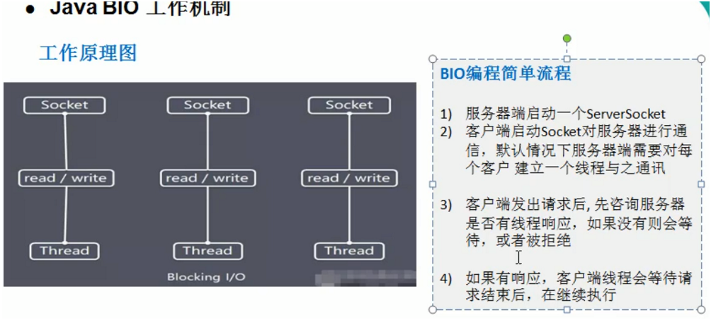

## 1.1 I/O模型基本介绍:

### 1.1.1 I/O模型的简单理解:

1. 为了实现不同类型的i/o方式,根据应用场景采取不同数据传输的通道,对数据进行接收和发送,不同的模型对通信的性能也有不同的影响.
2. I/O模型分类:  
   老张煮茶更为形象: [关于阻塞/非阻塞,异步/同步参考](https://www.zhihu.com/question/19732473)
    - I/O操作分两步走:  
      1.`发起I/O请求`,2.`实际的I/O读写操作(内核态和用户态的数据拷贝)`.
    - 阻塞与非阻塞:
      `阻塞与非阻塞的区别,发生在I/O操作的第一步`  
      阻塞: 当一个I/O操作发起,处理这个I/O操作的线程会一直阻塞到整个I/O处理完成,这就是阻塞I/O  
      非阻塞: 当一个I/O操作发起,处理这个I/O操作的线程不会阻塞在该I/O操作上,而是对所有的I/O操作进行轮询,只处理准备好结果的I/O操作.        
    - 同步和异步:  
      同步: 小明在泡面的过程期间,什么也不干,就一直等待到面泡好.  
      异步: 小红在泡面的过程期间,定个闹钟然后切了两个水果,冲了一杯咖啡.当闹钟响了表示面泡好了.  
      同步与异步的区别发生在I/0操作的第二步.同步I/O在实际读写的时候处理该I/O操作的进程会一直等待整个数据拷贝的过车,异步I/O则不会一直等待.
    - BIO: 同步阻塞模型,服务器实现方式为: 为每一个连接都分配一个线程专门处理这个client的请求,该连接会阻塞等待服务端的响应,如果该连接
      什么也不做的话,会造成资源的浪费和不必要的线程开销.  
      示意图:  
        
      缺点:  
      1. 如果连接空闲,容易造成资源的浪费,不必要的线程开销
      2. 高并发场景下,容易造成服务端的压力增加  
    - NIO: 同步非阻塞模型,服务端实现方式为: 一个线程(服务端可以维护多个这样的线程)处理多个client连接,通过一个多路复用器以轮询的方式去
      发现是否有连接有数据要传输,如果轮询到某个连接有数据传输就处理.对于连接是立即响应的,不会进行阻塞等待.  
      示意图:   
        
    - AIO: 异步非阻塞,AIO引入异步通道的概念,采用了Proactor模式,简化了程序编写,有效请求才启动线程,他的特点就是由操作系统处理完成后再通知
      服务端应用进程去处理,一般适用于连接较多且连接时间比较长的应用.
3. I/O模型使用的场景:
   - BIO方式适用于连接数目比较小且固定的架构，这种方式对服务器资源要求比较高，并发局限于应用中，JDK1.4以前的唯一选择，但程序简单易理解。
   - NIO方式适用于连接数目多且连接比较短（轻操作）的架构，比如聊天服务器，弹幕系统，服务器间通讯等。编程比较复杂，JDK1.4开始支持。
   - AIO方式使用于连接数目多且连接比较长（重操作）的架构，比如相册服务器，充分调用OS参与并发操作，编程比较复杂，JDK7开始支持。  

## 1.2 JAVA BIO(传统i/o模型):

1. 基本介绍:  

   1. java BIO就是传统的 java I/O编程,其相关的接口和类在 java.io包中.
   2. BIO(blocking I/O) ： 同步阻塞，服务器实现模式为一个连接一个线程，即客户端有连接请求时服务器端就需要启动一个线程进行处理，如果这个连接
      不做任何事情会造成不必要的线程开销，可以通过线程池机制改善(实现多个客户连接服务器)。
   3. BIO方式适用于连接数目比较小且固定的架构，这种方式对服务器资源要求比较高，并发局限于应用中，JDK1.4以前的唯一选择，程序简单易理解

2. 工作机制:  

   1. 原理图:  
        

   2. 编程流程:  

      - 服务端启动ServerSocket,用于接收和响应客户端.
      - 客户端启动Socket与服务端进行通信,默认情况下,服务端会给客户端每个socket建立一个线程与之通讯.
      - 客户端发出请求后，先咨询服务器是否有线程响应，如果没有则会等待，或者被拒绝。
      - 如果有响应，客户端线程会等待请求结束后，在继续执行。

   3. BIO实例:

      > 要求:  
      > 使用 BIO 模型编写一个服务器端，监听 6666 端口，当有客户端连接时，就启动一个线程与之通讯。  
      > 要求使用线程池机制改善，可以连接多个客户端。  
      > 服务器端可以接收客户端发送的数据（telnet 方式即可）。  

       ```java
          /*
          使用线程池模拟每个请求服务端都会为之开启一个线程来处理.忽略线程池中线程数量的限制
          */
      public class BioServer {
          public static void main(String[] args) {
              // 创建线程池处理连接:
              ThreadPoolExecutor executor = new ThreadPoolExecutor(
                      10,
                      10,
                      2 * 60,
                      TimeUnit.SECONDS,
                      new ArrayBlockingQueue<Runnable>(100),
                      new ThreadFactoryBuilder().setNameFormat("BIO-THREAD-POOL-%d").build(),
                      new ThreadPoolExecutor.DiscardPolicy());
              // 打开socket连接:
              try(ServerSocket serverSocket = new ServerSocket(6666)){
                  System.out.println("成功启动socket链接");
                  while (true){
                      // 有链接过来就建立简介
                      final Socket socket = serverSocket.accept();
                      System.out.println("客户端接入");
                      // 开启 线程处理通信
                      executor.execute(()->{
                          byte[] bytes = new byte[1024];
                          // 获取输入流
                          try (
                            final InputStream inputStream = socket.getInputStream()
                          ){
                              while (true){
                                  final int read = inputStream.read(bytes);
                                  if (read != -1){
                                      System.out.println(Thread.currentThread().getName() + " : " +new String(bytes, "GBK"));
                                  }else {
                                      break;
                                  }
                              }
                          }catch (Exception e){
                              e.printStackTrace();
                          }
      
                      });
                  }
              }catch (Exception e){
                  e.printStackTrace();
              }
          }
      }
       ```

   4. BIO的问题分析:

      - 每个请求都会创建一个线程来处理该请求.
      - 并发量较大的时候,会创建大量的线程来处理I/O请求,造成服务端的压力大,资源占用严重.
      - 建立连接之后,如果没有数据响应,那么这个线程就会被阻塞在这个I/O请求上, 造成资源的浪费.

## 1.3 JAVA NIO:  

1. NIO基本介绍:

   1. `NIO(non-blocking i/o)`: jdk提供的一套新的i/o api,同步非阻塞模型.
   2. NIO位于jdk的java.nio包下,大多数是对java.io包中类进行了一些修改.
   3. NIO的三大核心组件: `Channel(通道)`,`Buffer(缓冲区)`,`Selector(选择器)`.
   4. NIO是 `面向缓冲区` 或者 `面向块` 编程的.数据读取到一个它稍后处理的缓冲区,需要时可在缓冲区前后移动获取数据,这样增加了处理过程中的灵活性
      ,使用NIO可以提供非阻塞式的搞伸缩网络.
   5. JAVA NIO的非阻塞模式:
      - 读: 使一个线程从某个通道发送请求或者读取数据,但是他仅仅能得到当前可用数据,如果当前没有可用数据,什么都拿不到,不会阻塞保持线程阻塞.所以
        在数据准备完成之前,该线程是可以做其他事情的.
      - 写: 一个线程请求写入一些数据到某个通道,但不需要等待线程完全写入,这个线程就可以去做其他的事情.

2. NIO的原理示意图:
     
   解释:

     1. 上图是服务端的NIO原理示意图
     2. 一个线程对应一个selector,服务端可以开启多个线程管理多个selector,然后通过一个selector去管理多个channel
     3. 一个channel对应一个buffer,一个channel就可以看做是一个连接,channel会像selector注册自己. `一个severSocketChannel和多个socketC hannel`.
     4. 一个buffer对应一个client
     5. selector根据不同的事件,在不同事件的channel上切换,切换到哪一个channel是由事件决定的,比如: accept,read,write等事件
     6. buffer就是一个内存块,底层就是一个数组.
     7. 数据的写入读取都是通过buffer实现的.[这里就是与BIO的区别,NIO一个buffer就能解决输入与输出,BIO要么是输入,要么是输出,无法达到双向传输的效果]
        NIO只需要通过buffer的flip和clear方法就能完成读写的切换.
     8. channel是双线的,可以返回底层操作系统的情况.比如linux底层操作系统就是双向的.

3. NIO的三大核心组件:

   1. Buffer[缓冲区]: 缓冲区本质上是一个可以读写的内存块.(底层结构类似于数组). buffer提供了一组操作内存块的方法.缓冲区内部有一套机制,来跟踪和记录缓冲区
      内部的状态变化.channel提供文件,网络读取数据的通道,但是数据的读取和写入都需要经过buffer.  
        
      

       - buffer中几个重要的属性:  

         | 属性               | 作用                                                         |
         | :----------------- | ------------------------------------------------------------ |
         | capacity           | 描述整个缓冲区的容量, `可以理解为数组长度`,无法被修改        |
         | position           | 描述缓冲区下一个能够`写入`或者`读取`的位置,`get,put等方法会更新这个值` |
         | limit              | 描述缓冲区第一个不能`写入`或者`读取的位置`,读写模式的切换实际上就是操作的个变量 |
         | mark               | 标记,表示当前position的位置.可以通过reset()将position恢复到mark的位置 |
         | 几个变量的大小关系 | 0 <= mark <= position <= limit <= capacity                   |

       - 几个属性关系示意图:  
         

       - 读写模式切换属性变化示意图:  
         

       - 常用方法:  
         

       - 最常用的buffer --> ByteBuffer:  
         

   2. Channel[通道]:

      - NIO中的channel跟传统i/o中的流很相似,但主要有以下几点区别:
        - 通道是双向的,即可以读或者写,流要么是写入,要么是读取
        - 通道可以实现异步读写数据
        - 通道总是向缓冲区中读写数据
      - 几种常用的channel:
        -  FileChannel : `从文件中读取数据`  
           
        -  SocketChannel : `tcp客户端读写数据通道`  
           
        -  ServerSocketChannel : `tcp服务端读写数据的通道,通常使用来监听socketChannel连接的.`  
           
        -  DatagramChannel : `udp通信读写数据的通道`

   3. selector[选择器]:

      - 概念:
        - NIO,使用非阻塞式I/O,使用一个线程处理多个I/O操作,就是selector实现的.
        - `selector能够检测多个注册了的通道上是否有事件发生.`(ps: 多个通道以时间的方式可以注册到同一个selector上面,selector中维护了
          一个事件key集合,遍历这个集合判断通道对应key的状态,然后确定通道发生什么事件),``如果通道上发生了某个事件,就做对应的逻辑处理`这样就实现了
          非阻塞I/O以一个线程去管理多个I/O通道.
        - `只有在通道真正有读写事件发生的时候,才会去进行读写操作,可以大大的减少系统开销`.并且不必为每一个连接都创建一个线程,减少线程创建销毁的开销
        - `避免了线程之间上下文切换的开销`
      - selector的特点:
        - selector可以处理多个客户端连接的请求.
        - selector在某个通道没有进行数据读写的时候,可以去处理其他通道上的事件.
        - selector通常将阻塞I/O等待I/O操作完成的时间,用在处理其他通道上的I/O操作.
        - 由于读写操作都是非阻塞的,可以提升I/O线程的运行效率,避免频繁I/O导致线程挂起
        - 一个线程对应一个selector,从而处理多个客户端连接和读写操作,从根本上解决了传统I/O一对一线程模型.架构的性能,弹性伸缩能力,可靠性都大幅度提升
      - selector处理时间的流程:  
        
          - 创建服务端通道serverSocketChannel,并将其注册到selector上面,关注事件为accept
          - 当accept事件发生的时候,通过serverSocketChannel.accept()方法获取客户端通道socketChannel并将其按照关心的事件注册
            (socketChannel.register(selector,ops))到selector上
          - 注册成功后,回返回一个selectionKey,该key就是存放在selector的一个set集合里面,[ps:通过遍历这个set来判断发生什么事件]
          - selector通过select()方法,得到发生事件的通道个数.
          - 得到所有发生事件的selectionKey,通过selectionKey去获取对应的socketChannel完成相应的逻辑操作.
      - selector使用的注意事项:
        - 要被selector管理的通道,必须是非阻塞的通道, `即: 该通道要实现selectableChannel接口`
        - serverSocketChannel也需要注册到selector上面去,然后通过selector来管理监听事件.`通常一个serverSocketChannel`只有一个.
        - selector的方法keys和selectedKeys的区别:
          1. keys: 返回的是所有注册到selector上面的所有selectionKey, `即:只要注册成功就会生成一个key放进去`,是个set,selector不会主动删除这个set
             里面的元素.[ps:任何删除操作都不支持]
          2. selectedKey: 返回select方法中有事件发生的channel对应的selectionKey,[同样是任何删除操作都不支持]
      - selectionKey API:
        - selectionKey,表示selector与channel之间的一种注册关系,即 channel关心事件在selector中的记录.`共四种`:  
          
        - api:  
          

4. NIO注意事项:

   1. ByteBuffer在put,get的时候 ,put什么类型的数据,get的时候就需要使用什么类型的数据来接收,否则会抛出异常.
   2. buffer可以转换成只读buffer,但是之后就无法写入,否则抛出异常
   3. Nio还提供了MappedByteBuffer,可以让文件直接在内存中进行修改,然后是利用NIO来通不到文件
   4. NIO还支持通过多个buffer来完成同一个事件的读写.

5. NIO和BIO的比较:

   1. `BIO` 以流的方式处理数据，而 `NIO` 以块的方式处理数据，块 `I/O` 的效率比流 `I/O` 高很多。
   2. `BIO` 是阻塞的，`NIO` 则是非阻塞的。
   3. `BIO` 基于字节流和字符流进行操作，而 `NIO` 基于 `Channel`（通道）和 `Buffer`（缓冲区）进行操作，数据总是从通道读取到缓冲区中，或者从缓冲区写入到通道中。
      `Selector`（选择器）用于监听多个通道的事件（比如：连接请求，数据到达等），因此使用单个线程就可以监听多个客户端通道。

## 1.4 实例:  

1. 内存往磁盘写文件:

   ```java
       /*
       *    实例要求：
       * 1. 使用前面学习后的 `ByteBuffer`（缓冲）和 `FileChannel`（通道），将 "hello,尚硅谷" 写入到 `file01.txt` 中
       * 2. 文件不存在就创建
       * 3. 代码演示:
       */
       @Test
       public void test(){
           String info = "hello NIO";
   
           try(
               //1. 创建一个文件输出流
               final FileOutputStream fileOutputStream = new FileOutputStream("src/main/resources/NioOutPutFile.txt")
           ){
               //2. 通过流拿到FileChanel,channel实际上就是流使用了装饰者模式,将channel作为属性包裹在了流中
               FileChannel fileOutputStreamChannel = fileOutputStream.getChannel();
               //3. 创建buffer
               ByteBuffer byteBuffer = ByteBuffer.allocate(1024);
               //4. 向buffer里面写入数据
               byteBuffer.put(info.getBytes(StandardCharsets.UTF_8));
               //5. 切换buffer的模式,使用flip由写切换为读
               byteBuffer.flip();
               //6. 将buffer中数据写入channel中
               fileOutputStreamChannel.write(byteBuffer);
           }catch (Exception e){
               e.printStackTrace();
           }
   
       }
   ```

2. 从磁盘往内存读取数据:  

   ```java
      /*
       实例要求：
       1. 使用前面学习后的 `ByteBuffer`（缓冲）和 `FileChannel`（通道），将 `file01.txt` 中的数据读入到程序，并显示在控制台屏幕  
       2. 假定文件已经存在
       3. 代码演示
       */
       @Test
       public void test1(){
           try(
                   //1. 创建一个文件输出流
                   FileInputStream fileOutputStream = new FileInputStream("src/main/resources/NioOutPutFile.txt")
           ){
               //2. 通过流拿到FileChanel,channel实际上就是流使用了装饰者模式,将channel作为属性包裹在了流中
               FileChannel fileOutputStreamChannel = fileOutputStream.getChannel();
               //3. 创建buffer
               ByteBuffer byteBuffer = ByteBuffer.allocate(1024);
               //4. 从channel里面读取数据
               fileOutputStreamChannel.read(byteBuffer);
               //5. 获取数据,array会将整个缓冲区都获取出来,就不需要切换模式
               System.out.print(new String(byteBuffer.array()));
           }catch (Exception e){
               e.printStackTrace();
           }
       }
   ```

3. 文件读取然后写入:

   ```java
       /*
       实例要求：
       1. 使用 `FileChannel`（通道）和方法 `read、write`，完成文件的拷贝
       2. 拷贝一个文本文件 `1.txt`，放在项目下即可
       3. 代码演示
       */
       @Test
       public void test3(){
           try(
               FileInputStream fileInputStream = new FileInputStream("src/main/resources/NioOutPutFile.txt");
               FileOutputStream fileOutputStream = new FileOutputStream("src/main/resources/NioOutPutFile1.txt");
           ){
               FileChannel inputStreamChannel = fileInputStream.getChannel();
               FileChannel outputStreamChannel = fileOutputStream.getChannel();
               ByteBuffer byteBuffer = ByteBuffer.allocate(512);
               while (true){
                   // 往缓冲区写数据
                   int read = inputStreamChannel.read(byteBuffer);
                   if (read == -1){
                       System.out.println("read == " + read + ",于是退出啦");
                       break;
                   }
                   // 写模式切换为读模式
                   byteBuffer.flip();
                   // 从缓冲区读数据
                   outputStreamChannel.write(byteBuffer);
                   //读模式转换为写模式,数据超出缓冲区的大小,就要多次读写
                   byteBuffer.clear();
               }
           }catch (Exception e){
   
           }
       }
   ```

4. 通过transferForm拷贝文件:  

   ```java
       @Test
       public void test4(){
           try(
                   FileInputStream fileInputStream = new FileInputStream("src/main/resources/NioOutPutFile.txt");
                   FileOutputStream fileOutputStream = new FileOutputStream("src/main/resources/NioOutPutFile2.txt");
           ){
               FileChannel inputStreamChannel = fileInputStream.getChannel();
               FileChannel outputStreamChannel = fileOutputStream.getChannel();
               ByteBuffer byteBuffer = ByteBuffer.allocate(512);
               while (true){
                   // 往缓冲区写数据
                   int read = inputStreamChannel.read(byteBuffer);
                   if (read == -1){
                       System.out.println("read == " + read + ",于是退出啦");
                       break;
                   }
                   inputStreamChannel.transferTo(0,read,outputStreamChannel);
               }
           }catch (Exception e){
   
           }
       }
   ```

5. 可以将一个普通 `Buffer` 转成只读 `Buffer`【举例说明】

   ```java
   package com.atguigu.nio;
   
   import java.nio.ByteBuffer;
   
   public class ReadOnlyBuffer {
   
       public static void main(String[] args) {
   
           ByteBuffer normalBuffer = ByteBuffer.allocate(64);
           for (int i = 0; i < 64; i++) {
               normalBuffer.put((byte)i);
           }
           // 写切换为读
           normalBuffer.flip();
           // 转换只读
           ByteBuffer readOnlyBuffer = normalBuffer.asReadOnlyBuffer();
           readOnlyBuffer.put((byte)1);
       }
   }
   ```

6. `NIO` 还提供了 `MappedByteBuffer`，可以让文件直接在内存（堆外的内存）中进行修改，而如何同步到文件由 `NIO` 来完成。【举例说明】

   ```java
   package com.atguigu.nio;
   
   import java.io.RandomAccessFile;
   import java.nio.MappedByteBuffer;
   import java.nio.channels.FileChannel;
   
   /**
    * 说明 1.MappedByteBuffer 可让文件直接在内存（堆外内存）修改,操作系统不需要拷贝一次
    */
   public class MappedByteBufferTest {
   
       public static void main(String[] args) throws Exception {
   
           RandomAccessFile randomAccessFile = new RandomAccessFile("1.txt", "rw");
           //获取对应的通道
           FileChannel channel = randomAccessFile.getChannel();
   
           /**
            * 参数 1:FileChannel.MapMode.READ_WRITE 使用的读写模式
            * 参数 2：0：可以直接修改的起始位置
            * 参数 3:5: 是映射到内存的大小（不是索引位置），即将 1.txt 的多少个字节映射到内存
            * 可以直接修改的范围就是 0-5
            * 实际类型 DirectByteBuffer
            */
           MappedByteBuffer mappedByteBuffer = channel.map(FileChannel.MapMode.READ_WRITE, 0, 5);
   
           mappedByteBuffer.put(0, (byte) 'H');
           mappedByteBuffer.put(3, (byte) '9');
           mappedByteBuffer.put(5, (byte) 'Y');//IndexOutOfBoundsException
   
           randomAccessFile.close();
           System.out.println("修改成功~~");
       }
   }
   ```

7. 前面都是通过一个 `Buffer` 完成的，`NIO` 还支持通过多个 `Buffer`（即 `Buffer`数组）完成读写操作，即 `Scattering` 和 `Gathering`【举例说明】

   ```java
   package com.atguigu.nio;
   
   import java.net.InetSocketAddress;
   import java.nio.ByteBuffer;
   import java.nio.channels.ServerSocketChannel;
   import java.nio.channels.SocketChannel;
   import java.util.Arrays;
   
   /**
    * Scattering：将数据写入到 buffer 时，可以采用 buffer 数组，依次写入 [分散]
    * Gathering：从 buffer 读取数据时，可以采用 buffer 数组，依次读
    */
   public class ScatteringAndGatheringTest {
   
       public static void main(String[] args) throws Exception {
           
           //使用 ServerSocketChannel 和 SocketChannel 网络
           ServerSocketChannel serverSocketChannel = ServerSocketChannel.open();
           InetSocketAddress inetSocketAddress = new InetSocketAddress(7000);
   
           //绑定端口到 socket，并启动
           serverSocketChannel.socket().bind(inetSocketAddress);
   
           //创建 buffer 数组
           ByteBuffer[] byteBuffers = new ByteBuffer[2];
           byteBuffers[0] = ByteBuffer.allocate(5);
           byteBuffers[1] = ByteBuffer.allocate(3);
   
           //等客户端连接 (telnet)
           SocketChannel socketChannel = serverSocketChannel.accept();
   
           int messageLength = 8; //假定从客户端接收 8 个字节
   
           //循环的读取
           while (true) {
               int byteRead = 0;
   
               while (byteRead < messageLength) {
                   long l = socketChannel.read(byteBuffers);
                   byteRead += l; //累计读取的字节数
                   System.out.println("byteRead = " + byteRead);
                   //使用流打印,看看当前的这个 buffer 的 position 和 limit
                   Arrays.asList(byteBuffers).stream().map(buffer -> "position = " + buffer.position() + ", limit = " + buffer.limit()).forEach(System.out::println);
               }
   
               //将所有的 buffer 进行 flip
               Arrays.asList(byteBuffers).forEach(buffer -> buffer.flip());
               //将数据读出显示到客户端
               long byteWirte = 0;
               while (byteWirte < messageLength) {
                   long l = socketChannel.write(byteBuffers);//
                   byteWirte += l;
               }
               
               //将所有的buffer进行clear
               Arrays.asList(byteBuffers).forEach(buffer -> {
                   buffer.clear();
               });
               
               System.out.println("byteRead = " + byteRead + ", byteWrite = " + byteWirte + ", messagelength = " + messageLength);
           }
       }
   }
   ```

8. NIO 网络编程应用实例 - 群聊系统

实例要求：

1. 编写一个 `NIO` 群聊系统，实现服务器端和客户端之间的数据简单通讯（非阻塞）
2. 实现多人群聊
3. 服务器端：可以监测用户上线，离线，并实现消息转发功能
4. 客户端：通过 `Channel` 可以无阻塞发送消息给其它所有用户，同时可以接受其它用户发送的消息（有服务器转发得到）
5. 目的：进一步理解 `NIO` 非阻塞网络编程机制
6. 示意图分析和代码  

服务端代码:  

```java
    package cn.pounds.nio;

    import java.io.IOException;
    import java.net.InetSocketAddress;
    import java.nio.ByteBuffer;
    import java.nio.channels.*;
    import java.util.Iterator;
    import java.util.Set;
    
    /**
    * @Date 2021/4/18 19:08
    * @Author by pounds
    * @Description NIO 网络编程快速入门
    * 要求:
    * 实现服务端和客户端之间的数据简单通讯
    *
    */
    public class NioNetWorkServer {
    public static void main(String[] args) throws IOException {
    //1. 获取Selector
    Selector selector = Selector.open();
    //2. 开启serverSocketChannel
    ServerSocketChannel serverSocketChannel = ServerSocketChannel.open();
    //3. 绑定端口
    serverSocketChannel.socket().bind(new InetSocketAddress(6666));
    //4. 将channel设置为非阻塞
    serverSocketChannel.configureBlocking(false);
    //5. 注册serverSocketChannel,该channel只关心注册事件
    serverSocketChannel.register(selector, SelectionKey.OP_ACCEPT);
    
            System.out.println("注册后的selectionKey 数量=" + selector.keys().size());
    
            // 开始循环等待客户端链接
            while (true) {
                // 每一次都只阻塞监听端口1秒
                if (selector.select(1000) == 0 ){
                    System.out.println("本次监听端口 6666 没有监听到任何事件 ");
                    continue;
                }
    
                // 到这里表示监听到了事件,遍历keySet判断key的类型进行相应的处理
                Set<SelectionKey> selectionKeys = selector.selectedKeys();
                Iterator<SelectionKey> keyIterator = selectionKeys.iterator();
                while (keyIterator.hasNext()){
                    SelectionKey selectionKey = keyIterator.next();
                    // 判断是不是监听事件的key
                    if (selectionKey.isAcceptable()){
                        SocketChannel socketChannel = serverSocketChannel.accept();
                        System.out.println("客户端连接成功 生成了一个 socketChannel " + socketChannel.hashCode());
                        // 将客户端channel也设置为非阻塞
                        socketChannel.configureBlocking(false);
                        // 注册客户端channel ,关注事件为 read,并绑定一个buffer
                        socketChannel.register(selector,SelectionKey.OP_READ,ByteBuffer.allocate(1024));
                        System.out.println("客户端连接后 ，注册的selectionkey 数量=" + selector.keys().size());
                        //上面sout的输出: 2,3,4..
                    }
                    // 判断是否是read是事件
                    if (selectionKey.isReadable()){
                        SocketChannel channel = (SocketChannel)selectionKey.channel();
                        // 拿到关联的buffer
                        ByteBuffer buffer = (ByteBuffer)selectionKey.attachment();
                        // 往客户端的buffer里面写数据
                        channel.read(buffer);
                        System.out.println("form 客户端 " + new String(buffer.array()));
                    }
                    // 防止重复处理事件,及时删除事件
                    keyIterator.remove();
                }
            }
        }
    }

```


客户端代码:  

```java
package cn.pounds.nio;

import java.io.IOException;
import java.net.InetSocketAddress;
import java.nio.ByteBuffer;
import java.nio.channels.SocketChannel;

/**
 * @Date 2021/5/5 17:31
 * @Author by pounds
 * @Description NIO 网络编程快速入门
 * 要求:
 *      实现服务端和客户端之间的数据简单通讯
 */
public class NioClient {
    public static void main(String[] args) {
        try {
            // 获取client端的channel
            SocketChannel socketChannel = SocketChannel.open();
            // 设置非阻塞
            socketChannel.configureBlocking(false);
            // 提供服务端的ip和端口
            InetSocketAddress serverInetSocketAddress = new InetSocketAddress("127.0.0.1", 6666);

            // 连接服务端
            if (!socketChannel.connect(serverInetSocketAddress)) {
                while (!socketChannel.finishConnect()) {
                    System.out.println("连接失败,但是客户端不会阻塞,可以做些其他工作");
                }
            }
            // 连接成功,发送数据
            String info = "hello netty";
            ByteBuffer byteBuffer = ByteBuffer.wrap(info.getBytes());
            socketChannel.write(byteBuffer);

            // 让代码停止
            System.in.read();
        } catch (IOException e) {
            e.printStackTrace();
        }
    }
}
```
