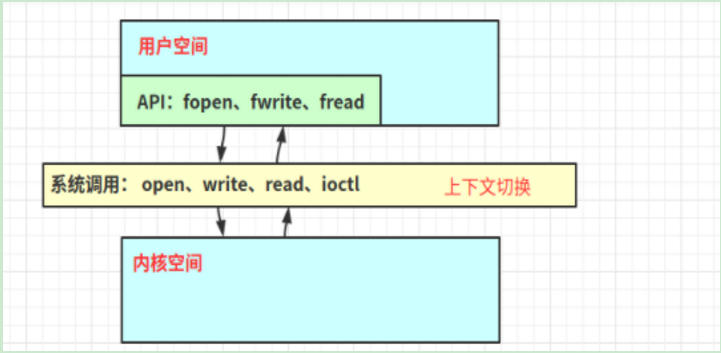

## 1. NIO 与 零拷贝:  

1. 简介: `零拷贝就是一种避免cpu将数据从一块存储拷贝到另外一块存储的技术,零拷贝指的是没有cpu参与拷贝数据`  
   - 零拷贝是网络编程的关键,很多性能优化都离不开零拷贝,利用零拷贝减少不必要的数据拷贝,从而优化网络编程效率  
   - 零拷贝指的是从操作系统的角度来说,整个操作系统中有且只有一份数据,此外没有与之重复的数据,通过MDA和SG-DMA技术减少cpu拷贝的开销
   - java程序中,常用的零拷贝有mmap(内存映射) 和 sendFile()

2. 零拷贝的好处:  
   - 减少或者避免不必要的cpu数据拷贝,从而释放cpu去执行其他任务  
   - 零拷贝机制能减少用户空间和操作系统内核空间的上下文切换次数
   - 减少内存的占用  
3. 内核空间和用户空间:  
     
   - 用户空间: 提供给各个进程的空间,`用户空间不具有访问内核空间资源的权限`,如果程序需要使用内核空间的资源,`需要通过操作系统调度来完成`.从用户空间切换到内核空间,完成操作之后再从内核空间切换到用户空间,
     这样的消耗很大.
   - 内核空间: 系统自身使用的空间,主要提供 进程调度,内存分配,连接硬件资源等功能.  
4. 缓冲区和虚拟内存:  
     
   - `直接内存访问技术(Direct Memory Access -DMA)`: 在进行I/O设备和内存数据传输的时候,数据传输工作全部交给I/O硬件设备中的DMA技术,
     从而cpu不需要参与将数据从I/O设备传输到内存这一过程数据的拷贝.  
   - `缓冲区`:  内核空间存放I/O过程中需要传输数据的区域  
   - `虚拟内存`:  

## 2. 传统i/o看数据拷贝流程:  

1. 以下面这个文件传输为例,了解传统I/O过程中数据拷贝的过程:  
     
   - 传统I/O文件数据拷贝流程:  
     
       
     过程总结:
      - 上下文切换: 一共发生了四次上下文切换
        1. 向操作系统发起read请求,`从用户空间切换到内核空间`  
        2. read请求完成,向用户返回数据,`从内核空间切换到用户空间`  
        3. 向操作系统发起write请求, `从用户空间切换到内核空间`  
        4. write请求完成,继续执行用户进程其他任务, `从内核空间切换到用户空间`  
      - 数据拷贝:  一共发生四次拷贝
        1. I/O硬件向内核空间缓冲区的DMA拷贝
        2. 内核缓冲区向用户缓冲区的cpu拷贝  
        3. 用户空间缓冲区向socket缓冲区的cpu拷贝  
        4. socket缓冲区向网卡的DMA拷贝

## 3. 优化传统I/O实现零拷贝:  

1. 使用mmap()调用优化掉一次`cpu拷贝`:  

   1. mmap()调用的效果: 通过内存映射,将内核空间的地址映射到用户空间,`达到内核空间和用户空间共享数据的效果`,从而减少一次从`内核空间拷贝数据到用户空间的cpu拷贝开销`  
      
       
      过程总结:  
      - 四次上下文切换:  
        1. 向操作系统发起mmap()调用,`从用户空间切换到内核空间`
        2. mmap()调用完成,返回用户空间执行用户进程后续操作,`从内核空间切换到用户空间`
        3. 向操作系统发起write请求, `从用户空间切换到内核空间`
        4. write请求完成,继续执行用户进程其他任务, `从内核空间切换到用户空间` 
      - 三次数据拷贝:  
        1. I/O硬件向内核空间缓冲区的DMA拷贝
        2. 由于内核空间和用户空间共享数据, `无需再像用户空间复制数据`,在write的时候`直接`从内核缓冲区通过cpu拷贝数据到socket缓冲区
        3. socket缓冲区向网卡的DMA拷贝

2. 使用sendFile()替换read,write函数, `优化掉两次上下文切换`  

   1. sendFile函数: 

      ```c++
         #include<sys/socket.h>
         ssize_t sendfile(int out_fd, int in_fd, off_t *offset,size_t count);
      ```

      - 解释: out_fd是目的文件描述符,in_fd是源文件描述符号,offset是源文件的偏移量,count是需要处理的长度
      - sendfile的作用: 
        1. 替换write和read函数,减少两次上下文切换
        2. 在调用sendfile函数的时候,由用户空间切换到内核空间之后,直接在内核空间使用cpu拷贝,向socket缓冲区复制数据,处理完成之后再切换到用户空间  

      

      

      - 总结:  
        - 两次上下文切换:  
          1. 调用sendfile函数,从用户空间切换到内核空间  
          2. sendfile处理完成,从内核空间切换到用户空间,继续执行用户进程剩下的操作.
        - 三次数据拷贝
          1. I/O硬件通过DMA技术,将数据拷贝至内核空间缓冲区  
          2. 用户进程调用sendFile函数之后,`数据与用户空间缓冲区不再产生联系`, 直接从内核缓冲区通过cpu拷贝数据到socket缓冲区
          3. socket缓冲向网卡的DMA拷贝  

3. 优化sendfile函数,实现真正的零拷贝,`没有cpu拷贝`:  

   - 如果网卡支持SG-DMA(The Scatter-Gather Direct Memory Access)技术,就可以进一步`减少`数据从内核空间经过cpu拷贝到socket缓冲区的开销.原来从内核空间缓冲区,通过cpu拷贝数据到
     socket缓冲区的过程还在,但是只有关于数据去向和长度信息的描述符才会被附加到套接字缓冲区,这部分的开销可以忽略不计.  
     

     

     - 总结:  
       - 2次上下文切换:
         1. 调用sendfile函数,从用户空间切换到内核空间
         2. sendfile处理完成,从内核空间切换到用户空间,继续执行用户进程剩下的操作. 
       - 2次数据拷贝:  
         1. I/O硬件通过DMA技术,将数据拷贝至内核空间缓冲区  
         2. 不再将内存缓冲区的数据复制到socket缓冲区,只是将少部分数据去向描述符和数据长度描述符传递给socket缓冲区,通过SG-DMA技术直接将数据拷贝到网卡中  


## 4. JAVA NIO中的零拷贝:

客户端demo:  

```java
    package cn.pounds.nio.zerocopy;
    
    import java.io.FileInputStream;
    import java.io.IOException;
    import java.net.InetSocketAddress;
    import java.nio.channels.FileChannel;
    import java.nio.channels.SocketChannel;
    
    /**
     * @Date 2021/5/9 12:43
     * @Author by pounds
     * @Description Nio中的零拷贝
     */
    public class NioClient {
        public static void main(String[] args) throws IOException {
            SocketChannel client = SocketChannel.open();
            client.connect(new InetSocketAddress("localhost",7001));
            String file = "protoc-3.6.1-win32.zip";
    
            FileChannel fileChannel = new FileInputStream(file).getChannel();
    
            long startTime = System.currentTimeMillis();
    
            // windows系统中,transferTo方法每次只能传输8m,需要分段传输,linux系统则不需要,下面这个写法是linux的写法\
            // transferTo 就是使用的零拷贝
            fileChannel.transferTo(0,fileChannel.size(),client);
    
            System.out.println(String.format("总共耗时 %s ",System.currentTimeMillis() - startTime));
    
        }
    }
```

服务端demo:  

```java
package cn.pounds.nio.zerocopy;

import java.io.IOException;
import java.net.InetSocketAddress;
import java.nio.ByteBuffer;
import java.nio.channels.ServerSocketChannel;
import java.nio.channels.SocketChannel;

/**
 * @Date 2021/5/9 12:35
 * @Author by pounds
 * @Description Nio中的零拷贝
 */
public class NioServer {
    public static void main(String[] args) throws IOException {
        ServerSocketChannel serverSocketChannel = ServerSocketChannel.open();
        serverSocketChannel.socket().bind(new InetSocketAddress("127.0.0.1",7001));

        ByteBuffer byteBuffer = ByteBuffer.allocate(4096);

        while (true){
            SocketChannel socketChannel = serverSocketChannel.accept();
            int readCount = 0;
            while (-1 != readCount){
                try {
                    readCount = socketChannel.read(byteBuffer);
                }catch (Exception e){
                    e.printStackTrace();
                }
                // 重新读
                byteBuffer.rewind();
            }
        }
    }
}
```
