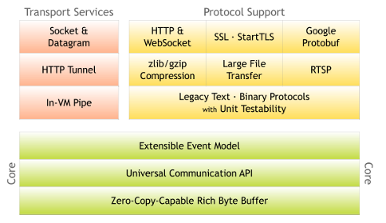

## 1. 简介:

1. Netty是由JBoss提供的一个java网络开源框架
2. Netty是一个异步的,基于事件驱动的网络框架,用来快速开发高性能,高可用的IO程序
3. Netty主要是针对tcp协议下,面向Clients端的高并发应用程序,或者是Peer-To-Peer场景下的大量数据传输应用
4. Netty本质就是java的NIO框架,在NIO的基础上进行了大量的封装,让开发者将精力集中于业务代码而不是网络通信,多使用于服务器通信相关的多种场景

## 2. Netty架构:   

  

## 3. Netty特性:

1. NIO的弊端:
   - NIO类库和api繁杂,使用麻烦,需要开发人员熟练掌握NIO技术
   - 需要具备其他额外的技能,否则无法写出高性能的NIO程序,比如: reactor模式就需要多线程技术实现.
   - 开发工作量和难度都非常大
   - NIO有bug: 比如 epoll bug,会到这selector轮空,打满cpu.
2. 优点:  
   - `设计`: 统一的API,支持多种传输类型,支持阻塞与非阻塞I/O模式,简单而强大的线程模型,支持真正的无连接数据报套接字,链接逻辑组件以支持复用
   - `易用性`: 大量的javadoc文档和大量的示例集,不需要超过jdk1.6+的依赖
   - `性能`: 拥有比java的核心api更高的吞吐量以及更低的延迟; 得益于池化和复用,拥有更低的资源消耗;更少的内存复制
   - `健壮性`: 不会因为慢速,快速或者超载的链接导致OOM;消除在高速网络NIO应用程序常见的不公平读写比率
   - `安全性`: 支持完整的SSL/TLS以及startTLS;可用于受限环境下,比如 APPLET 和 OSGI
   - `社区驱动`: 社区活跃,发布快速而频繁

## 4. 应用场景:  

- 互联网行业: 分布式系统,服务与服务之间的rpc远程调用的底层,通常就是netty这种异步高可用通信框架,比如: `DUBBO`
- 游戏行业: 使用netty作为聊天系统的通信组件
- 等

