## 4.1 前置知识:

### 4.1.1 中断简介:

1. 引导故事: 小明在打游戏的时候饿了,于是点了外卖,然后一边打游戏一边等外卖.过了一会外卖到了,给小明打电话让他下去取外卖,小明将正在玩儿的3A游戏存档,然后去取外卖, 拿到外卖后开始吃外卖.
   - 外卖小哥给小明打电话让他下去取外卖, 就是操作系统中的 `中断请求`
   - 小明接到电话后,`停下打游戏,将游戏存档`, 就是在执行 `中断处理程序`
   - 小明在等外卖的时候,如果把 `吃外卖` 看做是一个进程, 此时 `吃外卖`进程就是处于 `休眠状态`; 拿到外卖之后,开始吃外卖,此时 `吃外卖`进程就处于 `运行状态`

2. 什么是中断:
   - `中断`: 指处理器在处理程序运行过程中出现的紧急事件的整个过程.程序运行过程中,系统外部,系统内部或者现行程序若出现紧急事件,处理器立即中止现行程序的运行, 自动转入响应紧急事件的程序(`中断处理程序`)
     ,在处理完成后,在返回原来的程序继续运行.这整个过程就是 `中断`
   - `硬件中断`: 由与系统相连的外设(键盘,鼠标,硬盘,网卡等)自动产生的.每个设备或者设备集都有其自己的IRQ(中断请求),基于IRQ,cpu可以将相应的中断请求分发到具 体的硬件设备上.  
     意义: 硬件中断是一个 `异步信号`,表明需要注意,或者改变正在执行的一个同步事件
   - `软件中断`: 由当前运行程序产生,通常是一些对I/O的请求,软中断仅仅于内核联系,而内核主要负责对需要运行的任何其他进程进行调度.`软中断不会直接中断cpu,也只 有正待运行的代码(进程)才会产生软中断`
     .软中断是一种需要内核为正在运行的进程去做一些事情(比如网络I/O)的请求.有一个特殊的软中断`yield调用`,他的作用是请 求内核调度器去查看是否有其他的进程可以运行.

3. 中断是如何工作的: `以网卡为例子`  
   当网卡接收到网络中的数据后,会通过DMA技术将数据拷贝到内存中对应的数据缓冲区,`假设此时cpu正在执行进程c`,网卡在数据拷贝完成之后,会向cpu发起中断请求,cpu接
   接收到中断请求后,将正在执行中的进程c相关信息保存到 `进程描述符` 中,然后从用户态切换到用户态中,然后开始执行网卡的中断程序,待中断程序执行完成之后,通过之前 保存的进程描述符恢复进程c的运行

### 4.1.2 I/O多路复用技术:

I/O多路复用简单来讲就是使用一个线程去处理多个I/O请求,在不同的时间段对不同的i/o请求做出响应.下面是两种操作系统实现I/O多路复用的原理:

#### 4.1.2.1 select()函数:

- 本质: 用三个bitmap分别表示读事件,写事件,异常事件,在bitmap中,下标表示socket对应的文件描述符(唯一对应),元素值表示是否关心该bitmap代表的事件,`1表示关 心,0表示不关心`
  ,然后在操作系统准备好数据之后,直接改写具体事件的bitmap上的元素值,`1表示该位置对应的文件描述符需要的数据准备好了,0表示没有.`  
  在程序运行中会不断循环的去调用select函数,每调用一次select函数就会去遍历bitmap,数据准备好之后也会去遍历bitmap然后直接修改.然后通过 `FD_ISSET`方法去 判断是否有数据准备好了.

- select函数代码:

  ```c++
       #include<sys/select.h>
       int select(int maxfdp1, fd_set *readset, fd_set *writeset, fd_set *exceptset, struct timeval *timeout)
  
       // 调用的时候,示例: 表示只关心读事件
       select(max + 1, &readset, null, null, null);
  ```

  说明:

    - `maxfdp1`: 表示bitmap最大有效位数,即`maxfdp1`之后都是没有数据的,减少不必要的遍历
    - `timeout`: 表示本次select函数等待的时间
      - timeout == null: 一直阻塞
      - timeout->tv_sec == 0 || timeout->tv_usec = 0: 不阻塞直接返回
      - timeout->tv_sec != 0 || timeout->tv_usec != 0: 阻塞指定时间
    - `fd_set`: 就是一个bitmap,最大长度为1024,用类型表示某个事件,然后将socket对应的文件描述符映射到`fd_set`上面,值为1表示对 `fd_set`代表的事件关心  
      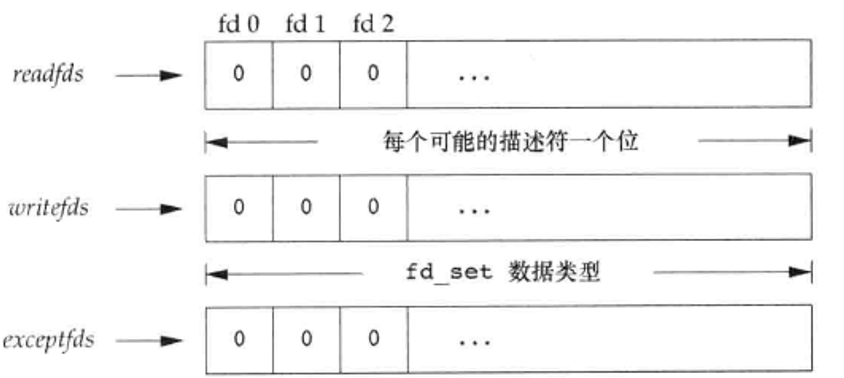
        - 操作这三个 `fd_set`的方法:  
          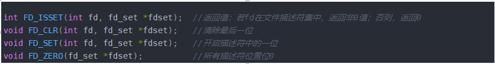

- select函数的优缺点:

  - 优点: 通过一次系统调用将所有文件描述符传递给内核,内核进行遍历,这种遍历减少了BIO的措辞系统调用的开销
  - 缺点:
    - 由于socket对应描述符是否对该事件关心,该事件是否准备就绪,都是在同一个bitmap上直接进行操作,所以导致每次select循环都需要重新设置文件描述符关心的 事件,然后内核设置事件是否准备就绪,造成了一些重复操作
    - 每一次select都会对bitmap进行遍历
    - 每次调用select函数都需要将bitmap在内核态和用户态之间来回复制

#### 4.1.2.2 epoll函数:

- 本质: 使用一个 epoll空间结构(有一个文件描述符来表示这个空间)来管理socket对应的文件描述符,在epoll空间中 有一个`红黑树`,用于存放文件描述 符以及其关心的事件, 还有一个`链表`
  用于存放关心事件准备就绪的文件描述符.每一次事件轮询都是从这个链表这种获取准备就绪的事件描述符

- epoll大致流程:  
  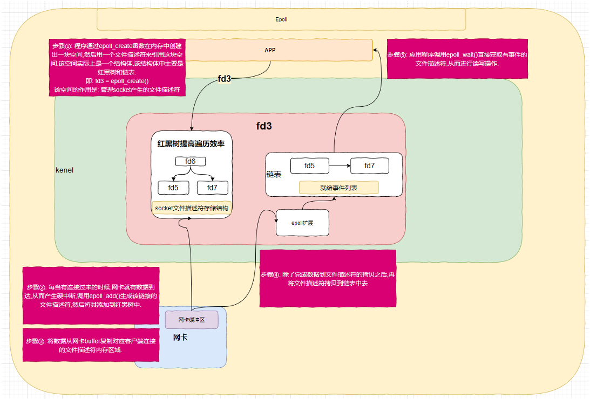

- epoll 相关函数:  
  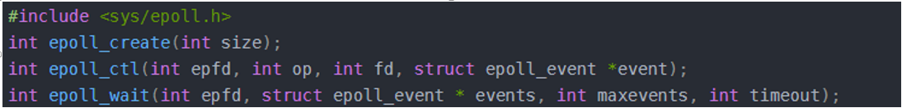  
  说明:

  ```c 
    int epoll_create(int size);
  ```

  该函数会在内存中开辟一块空间(这宗空间可能有很多个),通过一个文件描述符来引用这块地址,并将该文件描述符返回给调用方.  
  size表示 该空间一共能管理多少个文件描述符

  ```c 
    int epoll_ctl(int epfd, int op, int fd, struct epoll_event *event)
  ```

  该函数是对epoll空间进行管理的函数,对文件描述感兴趣的事件进行注册.  
  该函数是一个 `非阻塞函数`,作用是对epoll空间中fd信息进行crud  
  `与select不同的是`: select函数在调用的时候需要指定文件描述符和关心事件,epoll则是将文件描述符关心的事件注册到epoll空间内.    
  参数:  

    - `epfd`: epoll空间的文件描述符,用于定位epoll空间
    - `op`: 表示当前请求的类型,值通常是由三个宏定义
      - `EPOLL_CTL_ADD`: 注册新的fd到epfd中
      - `EPOLL_CTL_MOD`: 修改已经注册的fd监听事件
      - `EPOLL_CTL_DEL`: 删除epfd中某个fd
    - `fd`: 需要操作的fd.通常是socket_fd
    - `event`: 参数`fd`关注的事件   
      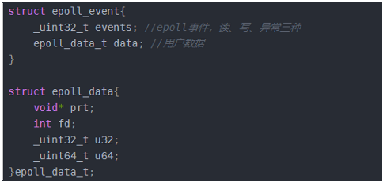  
      events属性是以下几个类型的集合:  
      `EPOLLIN`(可读),`EPOLLOUT`(可写),`EPOLLPRI`(),`EPOLLHUB`(挂断),`EPOLLET`(边缘触发),`EPOLLONESHOT`(只监听一次, 事件触发之后会清除该fd)    

  ```c 
    int epoll_wait(int epfd,struct epoll_event *event,int maxevents,int timeout)
  ```

  该函数是用来获取数据,从就绪列表里面读取fd(也就是epoll大致流程图中的链表)  
  参数:  

    - `epfd`: epoll空间的文件描述符
    - `events`: 关注的事件,是个数组,有数据的时候会将数据拷贝到这个数组里面去
    - `maxevents`: 设置events数组的长度
    - `timeout`: epoll_wait方法的时间
      - timeout == 0 : 表示epoll_wait方法非阻塞立即返回结果
      - timeout == -1 : 一直阻塞,直到有数据
      - timeout > 0: 如果没有数据,epoll_wait会阻塞timeout时间,这期间有数据就返回

- epoll的工作模式:

  - `LT(水平触发)`: 事件准备就绪之后,用户可以选择处理或者不处理数据,如果本次调用未处理,操作系统会保留这个数据,在下次调用epoll_wait函数的时候仍然会将数据打包返回 
  - `ET(边缘触发)`: 事件准备就绪后,无论用户处不处理数据,操作系统都会将数据删除,而不是保留该数据

## 4.2 常见线程模型概述:

### 4.1 传统阻塞I/O线程模型:

一句话总结: [一个线程处理整个I/0请求流程]  
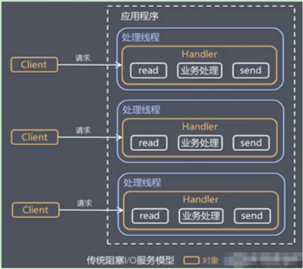  
模型特点:

- 采用阻塞i/o模式获取输入数据
- 每个连接都需要一个独立的线程,完成数据的输入,业务处理,结果数据的返回

问题:

- 并发数量很大的话,创建的线程过多,容易造成服务端资源压力
- 由于采用的是阻塞式i/o,在没有数据可读的时候,线程会阻塞在read方法中,导致线程资源浪费

### 4.2 Reactor模型: 别名(反应器模型,分发器模型,通知者模型)

#### 4.2.1 Reactor模型简介:

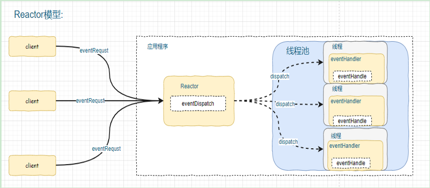

1. 核心思想: i/o复用 + 线程复用
   - `i/o复用`: 多个连接共用一个阻塞对象,应用程序只需要在一个阻塞对象(一个线程)等待,不需要阻塞等待所有连接.当某个连接有数据可以处理的时候(事件准备就绪),操作系统通知应用程序, 线程从阻塞状态返回,开始进行业务处理.
   - `线程复用`: 不再为每个连接都创建独立的线程,使用一个专门的线程来处理客户端的连接请求,连接成功后的业务处理任务分配给线程池中的线程来处理,一个线程可以处理多个连接的业务
2. 核心组件: reactor(分发器) + handler(打工仔)
   - `reactor`: reactor在一个单独的线程中运行,负责监听客户端的连接请求,以及任务的分发,将任务分配给适当的处理线程来对i/o事件做出反应.好比 `产品经理`. 
   - `handler`: handler是实际的业务处理人,处理具体的i/o事件,reactor通过调度适当的处理线程来响应i/o事件. 好比 `开发人员`.
3. 说明:
   - 服务端程序处理传入的多个请求,并将他们分发到相应的处理线程,dispatcher模式别名的由来 - reactor模式,通过一个或者多个输入同时传递给服务处理的模式(基于事件驱动)
   - reactor模式使用i/o复用监听事件,收到事件之后分发给相应的处理线程,这就是网络服务高并发处理的关键

#### 4.2.2 Reactor模型的分类: 

按照reactor的数量和处理资源池线程数量的不同分为以下几种


#### 4.2.2.1 单Reactor单线程:  

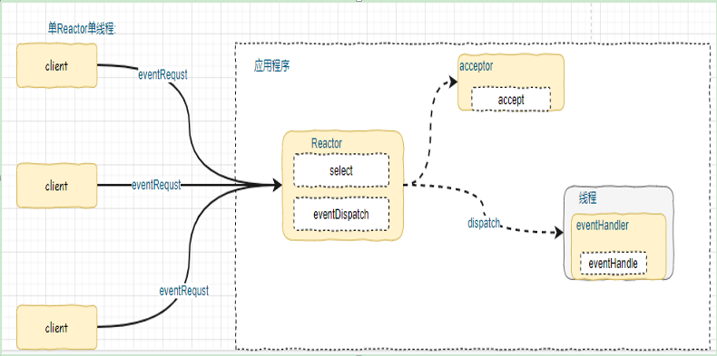

1. 说明:
   - `reactor`通过`select`监听客户端请求事件,然后通过`dispatch`将事件分发
   - `select`就是前面i/o复用模型介绍的标准网络api,通过`select`实现应用程序通过`一个阻塞对象(线程)监听多路连接请求`
   - 如果是`建立连接请求`事件,则由`acceptor`通过`accept`方法处理连接请求,然后创建一个`handler`对象处理连接完成之后的具体业务处理
   - 如果不是 `建立连接请求`事件,则 `Reacotr`会分发调用`handler`来处理该事件并响应.
   - `handler` 会完成 整套业务逻辑处理流程 (`read` -> `业务处理逻辑` -> `send`).
2. 优缺点:
   - 优点: 模型简单,没有多线程、进程通信、竞争的问题,全部都在一个线程中完成
   - 缺点: 性能问题,只有一个线程,无法完全发挥多核 `cpu`的性能.`handler`在处理某个客户端连接的业务时,整个进程无法处理其他客户端连接的事件,容易造成性能瓶颈
   - 缺点: 可靠性问题,线程以外终止,或者进入死循环,会导致整个系统通信模块无法使用,不能接收和处理外部消息,造成结点故障
3. 使用场景:
   - 客户端数量有限,业务处理非常快速,比如`Redis`在业务处理的`时间复杂度 O(1)` 的情况
4. 模型示例: 见NIO网络编程 [NIO复习](../../../netty-demo/java-io/src/main/java/cn/pounds/nio/NioNetWorkServer.java)


#### 4.2.2.2 单Reactor多线程:  

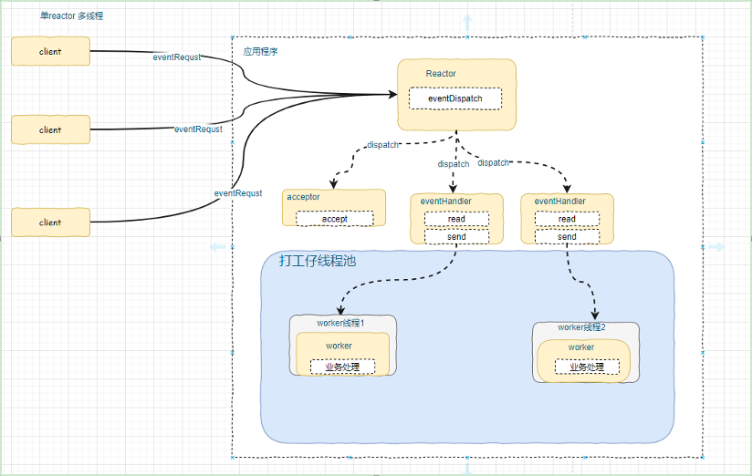  

1. 说明:  
   - `Reactor`通过`select`监听事件请求,完成i/o多路复用的目的,连接请求给`acceptor`,其他请求转发给`handler`
   - `handler`只进行 `read`和`send`操作,不进行业务处理,业务操作会分发给线程池中线程来处理,达到线程的复用
   - 由 `worker` 线程池分配线程来进行业务处理,并将结果返回给`handler`,由 `handler`通过`send`方法返回结果给`dispatcher`.

2. 优缺点:  
   - 优点: 实现i/o复用 和 线程的复用,节约资源提高性能.
   - 缺点: 多线程存在的问题他都有了, `reactor`处理所有的事件监听和响应,并且`reactor`是在单线程中运行的,高并发场景下可能会存在性能瓶颈

#### 4.2.2.3 主从Reactor多线程:  

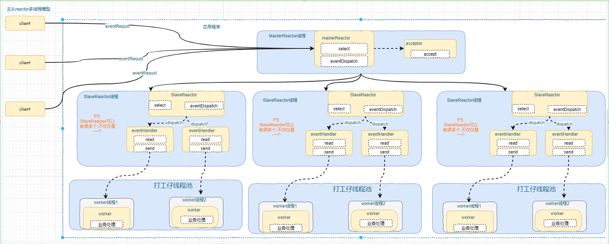  
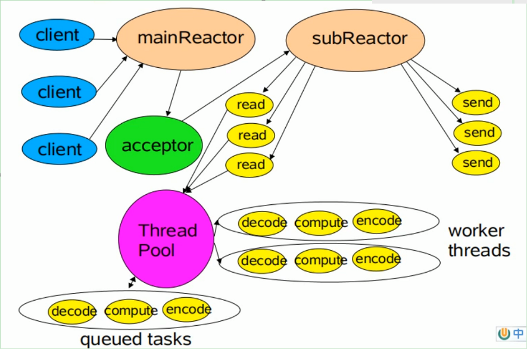

1. 说明:  
   - 主 `reactor`[即`mainReactor`]: 同样通过select监听有事件发生的i/o,收到事件之后,通过`Acceptor`处理`连接事件`
   - `Acceptor`处理完成`连接事件`后,`MainReactor`将连接分配给`SubReactor`
   - 从`reactor`[即`subReactor`]: 将连接加入到连接队列进行监听,并创建`handler`进行各种事件的处理  
   - 当有新事件准备就绪时, `subReactor`就会调用对应`handler`处理  
   - `handler`通过 `read方法`读取数据,分发给后面的 `worker`进行业务处理,并将结果返回给 `handker`  
   - `handler`接收到相应之后,再通过`send方法`将结果返回给Client  
   - `Reactor`主线程可以对应多个 `Reactor`子线程,即 `mainReactor`可以对应多个 `subReactor`  

2. 优缺点:  
   - 优点: 父线程与子线程的数据交互责任明确,父线程accept,子线程处理读写任务
   - 优点: 数据交互简单,只需要传递原始数据,响应结果
   - 缺点: 编程复杂度高

## 4.3 netty线程模型:  

1. Netty在`主从Reactor多线程`模型的基础上,进行了一定的改动:  
   简单版:
   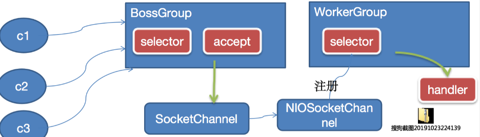  
   说明:

    - `BossGroup` 线程维护 `Selector`，只关注 `Accept`
    - 当接收到 `Accept` 事件，获取到对应的 `SocketChannel`，封装成 `NIOSocketChannel` 并注册到 `Worker 线程（事件循环）`，并进行维护
    - 当 `Worker` 线程监听到 `Selector` 中通道发生自己感兴趣的事件后，就进行处理（就由 handler），注意 `handler` 已经加入到通道

   进阶版:  
   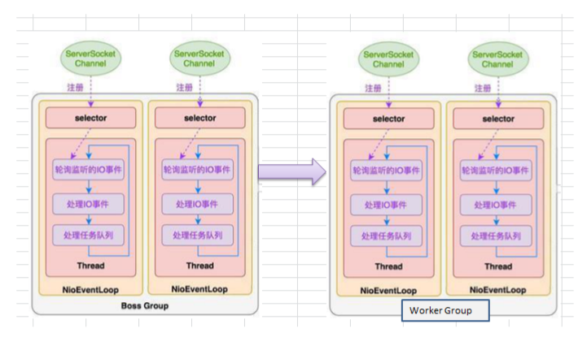

   完整版:  
   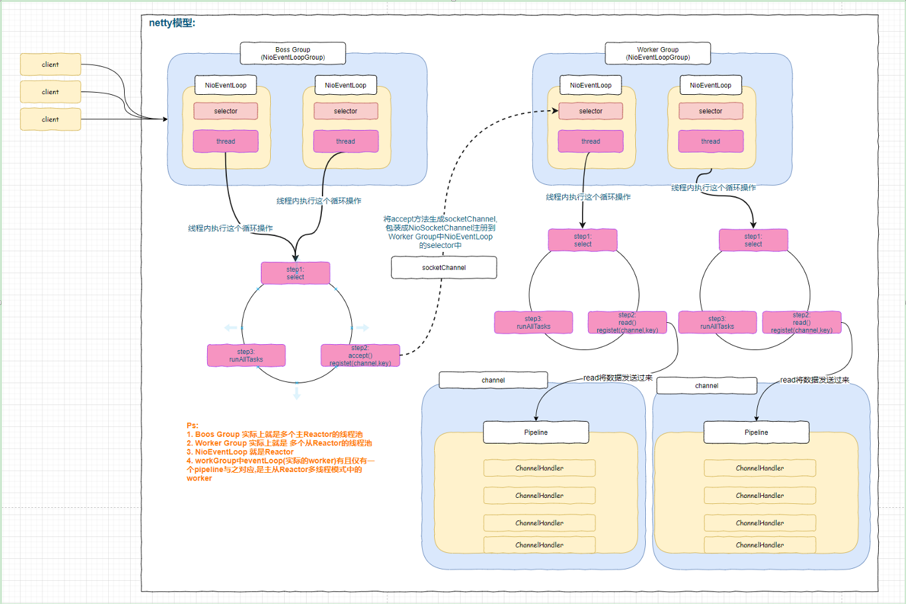   
   **<font color=#ff4500>EventLoop和channel、线程之间的对应关系: </font>**   
   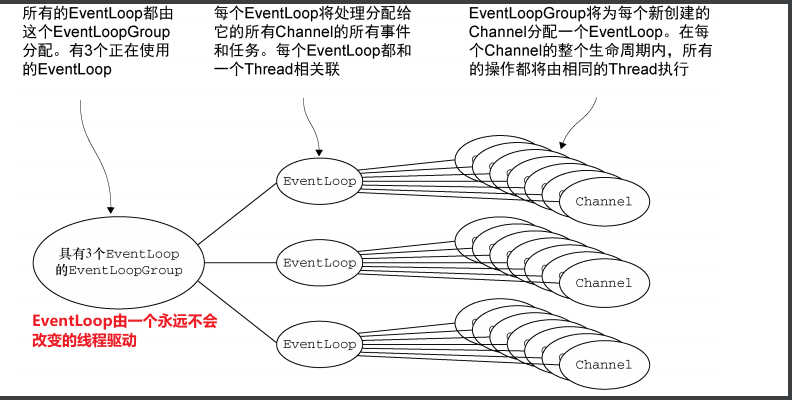
   **<font color=#ff4500>i/o操作大致执行原理: </font>**  
   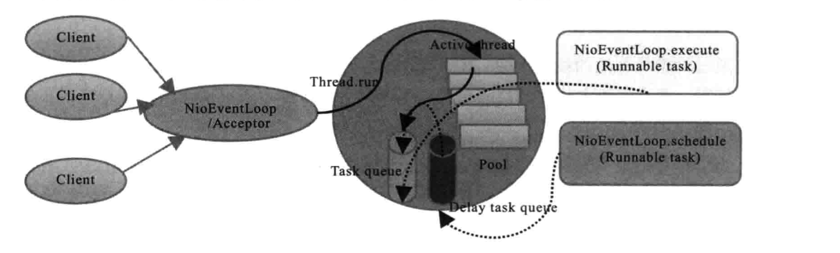
   说明:

     1. `Netty`抽象出两组线程池 `BossGroup专门负责客户端连接`和`WorkerGroup专门负责网络的读写`
     2. `BossGroup`和`WorkerGroup`的类型 都是`NioEventLoopGroup`.
        - `NioEventLoop`表示一个不断循环执行处理任务的线程,每个`NioEventLoop`都关联了一个`Selector`,用于监听注册在`NioEventLoop`上的网络通信
        - `NioEventLoopGroup`(事件循环组,其实是个`线程池`),里面包含很多 `NioEventLoop`(事件循环,`唯一`绑定一个`线程`)
     3. 每个 `BossNioEventLoop`循环执行的步骤有3步:
        - 轮询`accept`事件
        - 处理 `accept`事件,与 `client`建立连接,生成 `NioSocketChannel`,并将其注册到 `workerNioEventLoop`的`selector`上
        - 处理任务队列任务, 即 `runAllTasks`
     4. 每个 `worker NioEventLoop`循环执行的步骤:
        - 轮询 read，write 事件
        - 处理 I/O 事件，即 read，write 事件，在对应 NioSocketChannel 处理
        - 处理任务队列的任务，即 runAllTasks
     5. 每个 `worker NioEventloop`处理业务的时候,会使用`pipeline`(管道),[管道实际上是一个处理器链,上面维护了许多i/o处理器]


## 4.4 Netty快速入门实例:

1. 实例要求：使用 IDEA 创建 Netty 项目

   - Netty 服务器在 6668 端口监听，客户端能发送消息给服务器"hello,服务器~"
   - 服务器可以回复消息给客户端"hello,客户端~"
   - 目的：对 Netty 线程模型有一个初步认识，便于理解 Netty 模型理论
   - 看老师代码演示 5.1 编写服务端 5.2 编写客户端 5.3 对 netty 程序进行分析，看看 netty 模型特点 说明：创建 Maven 项目，并引入 Netty 包  

代码如下:  

- 服务端

```java
    package cn.pounds.netty.simple;
    
    import io.netty.bootstrap.ServerBootstrap;
    import io.netty.channel.ChannelFuture;
    import io.netty.channel.ChannelFutureListener;
    import io.netty.channel.ChannelInitializer;
    import io.netty.channel.ChannelOption;
    import io.netty.channel.nio.NioEventLoopGroup;
    import io.netty.channel.socket.SocketChannel;
    import io.netty.channel.socket.nio.NioServerSocketChannel;
    
    /**
     * @Date 2021/5/9 18:08
     * @Author by pounds
     * @Description netty入门教程:
     * 1. 服务端端口号 6668, 接受客户端的消息,并返回消息"hello,客户端"
     * 2. 客户端连接服务端,发送消息"hello,服务端"
     */
    public class NettyServer {
        public static void main(String[] args) {
            // 1. 创建两个NioEventLoopGroup,分别作为Boss Group 和  Worker Group
            // 两个Group的实际子线程NioEventLoop的个数为: 实际核心数 * 2
            NioEventLoopGroup bossGroup = new NioEventLoopGroup();
            NioEventLoopGroup workerGroup = new NioEventLoopGroup();
    
            try {
                // 2.创建netty服务器的启动对象,主要是用来配置参数
                ServerBootstrap bootstrap = new ServerBootstrap();
    
                // 3. 配置参数
                bootstrap
                        // 设置parent group,child group
                        .group(bossGroup,workerGroup)
                        // 设置服务端通道,如同Nio中的serverSocketChannel
                        .channel(NioServerSocketChannel.class)
                        // 设置服务端channel等待连接队列的容量
                        .option(ChannelOption.SO_BACKLOG,128)
                        // 设置保持活动连接状态,因该是设置workerGroup的属性
                        .childOption(ChannelOption.SO_KEEPALIVE,true)
                        // 设置真正执行业务逻辑的handler
                        .childHandler(
                                // 创建通道初始化对象,初始化的是socketChannel
                                new ChannelInitializer<SocketChannel>() {
                            /**
                             * 给pipeline设置一个handler
                             * @param ch --- SocketChannel
                             * @throws Exception
                             */
                            @Override
                            protected void initChannel(SocketChannel ch) throws Exception {
                                // 入门案例的演示
                                // ch.pipeline().addLast(new NettyServerHandler());
                                // task使用方式的演示
                                ch.pipeline().addLast(new NettyServerTaskQueueHandler());
    
                            }
                        });
    
                System.out.println(" ..........  server is ready ............");
    
                // 4. 将服务器绑定一个端口,并同步监听:  真正的启动服务器操作
                ChannelFuture channelFuture = bootstrap.bind(6668).sync();
    
                // future-listener机制举个栗子,给端口绑定事件添加一个监听器:
                // 操作(端口绑定事件)完成触发
                channelFuture.addListener((ChannelFutureListener) future -> {
                    if (channelFuture.isSuccess()){
                        System.out.println("绑定成功");
                    }else{
                        System.out.println("绑定端口失败.");
                    }
                });
    
                // 5.  监听服务器channel关闭事件
                channelFuture.channel().closeFuture().sync();
            }catch (Exception e){
                e.printStackTrace();
            }finally {
                bossGroup.shutdownGracefully();
                workerGroup.shutdownGracefully();
            }
        }
    }
```

```java
    package cn.pounds.netty.simple;
    
    import io.netty.buffer.ByteBuf;
    import io.netty.buffer.Unpooled;
    import io.netty.channel.ChannelHandlerContext;
    import io.netty.channel.ChannelInboundHandlerAdapter;
    import io.netty.util.CharsetUtil;
    
    /**
     * @Date 2021/5/9 18:47
     * @Author by pounds
     * @Description netty服务器端真正业务处理类
     * 几点说明:
     * 1. 我们自定义的handler 需要继承netty规定好的某个HandlerAdapter,比如下面继承这个
     * 2. 这是自定义handler的方式,也可以使用netty自带的handler
     * 3. 需要重写一些方法
     */
    public class NettyServerHandler extends ChannelInboundHandlerAdapter {
        /**
         * handler的read 方法,处理read事件的方法
         * @param ctx ---  上下文对象,包含 pipeline,通道,地址
         * @param msg --- 客户端的数据
         * @throws Exception
         */
        @Override
        public void channelRead(ChannelHandlerContext ctx, Object msg) throws Exception {
            System.out.println("server ctx= " + ctx);
            // 将msg转换成netty提供的 ByteBuf ,功能与nio ByteBuffer差不多,但是性能更好
            ByteBuf byteBuf = (ByteBuf) msg;
            // 读取数据展示,附带解码流程
            System.out.println("客户端发送消息是: "+byteBuf.toString(CharsetUtil.UTF_8));
            System.out.println("客户端地址: "+ ctx.channel().remoteAddress());
        }
    
        /**
         * handler的write方法,会在数据读完之后触发,也就是read处理完之后触发
         * @param ctx --- 上下文对象
         * @throws Exception
         */
        @Override
        public void channelReadComplete(ChannelHandlerContext ctx) throws Exception {
            // 写入缓存并发送出去,返回的数据需要进行编码
            ctx.writeAndFlush(Unpooled.copiedBuffer("hello 客户端~ ",CharsetUtil.UTF_8));
        }
    
        /**
         * 异常处理
         * @param ctx --- 上下文对象
         * @param cause --- 异常
         * @throws Exception
         */
        @Override
        public void exceptionCaught(ChannelHandlerContext ctx, Throwable cause) throws Exception {
            ctx.close();
        }
    }
```

- 客户端:  

```java
    package cn.pounds.netty.simple;
    
    import io.netty.bootstrap.Bootstrap;
    import io.netty.channel.ChannelFuture;
    import io.netty.channel.ChannelInitializer;
    import io.netty.channel.nio.NioEventLoopGroup;
    import io.netty.channel.socket.SocketChannel;
    import io.netty.channel.socket.nio.NioSocketChannel;
    
    
    /**
     * @Date 2021/5/9 19:10
     * @Author by pounds
     * @Description netty入门教程 客户端
     */
    public class NettyClient {
        public static void main(String[] args) {
            // 1. 创建客户端事件循环组
            NioEventLoopGroup eventExecutors = new NioEventLoopGroup();
    
            try {
                // 2. 创建启动对象,注意: 要使用netty的包,并且不是的ServerBootStrap
                Bootstrap bootstrap = new Bootstrap();
                // 3. 设置属性
                bootstrap
                        // 设置事件组
                        .group(eventExecutors)
                        // 设置通道
                        .channel(NioSocketChannel.class)
                        // 设置handler
                        .handler(new ChannelInitializer<SocketChannel>() {
                            @Override
                            protected void initChannel(SocketChannel ch) throws Exception {
                                ch.pipeline().addLast(new NettyClientHandler());
                            }
                        });
                System.out.println(" 客户端准备完毕 ......");
    
                // 4. 启动客户端,并同步监听
                ChannelFuture channelFuture = bootstrap.connect("127.0.0.1", 6668).sync();
                // 5. 同步监听socketChannel 关闭
                channelFuture.channel().closeFuture().sync();
            }catch (Exception e) {
                e.printStackTrace();
            } finally{
                eventExecutors.shutdownGracefully();
            }
        }
    }
```

```java
    /**
     * @Date 2021/5/9 19:24
     * @Author by pounds
     * @Description 跟NettyServerHandler 一回事
     */
    public class NettyClientHandler extends ChannelInboundHandlerAdapter {
        /**
         * channel准备就绪就会触发这个方法,向服务端发送消息
         * @param ctx
         * @throws Exception
         */
        @Override
        public void channelActive(ChannelHandlerContext ctx) throws Exception {
            System.out.println("client: " + ctx);
            ctx.writeAndFlush(Unpooled.copiedBuffer("hello server: 我是netty客户端", CharsetUtil.UTF_8));
        }
    
        /**
         * 读事件
         */
        @Override
        public void channelRead(ChannelHandlerContext ctx, Object msg) throws Exception {
            System.out.println("执行了");
            ByteBuf byteBuf = (ByteBuf) msg;
            System.out.println("服务器回复的消息: " + byteBuf.toString(CharsetUtil.UTF_8));
            System.out.println("服务器地址: " + ctx.channel().remoteAddress());
        }
    
        /**
         * 异常处理
         * @param ctx
         * @param cause
         * @throws Exception
         */
        @Override
        public void exceptionCaught(ChannelHandlerContext ctx, Throwable cause) throws Exception {
            System.out.println(String.format("出现了异常 [%s] : %s",cause.getMessage(),cause));
            ctx.close();
        }
    
    }
```

